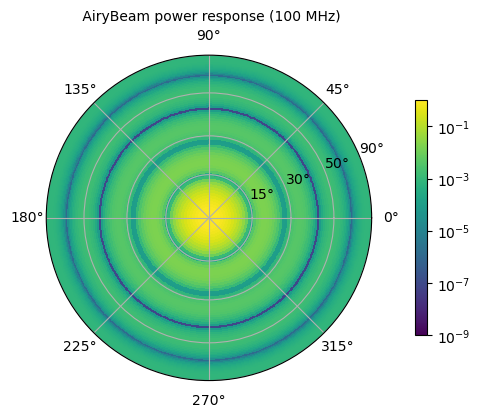
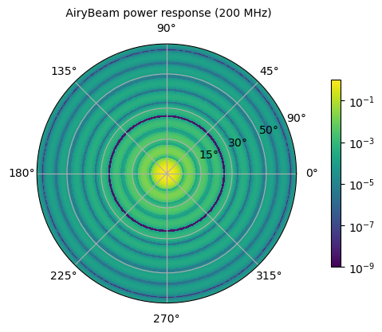
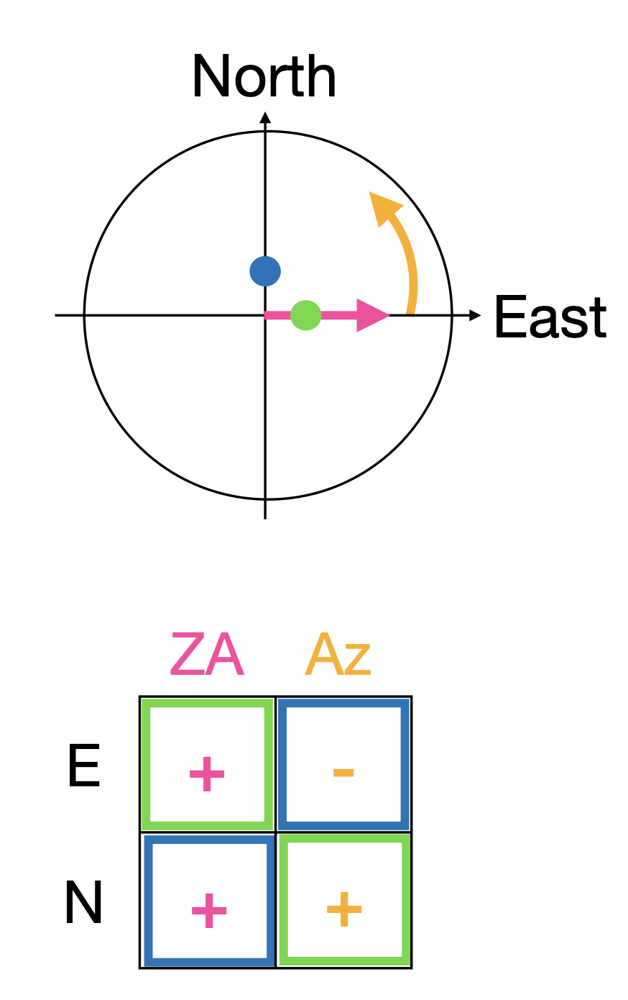

.. _analytic_beam_tutorial:

--------------
Analytic Beams
--------------

The analytic beams defined in pyuvdata are based on a base class,
:class:`pyuvdata.analytic_beam.AnalyticBeam`, which ensures a standard interface
and can be used to define other analytic beams in a consistent way.

Evaluating analytic beams
-------------------------

To evaluate an analytic beam at one or more frequencies and in in one or more
directions, use either the :meth:`pyuvdata.analytic_beam.AnalyticBeam.efield_eval`
or :meth:`pyuvdata.analytic_beam.AnalyticBeam.power_eval` methods as appropriate.

Evaluating an Airy Beam power response
**************************************

This code evaluates an Airy beam power response. Note that we exclude the cross
polarizations, since this is an unpolarized beam, the cross polarizations
are identical to the auto polarization power beams. If the cross polarizations
are included, the array returned from the ``power_eval`` method will be complex.

.. code-block:: python

    import numpy as np

    from pyuvdata import AiryBeam

    # Create an AiryBeam with a diameter of 14.5 meters
    airy_beam = AiryBeam(diameter=14.5, include_cross_pols=False)

    # set up zenith angle, azimuth and frequency arrays to evaluate with
    az_grid = np.deg2rad(np.arange(0, 360))
    za_grid = np.deg2rad(np.arange(0, 91))
    az_array, za_array = np.meshgrid(az_grid, za_grid)

    az_array = az_array.flatten()
    za_array = za_array.flatten()

    Nfreqs = 11
    freqs = np.linspace(100, 200, 11) * 1e6

    beam_vals = airy_beam.power_eval(
        az_array=az_array, za_array=za_array, freq_array=freqs
    )
    assert beam_vals.shape == (1, 2, 11, 91 * 360)
    assert beam_vals.dtype == np.float64

Evaluating a Short Dipole Beam E-Field response
***********************************************

This code evaluates and plots a short (Herzian) dipole beam E-field response
(also called the Jones matrix). Since it is the E-Field response, we have 4
effective maps because we have the response to each polarization basis vector
for each feed. In the case of a short dipole, these maps do not have an imaginary
part, but in general E-Field beams can be complex, so a complex array is returned.

.. clear-namespace

.. code-block:: python

    import matplotlib.pyplot as plt
    import numpy as np

    from pyuvdata import ShortDipoleBeam

    # Create an ShortDipoleBeam
    dipole_beam = ShortDipoleBeam()

    # set up zenith angle, azimuth and frequency arrays to evaluate with
    az_grid = np.deg2rad(np.arange(0, 360))
    za_grid = np.deg2rad(np.arange(0, 91))
    az_array, za_array = np.meshgrid(az_grid, za_grid)

    az_array = az_array.flatten()
    za_array = za_array.flatten()

    Nfreqs = 11
    freqs = np.linspace(100, 200, 11) * 1e6

    beam_vals = dipole_beam.efield_eval(
        az_array=az_array, za_array=za_array, freq_array=freqs
    )
    assert beam_vals.shape == (2, 2, 11, 91 * 360)
    assert beam_vals.dtype == np.complex128

Plotting analytic beams
-----------------------

Plotting beams can be extremely helpful to reason about their behavior and
whether they are implemented properly given the various conventions. To aid with
this, a basic plotting method is available on AnalyticBeams.

Plotting an Airy Beam power response
************************************

For unpolarized analytic beams, only a single feed is plotted (because all feeds
are the same). Airy beams are frequency dependent, so we plot two frequencies to
allow comparison.

.. clear-namespace

.. code-block:: python

    from pyuvdata import AiryBeam

    # Create an AiryBeam with a diameter of 14.5 meters with just one feed
    airy_beam = AiryBeam(diameter=14.5, feed_array=["x"], include_cross_pols=False)

    airy_beam.plot(
        beam_type="power",
        freq=100e6,
        logcolor=True,
        norm_kwargs={"vmin": 1e-9},
        savefile="Images/airy_beam_100MHz.png",
    )
    airy_beam.plot(
        beam_type="power",
        freq=200e6,
        logcolor=True,
        norm_kwargs={"vmin": 1e-9},
        savefile="Images/airy_beam_200MHz.png",
    )

Plotting a Short Dipole Beam E-Field response
*********************************************

Polarized E-field beams are more complex because they represent the response
from each feed to the 2 orthogonal directions on the sky. Looking at them
carefully though allows us to check that everything is set up properly.

We use the following figure to illustrate the conventions. The two orthogonal
polarization directions on the sky for analytic beams in pyuvdata are zenith angle,
with is zero at zenith and decreasing towards the horizon and azimuth, which is
zero at East and runs towards North, counter-clockwise as viewed from above. Note
that this is consistent with the coordinate system of many EM beam simulators but
different than the coordinate systems used in many radio astronomy contexts. The
zenith angle polarization direction is shown in pink in the figure below and the
azimuth angle polarization direction is shown in orange. We choose two locations,
noted in green and blue, just off of zenith to the East and North to check the
sign of the expected response for each feed. The expected signs are shown in the
table below the figure.

So the east dipole is expected to have a **positive** response to the
zenith-angle aligned polarization just off of zenith in the East direction and a
**negative** response to the azimuthal aligned polarization just of zenith in the
North direction, which matches what we see in the following plots. Below we plot
the real part for each feed and polarization orientation.

We can also check that the zenith-angle aligned polarization response goes to
zero near the horizon for both feeds while the azimuthal aligned polarization
response does not.

.. clear-namespace

.. code-block:: python

    from pyuvdata import ShortDipoleBeam

    # Create an ShortDipoleBeam
    dipole_beam = ShortDipoleBeam()

    dipole_beam.plot(beam_type="efield", freq=100e6, savefile="Images/short_dipole_beam.png")

.. image:: Images/short_dipole_beam.png
    :width: 600

Defining new analytic beams
---------------------------

We have worked to make defining new analytic beams as straight forward as possible.
The new beam needs to inherit from either the :class:`pyuvdata.analytic_beam.AnalyticBeam`,
or the :class:`pyuvdata.analytic_beam.UnpolarizedAnalyticBeam`, which are base
classes that specify what needs to be defined on the new class. Unpolarized
beams (based on the ``UnpolarizedAnalyticBeam`` class) have fewer things that
need to be specified.

Note that while unpolarized beams are simpler to define and think about, they
are quite unphysical and can have results that may be surprising to radio
astronomers. Since unpolarized feeds respond equally to all orientations of the
E-field, if two feeds are specified they will have cross-feed power responses that
are more similar to typical auto-feed power responses (and they will be identical
to auto-feed power responses if the two feeds have the same beam shapes).

Setting parameters on the beam
******************************

If the new beam has any parameters that control the beam response (e.g. diameter),
The class must have an ``@dataclass`` decorator and the parameters must be listed
in the class definitions with type annotations and optionally defaults (these
are called ``fields`` in the dataclass, see the examples below and
`dataclass <https://docs.python.org/3/library/dataclasses.html>`_ for more details).

If you need to do some manipulation or validation of the parameters after they
are specified by the user, you can use the ``validate`` method to do that
(under the hood the ``validate`` method is called by the base object's dataclass
``__post_init__`` method, so the ``validate`` method will always be called
when the class is instantiated).
The gaussian beam example below shows how this can be done.

Polarized beams
***************

For polarized beams (based on the ``AnalyticBeam`` class), the following items
may be specified, the defaults on the ``AnalyticBeam`` class are noted:

  - ``feed_array``: This an array of feed strings (a list can also be passed,
    it will be converted to an array). The default is ``["x", "y"]``.
    This is a a dataclass field, so if it is specified, the class must have
    ``@dataclass`` decorator and it should be specified with type annotations
    and optionally a default (see examples below).

  - ``x_orientation``: For linear polarization feeds, this specifies what the
    ``x`` feed polarization correspond to, allowed values are ``"east"`` or
    ``"north"``, the default is ``"east"``. Should be set to ``None`` for
    circularly polarized feeds.
    This is a a dataclass field, so if it is specified, the class must have
    ``@dataclass`` decorator and it should be specified with type annotations
    and optionally a default (see examples below).

  - ``basis_vector_type``: This defines the coordinate system for the
    polarization basis vectors, the default is ``"az_za"``. Currently only
    ``"az_za"`` is supported, which specifies that there are 2 vector directions
    (i.e. ``Naxes_vec`` is 2).
    This should be defined as a class variable (see examples below).

Defining the beam response
**************************

At least one of the ``_efield_eval`` or ``_power_eval`` methods must be
defined to specify the response of the new beam. Defining ``_efield_eval`` is
the most general approach because it can represent complex and negative going
E-field beams (if only ``_efield_eval`` defined, power beams will be calculated
from the E-field beams). If only ``_power_eval`` is defined, the E-field beam is
defined as the square root of the auto polarization power beam, so the E-field
beam will be real and positive definite. Both methods can be specified, which
may allow for computational efficiencies in some cases.

The inputs to the ``_efield_eval`` and ``_power_eval`` methods are the same and
give the directions (azimuth and zenith angle) and frequencies to evaluate the
beam. All three inputs must be two-dimensional with the first axis having the
length of the number of frequencies and the second axis having the having the
length of the number of directions (these are essentially the output of an
``np.meshgrid`` on the direction and frequency vectors). The inputs are:

    - ``az_grid``: an array of azimuthal values in radians for the directions
      to evaluate the beam. Shape: (number of frequencies, number of directions)
    - ``za_array``: an array of zenith angle values in radians for the directions
      to evaluate the beam. Shape: (number of frequencies, number of directions)
    - ``freq_array``: an array of frequencies in Hz at which to evaluate the beam.
      Shape: (number of frequencies, number of directions)

The ``_efield_eval`` and ``_power_eval`` methods must return arrays with the beam
response. The shapes and types of the returned arrays are:

    - _efield_eval: a complex array of beam responses with shape:
      (``Naxes_vec``, ``Nfeeds``, ``freq_array.size``, ``az_array.size``).
      ``Naxes_vec`` is 2 for the ``"az_za"`` basis, and ``Nfeeds`` is typically 2.

    - ``_power_eval``: an array with shape: (1, ``Npols``, ``freq_array.size``,
      ``az_array.size``). ``Npols`` is equal to either ``Nfeeds`` squared if
      ``include_cross_pols`` was set to True (the default) when the beam was
      instantiated or ``Nfeeds`` if ``include_cross_pols`` was set to False. The
      array should be real if ``include_cross_pols`` was set to False and it can
      be complex if ``include_cross_pols`` was set to True (it will be cast to
      complex when it is called via the ``power_eval`` method on the base class).

Below we provide some examples of beams defined in pyuvdata to make this more
concrete.

Example: Defining simple unpolarized beams
******************************************

Airy beams are unpolarized but frequency dependent and require one parameter,
the dish diameter in meters. Since the Airy beam E-field response goes negative,
the ``_efield_eval`` method is specified in this beam. The definition in pyuvdata
for the AiryBeam object is:

.. literalinclude:: ../src/pyuvdata/analytic_beam.py
   :pyobject: AiryBeam

Below we show how to define a cosine shaped beam with a single width parameter,
which can be defined with just the ``_power_eval`` method.

.. clear-namespace

.. code-block:: python

    from dataclasses import dataclass

    import numpy as np
    from pyuvdata.analytic_beam import UnpolarizedAnalyticBeam
    from pyuvdata.utils.types import FloatArray

    @dataclass(kw_only=True)
    class CosBeam(UnpolarizedAnalyticBeam):
        """
        A variable-width zenith pointed cosine beam.

        Attributes
        ----------
        width : float
            Width parameter, E-field goes like a cosine of width * zenith angle,
            power goes like the same cosine squared.

        Parameters
        ----------
        width : float
            Width parameter, E-field goes like a cosine of width * zenith angle,
            power goes like the same cosine squared.
        include_cross_pols : bool
            Option to include the cross polarized beams (e.g. xy and yx or en and ne) for
            the power beam.

        """

        width: float

        def _power_eval(
            self,
            *,
            az_grid: FloatArray,
            za_grid: FloatArray,
            f_grid: FloatArray,
        ) -> FloatArray:
            """Evaluate the power at the given coordinates."""

            data_array = self._get_empty_data_array(az_grid.shape, beam_type="power")

            for pol_i in np.arange(self.Npols):
                data_array[0, pol_i, :, :] = np.cos(self.width * za_grid) ** 2

            return data_array

Defining a cosine beam with no free parameters is even simpler:

.. clear-namespace

.. code-block:: python

    import numpy as np
    from pyuvdata.analytic_beam import UnpolarizedAnalyticBeam
    from pyuvdata.utils.types import FloatArray

    class CosBeam(UnpolarizedAnalyticBeam):
        """
        A zenith pointed cosine beam.

        Parameters
        ----------
        include_cross_pols : bool
            Option to include the cross polarized beams (e.g. xy and yx or en and ne) for
            the power beam.

        """

        def _power_eval(
            self,
            *,
            az_grid: FloatArray,
            za_grid: FloatArray,
            f_grid: FloatArray,
        ) -> FloatArray:
            """Evaluate the power at the given coordinates."""

            data_array = self._get_empty_data_array(az_grid.shape, beam_type="power")

            for pol_i in np.arange(self.Npols):
                data_array[0, pol_i, :, :] = np.cos(za_grid) ** 2

            return data_array

Example: Defining a beam with post init validation
**************************************************

The gaussian beam defined in pyuvdata is an unpolarized beam that has several
optional configurations that require some validation, which we do using the
``validate`` method.

Here is the definition in pyuvdata for the GaussianBeam object and the
``diameter_to_sigma`` function it uses:

.. literalinclude:: ../src/pyuvdata/analytic_beam.py
   :pyobject: diameter_to_sigma

.. literalinclude:: ../src/pyuvdata/analytic_beam.py
   :pyobject: GaussianBeam

Example: Defining a simple polarized beam
*****************************************

Short (Hertzian) dipole beams are polarized but frequency independent and do not
require any extra parameters. We just inherit the default values of ``feed_array``
and ``x_orientation`` from the ``AnalyticBeam`` class, so do not list them here.

Note that we define both the ``_efield_eval`` and ``_power_eval`` methods because
we can use some trig identities to reduce the number of cos/sin evaluations for
the power calculation, but it would give the same results if the ``_power_eval``
method was not defined (we have tests verifying this).

We handle the defaulting of the feed_array in the ``validate`` because dataclass
fields cannot have mutable defaults. We also do some other validation in that method.

The definition in pyuvdata for the ShortDipoleBeam object is:

.. literalinclude:: ../src/pyuvdata/analytic_beam.py
   :pyobject: ShortDipoleBeam
