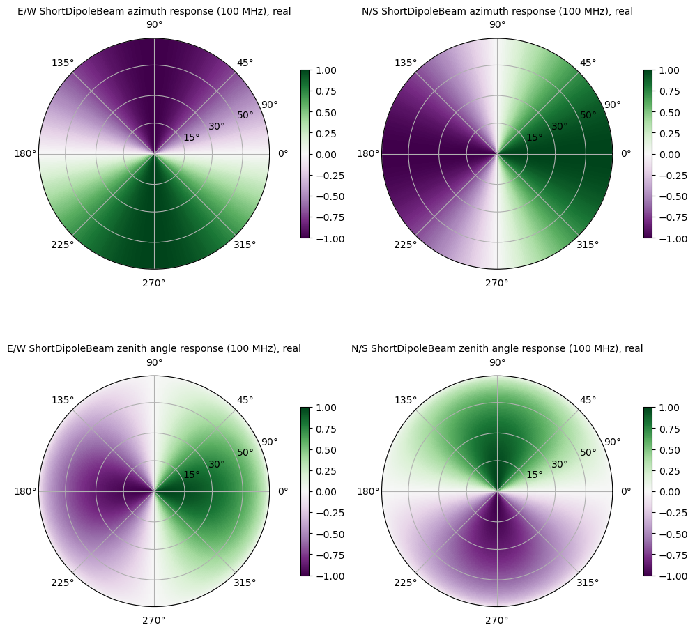

.. _analytic_beam_tutorial:

--------------
Analytic Beams
--------------

The analytic beams defined in pyuvdata are based on a base class,
:class:`pyuvdata.analytic_beam.AnalyticBeam`, which ensures a standard interface
and can be used to define other analytic beams in a consistent way.

Evaluating analytic beams
-------------------------

To evaluate an analytic beam at one or more frequencies and in in one or more
directions, use either the :meth:`pyuvdata.analytic_beam.AnalyticBeam.efield_eval`
or :meth:`pyuvdata.analytic_beam.AnalyticBeam.power_eval` methods as appropriate.

Evaluating an Airy Beam power response
**************************************

This code evaluates and plots an Airy beam power response. Note that we exclude
the cross polarizations, since this is an unpolarized beam, the cross polarizations
are identical to the auto polarization power beams. If the cross polarizations
are included, the array returned from the ``power_eval`` method will be complex.

.. code-block:: python

  >>> import matplotlib.pyplot as plt
  >>> import numpy as np
  >>> from matplotlib.colors import LogNorm

  >>> from pyuvdata import AiryBeam

  >>> # Create an AiryBeam with a diameter of 14.5 meters
  >>> airy_beam = AiryBeam(diameter=14.5, include_cross_pols=False)

  >>> # set up zenith angle, azimuth and frequency arrays to evaluate with
  >>> # make a regular grid in direction cosines for nice plots
  >>> n_vals = 100
  >>> zmax = np.radians(90)  # Degrees
  >>> axis_arr = np.arange(-n_vals/2., n_vals/2.) / float(n_vals/2.)
  >>> l_arr, m_arr = np.meshgrid(axis_arr, axis_arr)
  >>> radius = np.sqrt(l_arr**2 + m_arr**2)
  >>> za_array = radius * zmax
  >>> az_array = np.arctan2(m_arr, l_arr)

  >>> az_array = az_array.flatten()
  >>> za_array = za_array.flatten()

  >>> Nfreqs = 11
  >>> freqs = np.linspace(100, 200, 11) * 1e6

  >>> # find the values above the horizon so we don't evaluate beyond the horizon
  >>> above_hor = np.nonzero(za_array <= np.pi / 2.)[0]

  >>> # set up an output array that matches the expected shape, except that it
  >>> # includes the points beyond the horizon, and fill it with infinity.
  >>> # Then we will set the points above the horizon to the output of power_eval.
  >>> beam_vals = np.full((1, airy_beam.Npols, Nfreqs, n_vals * n_vals), np.inf, dtype=float)

  >>> beam_vals[:, :, :, above_hor] = airy_beam.power_eval(
  ...     az_array=az_array[above_hor], za_array=za_array[above_hor], freq_array=freqs
  ... )

  >>> beam_vals = np.reshape(beam_vals, (1, airy_beam.Npols, Nfreqs, n_vals, n_vals))

  >>> fig, ax = plt.subplots(1, 2)
  >>> bp_low = ax[0].imshow(
  ...   beam_vals[0,0,0],
  ...   norm=LogNorm(vmin = 1e-8, vmax =1),
  ...   extent=[np.min(l_arr), np.max(l_arr), np.min(m_arr), np.max(m_arr)],
  ...   origin="lower",
  ... )
  >>> _ = ax[0].set_title(f"Airy beam {freqs[0]*1e-6} MHz")
  >>> _ = fig.colorbar(bp_low, ax=ax[0], fraction=0.046, pad=0.04, location="left")

  >>> bp_high = ax[1].imshow(
  ...   beam_vals[0,0,-1],
  ...   norm=LogNorm(vmin = 1e-8, vmax =1),
  ...   extent=[np.min(l_arr), np.max(l_arr), np.min(m_arr), np.max(m_arr)],
  ...   origin="lower",
  ... )
  >>> _ = ax[1].set_title(f"Airy beam {freqs[-1]*1e-6} MHz")
  >>> _ = fig.colorbar(bp_high, ax=ax[1], fraction=0.046, pad=0.04, location="left")

  >>> for ind in range(2):
  ...   _ = ax[ind].set_xticks([0], labels=["North"])
  ...   _ = ax[ind].set_yticks([0], labels=["East"])
  ...   _ = ax[ind].yaxis.set_label_position("right")
  ...   _ = ax[ind].yaxis.tick_right()
  ...   _ = ax[ind].xaxis.set_label_position("top")
  ...   _ = ax[ind].xaxis.tick_top()

  >>> fig.tight_layout()
  >>> plt.show()  # doctest: +SKIP
  >>> plt.savefig("Images/airy_beam.png", bbox_inches='tight')
  >>> plt.clf()

.. image:: Images/airy_beam.png
  :width: 600

Evaluating a Short Dipole Beam E-Field response
***********************************************

This code evaluates and plots a short (Herzian) dipole beam E-field response
(also called the Jones matrix). Since it is the E-Field response, we have 4
effective maps because we have the response to each polarization basis vector
for each feed. In the case of a short dipole, these maps do not have an imaginary
part, but in general E-Field beams can be complex, so a complex array is returned.

.. code-block:: python

  >>> import matplotlib.pyplot as plt
  >>> import numpy as np

  >>> from pyuvdata import ShortDipoleBeam

  >>> # Create an ShortDipoleBeam
  >>> dipole_beam = ShortDipoleBeam()

  >>> # set up zenith angle, azimuth and frequency arrays to evaluate with
  >>> # make a regular grid in direction cosines for nice plots
  >>> n_vals = 100
  >>> zmax = np.radians(90)  # Degrees
  >>> axis_arr = np.arange(-n_vals/2., n_vals/2.) / float(n_vals/2.)
  >>> l_arr, m_arr = np.meshgrid(axis_arr, axis_arr)
  >>> radius = np.sqrt(l_arr**2 + m_arr**2)
  >>> za_array = radius * zmax
  >>> az_array = np.arctan2(m_arr, l_arr)

  >>> az_array = az_array.flatten()
  >>> za_array = za_array.flatten()

  >>> Nfreqs = 11
  >>> freqs = np.linspace(100, 200, 11) * 1e8

  >>> # find the values above the horizon so we don't evaluate beyond the horizon
  >>> above_hor = np.nonzero(za_array <= np.pi / 2.)[0]

  >>> # set up an output array that matches the expected shape except, that it
  >>> # includes the points beyond the horizon, and fill it with infinity.
  >>> # Then we will set the points above the horizon to the output of efield_eval.
  >>> beam_vals = np.full((dipole_beam.Naxes_vec, dipole_beam.Nfeeds, Nfreqs, n_vals * n_vals), np.inf, dtype=complex)

  >>> beam_vals[:, :, :, above_hor] = dipole_beam.efield_eval(
  ...     az_array=az_array[above_hor], za_array=za_array[above_hor], freq_array=freqs
  ... )

  >>> beam_vals = np.reshape(beam_vals, (dipole_beam.Naxes_vec, dipole_beam.Nfeeds, Nfreqs, n_vals, n_vals))

  >>> fig, ax = plt.subplots(2, 2)

  >>> be00 = ax[0,0].imshow(
  ...   beam_vals[0,0,0].real,
  ...   extent=[np.min(l_arr), np.max(l_arr), np.min(m_arr), np.max(m_arr)],
  ...   origin="lower",
  ... )
  >>> _ = ax[0,0].set_title("E/W dipole azimuth response")
  >>> _ = fig.colorbar(be00, ax=ax[0,0], location="left")

  >>> be10 = ax[1,0].imshow(
  ...   beam_vals[1,0,0].real,
  ...   extent=[np.min(l_arr), np.max(l_arr), np.min(m_arr), np.max(m_arr)],
  ...   origin="lower",
  ... )
  >>> _ = ax[1,0].set_title("E/W dipole zenith angle response")
  >>> _ = fig.colorbar(be10, ax=ax[1,0], location="left")

  >>> be01 = ax[0,1].imshow(
  ...   beam_vals[0,1,0].real,
  ...   extent=[np.min(l_arr), np.max(l_arr), np.min(m_arr), np.max(m_arr)],
  ...   origin="lower",
  ... )
  >>> _ = ax[0,1].set_title("N/S dipole azimuth response")
  >>> _ = fig.colorbar(be01, ax=ax[0,1], location="left")

  >>> be11 = ax[1,1].imshow(
  ...   beam_vals[1,1,0].real,
  ...   extent=[np.min(l_arr), np.max(l_arr), np.min(m_arr), np.max(m_arr)],
  ...   origin="lower",
  ... )
  >>> _ = ax[1,1].set_title("N/S dipole zenith angle response")
  >>> _ = fig.colorbar(be11, ax=ax[1,1], location="left")

  >>> for row_ind in range(2):
  ...   for col_ind in range(2):
  ...      _ = ax[row_ind,col_ind].set_xticks([0], labels=["North"])
  ...      _ = ax[row_ind,col_ind].set_yticks([0], labels=["East"])
  ...      _ = ax[row_ind,col_ind].yaxis.set_label_position("right")
  ...      _ = ax[row_ind,col_ind].yaxis.tick_right()
  ...      _ = ax[row_ind,col_ind].xaxis.set_label_position("top")
  ...      _ = ax[row_ind,col_ind].xaxis.tick_top()

  >>> fig.tight_layout()
  >>> plt.show()  # doctest: +SKIP
  >>> plt.savefig("Images/short_dipole_beam.png", bbox_inches='tight')
  >>> plt.clf()

Defining new analytic beams
---------------------------

We have worked to make defining new analytic beams as straight forward as possible.
The new beam needs to inherit from either the :class:`pyuvdata.analytic_beam.AnalyticBeam`,
or the :class:`pyuvdata.analytic_beam.UnpolarizedAnalyticBeam`, which are base
classes that specify what needs to be defined on the new class. Unpolarized
beams (based on the ``UnpolarizedAnalyticBeam`` class) have fewer things that
need to be specified.

Note that while unpolarized beams are simpler to define and think about, they
are quite unphysical and can have results that may be surprising to radio
astronomers. Since unpolarized feeds respond equally to all orientations of the
E-field, if two feeds are specified they will have cross-feed power responses that
are more similar to typical auto-feed power responses (and they will be identical
to auto-feed power responses if the two feeds have the same beam shapes).

Setting parameters on the beam
******************************

If the new beam has any parameters that control the beam response (e.g. diameter),
The class must have an ``@dataclass`` decorator and the parameters must be listed
in the class definitions with type annotations and optionally defaults (these
are called ``fields`` in the dataclass, see the examples below and
`dataclass <https://docs.python.org/3/library/dataclasses.html>`_ for more details).

If you need to do some manipulation or validation of the parameters after they
are specified by the user, you can use the ``validate`` method to do that
(under the hood the ``validate`` method is called by the base object's dataclass
``__post_init__`` method, so the ``validate`` method will always be called
when the class is instantiated).
The gaussian beam example below shows how this can be done.

Polarized beams
***************

For polarized beams (based on the ``AnalyticBeam`` class), the following items
may be specified, the defaults on the ``AnalyticBeam`` class are noted:

  - ``feed_array``: This an array of feed strings (a list can also be passed,
    it will be converted to an array). The default is ``["x", "y"]``.
    This is a a dataclass field, so if it is specified, the class must have
    ``@dataclass`` decorator and it should be specified with type annotations
    and optionally a default (see examples below).

  - ``x_orientation``: For linear polarization feeds, this specifies what the
    ``x`` feed polarization correspond to, allowed values are ``"east"`` or
    ``"north"``, the default is ``"east"``. Should be set to ``None`` for
    circularly polarized feeds.
    This is a a dataclass field, so if it is specified, the class must have
    ``@dataclass`` decorator and it should be specified with type annotations
    and optionally a default (see examples below).

  - ``basis_vector_type``: This defines the coordinate system for the
    polarization basis vectors, the default is ``"az_za"``. Currently only
    ``"az_za"`` is supported, which specifies that there are 2 vector directions
    (i.e. ``Naxes_vec`` is 2).
    This should be defined as a class variable (see examples below).

Defining the beam response
**************************

At least one of the ``_efield_eval`` or ``_power_eval`` methods must be
defined to specify the response of the new beam. Defining ``_efield_eval`` is
the most general approach because it can represent complex and negative going
E-field beams (if only ``_efield_eval`` defined, power beams will be calculated
from the E-field beams). If only ``_power_eval`` is defined, the E-field beam is
defined as the square root of the auto polarization power beam, so the E-field
beam will be real and positive definite. Both methods can be specified, which
may allow for computational efficiencies in some cases.

The inputs to the ``_efield_eval`` and ``_power_eval`` methods are the same and
give the directions (azimuth and zenith angle) and frequencies to evaluate the
beam. All three inputs must be two-dimensional with the first axis having the
length of the number of frequencies and the second axis having the having the
length of the number of directions (these are essentially the output of an
``np.meshgrid`` on the direction and frequency vectors). The inputs are:

    - ``az_grid``: an array of azimuthal values in radians for the directions
      to evaluate the beam. Shape: (number of frequencies, number of directions)
    - ``za_array``: an array of zenith angle values in radians for the directions
      to evaluate the beam. Shape: (number of frequencies, number of directions)
    - ``freq_array``: an array of frequencies in Hz at which to evaluate the beam.
      Shape: (number of frequencies, number of directions)

The ``_efield_eval`` and ``_power_eval`` methods must return arrays with the beam
response. The shapes and types of the returned arrays are:

    - _efield_eval: a complex array of beam responses with shape:
      (``Naxes_vec``, ``Nfeeds``, ``freq_array.size``, ``az_array.size``).
      ``Naxes_vec`` is 2 for the ``"az_za"`` basis, and ``Nfeeds`` is typically 2.

    - ``_power_eval``: an array with shape: (1, ``Npols``, ``freq_array.size``,
      ``az_array.size``). ``Npols`` is equal to either ``Nfeeds`` squared if
      ``include_cross_pols`` was set to True (the default) when the beam was
      instantiated or ``Nfeeds`` if ``include_cross_pols`` was set to False. The
      array should be real if ``include_cross_pols`` was set to False and it can
      be complex if ``include_cross_pols`` was set to True (it will be cast to
      complex when it is called via the ``power_eval`` method on the base class).

Below we provide some examples of beams defined in pyuvdata to make this more
concrete.

Example: Defining simple unpolarized beams
******************************************

Airy beams are unpolarized but frequency dependent and require one parameter,
the dish diameter in meters. Since the Airy beam E-field response goes negative,
the ``_efield_eval`` method is specified in this beam.

.. code-block:: python
  :linenos:

    from dataclasses import dataclass

    import numpy as np
    import numpy.typing as npt
    from astropy.constants import c as speed_of_light
    from scipy.special import j1
    from pyuvdata.analytic_beam import UnpolarizedAnalyticBeam

    @dataclass(kw_only=True)
    class AiryBeam(UnpolarizedAnalyticBeam):
        """
        A zenith pointed Airy beam.

        Airy beams are the diffraction pattern of a circular aperture, so represent
        an idealized dish. Requires a dish diameter in meters and is inherently
        chromatic and unpolarized.

        The unpolarized nature leads to some results that may be surprising to radio
        astronomers: if two feeds are specified they will have identical responses
        and the cross power beam between the two feeds will be identical to the
        power beam for a single feed.

        Attributes
        ----------
        diameter : float
            Dish diameter in meters.

        Parameters
        ----------
        diameter : float
            Dish diameter in meters.
        include_cross_pols : bool
            Option to include the cross polarized beams (e.g. xy and yx or en and ne) for
            the power beam.

        """

        diameter: float

        def _efield_eval(
            self,
            *,
            az_grid: npt.NDArray[float],
            za_grid: npt.NDArray[float],
            f_grid: npt.NDArray[float],
        ) -> npt.NDArray[float]:
            """Evaluate the efield at the given coordinates."""
            data_array = self._get_empty_data_array(az_grid.shape)

            kvals = (2.0 * np.pi) * f_grid / speed_of_light.to("m/s").value
            xvals = (self.diameter / 2.0) * np.sin(za_grid) * kvals
            values = np.zeros_like(xvals)
            nz = xvals != 0.0
            ze = xvals == 0.0
            values[nz] = 2.0 * j1(xvals[nz]) / xvals[nz]
            values[ze] = 1.0

            for fn in np.arange(self.Nfeeds):
                data_array[0, fn, :, :] = values / np.sqrt(2.0)
                data_array[1, fn, :, :] = values / np.sqrt(2.0)

            return data_array

Below we show how to define a cosine shaped beam with a single width parameter,
which can be defined with just the ``_power_eval`` method.

.. code-block:: python
  :linenos:

    from dataclasses import dataclass

    import numpy as np
    import numpy.typing as npt
    from pyuvdata.analytic_beam import UnpolarizedAnalyticBeam

    @dataclass(kw_only=True)
    class CosBeam(UnpolarizedAnalyticBeam):
        """
        A variable-width zenith pointed cosine beam.

        Attributes
        ----------
        width : float
            Width parameter, E-field goes like a cosine of width * zenith angle,
            power goes like the same cosine squared.

        Parameters
        ----------
        width : float
            Width parameter, E-field goes like a cosine of width * zenith angle,
            power goes like the same cosine squared.
        include_cross_pols : bool
            Option to include the cross polarized beams (e.g. xy and yx or en and ne) for
            the power beam.

        """

        width: float

        def _power_eval(
            self,
            *,
            az_grid: npt.NDArray[float],
            za_grid: npt.NDArray[float],
            f_grid: npt.NDArray[float],
        ) -> npt.NDArray[float]:
            """Evaluate the power at the given coordinates."""

            data_array = self._get_empty_data_array(az_grid.shape, beam_type="power")

            for pol_i in np.arange(self.Npols):
                data_array[0, pol_i, :, :] = np.cos(self.width * za_grid) ** 2

            return data_array

Defining a cosine beam with no free parameters is even simpler:

.. code-block:: python
  :linenos:

    import numpy as np
    import numpy.typing as npt
    from pyuvdata.analytic_beam import UnpolarizedAnalyticBeam

    class CosBeam(UnpolarizedAnalyticBeam):
        """
        A zenith pointed cosine beam.

        Parameters
        ----------
        include_cross_pols : bool
            Option to include the cross polarized beams (e.g. xy and yx or en and ne) for
            the power beam.

        """

        def _power_eval(
            self,
            *,
            az_grid: npt.NDArray[float],
            za_grid: npt.NDArray[float],
            f_grid: npt.NDArray[float],
        ) -> npt.NDArray[float]:
            """Evaluate the power at the given coordinates."""

            data_array = self._get_empty_data_array(az_grid.shape, beam_type="power")

            for pol_i in np.arange(self.Npols):
                data_array[0, pol_i, :, :] = np.cos(za_grid) ** 2

            return data_array

Example: Defining a simple polarized beam
*****************************************

Short (Hertzian) dipole beams are polarized but frequency independent and do not
require any extra parameters. We just inherit the default values of ``feed_array``
and ``x_orientation`` from the ``AnalyticBeam`` class, so do not list them here.

Note that we define both the ``_efield_eval`` and ``_power_eval`` methods because
we can use some trig identities to reduce the number of cos/sin evaluations for
the power calculation, but it would give the same results if the ``_power_eval``
method was not defined (we have tests verifying this).

.. code-block:: python
  :linenos:

    import numpy as np
    import numpy.typing as npt
    from pyuvdata.analytic_beam import AnalyticBeam

    class ShortDipoleBeam(AnalyticBeam):
        """
        A zenith pointed analytic short dipole beam with two crossed feeds.

        A classical short (Hertzian) dipole beam with two crossed feeds aligned east
        and north. Short dipole beams are intrinsically polarized but achromatic.
        Does not require any parameters, but the orientation of the dipole labelled
        as "x" can be specified to align "north" or "east" via the x_orientation
        parameter (matching the parameter of the same name on UVBeam and UVData
        objects).

        Attributes
        ----------
        feed_array : list of str
            Feeds to define this beam for, e.g. x & y or n & e (for "north" and "east").
        x_orientation : str
            The orientation of the dipole labeled 'x'. The default ("east") means
            that the x dipole is aligned east-west and that the y dipole is aligned
            north-south.

        Parameters
        ----------
        feed_array : list of str
            Feeds to define this beam for, e.g. x & y or n & e (for "north" and "east").
        x_orientation : str
            The orientation of the dipole labeled 'x'. The default ("east") means
            that the x dipole is aligned east-west and that the y dipole is aligned
            north-south.
        include_cross_pols : bool
            Option to include the cross polarized beams (e.g. xy and yx or en and ne)
            for the power beam.

        """

        basis_vector_type = "az_za"

        def _efield_eval(
            self,
            *,
            az_grid: npt.NDArray[float],
            za_grid: npt.NDArray[float],
            f_grid: npt.NDArray[float],
        ) -> npt.NDArray[float]:
            """Evaluate the efield at the given coordinates."""
            data_array = self._get_empty_data_array(az_grid.shape)

            # The first dimension is for [azimuth, zenith angle] in that order
            # the second dimension is for feed [e, n] in that order
            data_array[0, self.east_ind] = -np.sin(az_grid)
            data_array[0, self.north_ind] = np.cos(az_grid)
            data_array[1, self.east_ind] = np.cos(za_grid) * np.cos(az_grid)
            data_array[1, self.north_ind] = np.cos(za_grid) * np.sin(az_grid)

            return data_array

        def _power_eval(
            self,
            *,
            az_grid: npt.NDArray[float],
            za_grid: npt.NDArray[float],
            f_grid: npt.NDArray[float],
        ) -> npt.NDArray[float]:
            """Evaluate the power at the given coordinates."""
            data_array = self._get_empty_data_array(az_grid.shape, beam_type="power")

            # these are just the sum in quadrature of the efield components.
            # some trig work is done to reduce the number of cos/sin evaluations
            data_array[0, 0] = 1 - (np.sin(za_grid) * np.cos(az_grid)) ** 2
            data_array[0, 1] = 1 - (np.sin(za_grid) * np.sin(az_grid)) ** 2

            if self.Npols > self.Nfeeds:
                # cross pols are included
                data_array[0, 2] = -(np.sin(za_grid) ** 2) * np.sin(2.0 * az_grid) / 2.0
                data_array[0, 3] = data_array[0, 2]

            return data_array

If we wanted to specify the default feed_array to be ``["e", "n"]`` and that the
default x_orientation was ``"north"`` we would define it as shown below. We
handle the defaulting of the feed_array in the ``validate`` because dataclass
fields cannot have mutable defaults. We also do some other validation in that method.

.. code-block:: python
  :linenos:

    from typing import Literal
    from dataclasses import dataclass

    import numpy as np
    import numpy.typing as npt
    from pyuvdata.analytic_beam import AnalyticBeam

    @dataclass(kw_only=True)
    class ShortDipoleBeam(AnalyticBeam):
        """
        A zenith pointed analytic short dipole beam with two crossed feeds.

        A classical short (Hertzian) dipole beam with two crossed feeds aligned east
        and north. Short dipole beams are intrinsically polarized but achromatic.
        Does not require any parameters, but the orientation of the dipole labelled
        as "x" can be specified to align "north" or "east" via the x_orientation
        parameter (matching the parameter of the same name on UVBeam and UVData
        objects).

        Attributes
        ----------
        feed_array : list of str
            Feeds to define this beam for, e.g. x & y or n & e (for "north" and "east").
        x_orientation : str
            The orientation of the dipole labeled 'x'. The default ("east") means
            that the x dipole is aligned east-west and that the y dipole is aligned
            north-south.

        Parameters
        ----------
        feed_array : list of str
            Feeds to define this beam for, e.g. x & y or n & e (for "north" and "east").
        x_orientation : str
            The orientation of the dipole labeled 'x'. The default ("east") means
            that the x dipole is aligned east-west and that the y dipole is aligned
            north-south.
        include_cross_pols : bool
            Option to include the cross polarized beams (e.g. xy and yx or en and ne)
            for the power beam.

        """

        feed_array: npt.NDArray[str] | list[str] | None = None
        x_orientation: Literal["east", "north"] | None = "north"

        basis_vector_type = "az_za"

        def validate(self):
            """Post-initialization validation and conversions."""
            if self.feed_array is None:
                self.feed_array = ["e", "n"]

            allowed_feeds = ["n", "e", "x", "y"]
            for feed in self.feed_array:
                if feed not in allowed_feeds:
                    raise ValueError(
                        f"Feeds must be one of: {allowed_feeds}, "
                        f"got feeds: {self.feed_array}"
                    )

        def _efield_eval(
            self,
            *,
            az_grid: npt.NDArray[float],
            za_grid: npt.NDArray[float],
            f_grid: npt.NDArray[float],
        ) -> npt.NDArray[float]:
            """Evaluate the efield at the given coordinates."""
            data_array = self._get_empty_data_array(az_grid.shape)

            # The first dimension is for [azimuth, zenith angle] in that order
            # the second dimension is for feed [e, n] in that order
            data_array[0, self.east_ind] = -np.sin(az_grid)
            data_array[0, self.north_ind] = np.cos(az_grid)
            data_array[1, self.east_ind] = np.cos(za_grid) * np.cos(az_grid)
            data_array[1, self.north_ind] = np.cos(za_grid) * np.sin(az_grid)

            return data_array

        def _power_eval(
            self,
            *,
            az_grid: npt.NDArray[float],
            za_grid: npt.NDArray[float],
            f_grid: npt.NDArray[float],
        ) -> npt.NDArray[float]:
            """Evaluate the power at the given coordinates."""
            data_array = self._get_empty_data_array(az_grid.shape, beam_type="power")

            # these are just the sum in quadrature of the efield components.
            # some trig work is done to reduce the number of cos/sin evaluations
            data_array[0, 0] = 1 - (np.sin(za_grid) * np.cos(az_grid)) ** 2
            data_array[0, 1] = 1 - (np.sin(za_grid) * np.sin(az_grid)) ** 2

            if self.Npols > self.Nfeeds:
                # cross pols are included
                data_array[0, 2] = -(np.sin(za_grid) ** 2) * np.sin(2.0 * az_grid) / 2.0
                data_array[0, 3] = data_array[0, 2]

            return data_array

Example: Defining a beam with post init validation
**************************************************

The gaussian beam defined in pyuvdata is an unpolarized beam that has several
optional configurations that require some validation, which we do using the
``validate`` method.

.. code-block:: python
  :linenos:

    from dataclasses import dataclass
    from typing import Literal

    import numpy as np
    import numpy.typing as npt
    from astropy.constants import c as speed_of_light
    from pyuvdata.analytic_beam import UnpolarizedAnalyticBeam

    def diameter_to_sigma(diameter: float, freq_array: npt.NDArray[float]) -> float:
        """
        Find the sigma that gives a beam width similar to an Airy disk.

        Find the stddev of a gaussian with fwhm equal to that of
        an Airy disk's main lobe for a given diameter.

        Parameters
        ----------
        diameter : float
            Antenna diameter in meters
        freq_array : array of float
            Frequencies in Hz

        Returns
        -------
        sigma : float
            The standard deviation in zenith angle radians for a Gaussian beam
            with FWHM equal to that of an Airy disk's main lobe for an aperture
            with the given diameter.

        """
        wavelengths = speed_of_light.to("m/s").value / freq_array

        scalar = 2.2150894  # Found by fitting a Gaussian to an Airy disk function

        sigma = np.arcsin(scalar * wavelengths / (np.pi * diameter)) * 2 / 2.355

        return sigma

    @dataclass(kw_only=True)
    class GaussianBeam(UnpolarizedAnalyticBeam):
        """
        A circular, zenith pointed Gaussian beam.

        Requires either a dish diameter in meters or a standard deviation sigma in
        radians. Gaussian beams specified by a diameter will have their width
        matched to an Airy beam at each simulated frequency, so are inherently
        chromatic. For Gaussian beams specified with sigma, the sigma_type defines
        whether the width specified by sigma specifies the width of the E-Field beam
        (default) or power beam in zenith angle. If only sigma is specified, the
        beam is achromatic, optionally both the spectral_index and reference_frequency
        parameters can be set to generate a chromatic beam with standard deviation
        defined by a power law:

        stddev(f) = sigma * (f/ref_freq)**(spectral_index)

        Attributes
        ----------
        sigma : float
            Standard deviation in radians for the gaussian beam. Only one of sigma
            and diameter should be set.
        sigma_type : str
            Either "efield" or "power" to indicate whether the sigma specifies the size of
            the efield or power beam. Ignored if `sigma` is None.
        diameter : float
            Dish diameter in meters to use to define the size of the gaussian beam, by
            matching the FWHM of the gaussian to the FWHM of an Airy disk. This will result
            in a frequency dependent beam.  Only one of sigma and diameter should be set.
        spectral_index : float
            Option to scale the gaussian beam width as a power law with frequency. If set
            to anything other than zero, the beam will be frequency dependent and the
            `reference_frequency` must be set. Ignored if `sigma` is None.
        reference_frequency : float
            The reference frequency for the beam width power law, required if `sigma` is not
            None and `spectral_index` is not zero. Ignored if `sigma` is None.

        Parameters
        ----------
        sigma : float
            Standard deviation in radians for the gaussian beam. Only one of sigma
            and diameter should be set.
        sigma_type : str
            Either "efield" or "power" to indicate whether the sigma specifies the size of
            the efield or power beam. Ignored if `sigma` is None.
        diameter : float
            Dish diameter in meters to use to define the size of the gaussian beam, by
            matching the FWHM of the gaussian to the FWHM of an Airy disk. This will result
            in a frequency dependent beam.  Only one of sigma and diameter should be set.
        spectral_index : float
            Option to scale the gaussian beam width as a power law with frequency. If set
            to anything other than zero, the beam will be frequency dependent and the
            `reference_frequency` must be set. Ignored if `sigma` is None.
        reference_frequency : float
            The reference frequency for the beam width power law, required if `sigma` is not
            None and `spectral_index` is not zero. Ignored if `sigma` is None.
        include_cross_pols : bool
            Option to include the cross polarized beams (e.g. xy and yx or en and ne) for
            the power beam.

        """

        sigma: float | None = None
        sigma_type: Literal["efield", "power"] = "efield"
        diameter: float | None = None
        spectral_index: float = 0.0
        reference_frequency: float = None

        def validate(self):
            """Post-initialization validation and conversions."""
            if (self.diameter is None and self.sigma is None) or (
                self.diameter is not None and self.sigma is not None
            ):
                if self.diameter is None:
                    raise ValueError("Either diameter or sigma must be set.")
                else:
                    raise ValueError("Only one of diameter or sigma can be set.")

            if self.sigma is not None:
                if self.sigma_type not in ["efield", "power"]:
                    raise ValueError("sigma_type must be 'efield' or 'power'.")

                if self.sigma_type == "power":
                    self.sigma = np.sqrt(2) * self.sigma

                if self.spectral_index != 0.0 and self.reference_frequency is None:
                    raise ValueError(
                        "reference_frequency must be set if `spectral_index` is not zero."
                    )
                if self.reference_frequency is None:
                    self.reference_frequency = 1.0

        def get_sigmas(self, freq_array: npt.NDArray[float]) -> npt.NDArray[float]:
            """
            Get the sigmas for the gaussian beam using the diameter (if defined).

            Parameters
            ----------
            freq_array : array of floats
                Frequency values to get the sigmas for in Hertz.

            Returns
            -------
            sigmas : array_like of float
                Beam sigma values as a function of frequency. Size will match the
                freq_array size.

            """
            if self.diameter is not None:
                sigmas = diameter_to_sigma(self.diameter, freq_array)
            elif self.sigma is not None:
                sigmas = (
                    self.sigma
                    * (freq_array / self.reference_frequency) ** self.spectral_index
                )
            return sigmas

        def _power_eval(
            self,
            *,
            az_grid: npt.NDArray[float],
            za_grid: npt.NDArray[float],
            f_grid: npt.NDArray[float],
        ) -> npt.NDArray[float]:
            """Evaluate the power at the given coordinates."""
            sigmas = self.get_sigmas(f_grid)

            values = np.exp(-(za_grid ** 2) / (sigmas ** 2))
            data_array = self._get_empty_data_array(az_grid.shape, beam_type="power")
            for fn in np.arange(self.Npols):
                data_array[0, fn, :, :] = values

            return data_array
