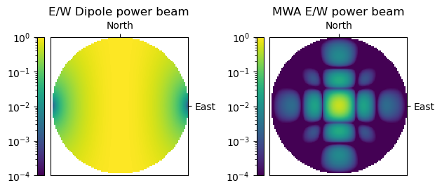

--------------
Beam Interface
--------------

The BeamInterface object is designed to provide a unified interface for UVBeam
and AnalyticBeam objects to compute beam response values. It can be constructed
with either a :class:`pyuvdata.UVBeam` or :class:`AnalyticBeam` and the beam
response can be calculated using the :meth:`pyuvdata.BeamInterface.compute_response`
method.

Using BeamInterface
-------------------

The following code shows how to set up two BeamInterface objects, one with an
analytic beam and one with a UVBeam. Then each is evalated at the same frequency
and directions using the same call to :meth:`pyuvdata.BeamInterface.compute_response`
and the results are plotted. The value of the BeamInterface object is that it
unifies the interface so the code calling it does not need to know if the beam
that is attached to it is an analytic beam or a UVBeam.

.. code-block:: python

  >>> import os
  >>> import matplotlib.pyplot as plt
  >>> import numpy as np
  >>> from matplotlib.colors import LogNorm

  >>> from pyuvdata import ShortDipoleBeam, BeamInterface, UVBeam
  >>> from pyuvdata.data import DATA_PATH

  >>> filename = os.path.join(DATA_PATH, "mwa_full_EE_test.h5")

  >>> dipole_beam = BeamInterface(ShortDipoleBeam(), beam_type="power")
  >>> mwa_beam = BeamInterface(UVBeam.from_file(filename, pixels_per_deg=1), beam_type="power")

  >>> # set up zenith angle, azimuth and frequency arrays to evaluate with
  >>> # make a regular grid in direction cosines for nice plots
  >>> n_vals = 100
  >>> zmax = np.radians(90)  # Degrees
  >>> axis_arr = np.arange(-n_vals/2., n_vals/2.) / float(n_vals/2.)
  >>> l_arr, m_arr = np.meshgrid(axis_arr, axis_arr)
  >>> radius = np.sqrt(l_arr**2 + m_arr**2)
  >>> za_array = radius * zmax
  >>> az_array = np.arctan2(m_arr, l_arr)

  >>> # Wrap the azimuth array to [0, 2pi] to match the extent of the UVBeam azimuth
  >>> where_neg_az = np.nonzero(az_array < 0)
  >>> az_array[where_neg_az] = az_array[where_neg_az] + np.pi * 2.
  >>> az_array = az_array.flatten()
  >>> za_array = za_array.flatten()

  >>> # find the values above the horizon so we don't try to interpolate the MWA beam
  >>> # beyond the horizon
  >>> above_hor = np.nonzero(za_array <= np.pi / 2.)[0]

  >>> # set up output arrays that matches the expected shape, except that they
  >>> # include the points beyond the horizon, and fill them with infinity.
  >>> # Then we will set the points above the horizon to the computed responses.
  >>> dipole_beam_vals = np.full((1, 4, 1, n_vals * n_vals), np.inf, dtype=complex)
  >>> mwa_beam_vals = np.full((1, 4, 1, n_vals * n_vals), np.inf, dtype=complex)

  >>> # The MWA beam we have in our test data is small, it only has 3 frequencies,
  >>> # so we will just get the value at one of those frequencies rather than
  >>> # trying to interpolate to a new frequency.
  >>> freqs = np.array([mwa_beam.beam.freq_array[-1]])

  >>> dipole_beam_vals[:, :, :, above_hor] = dipole_beam.compute_response(
  ...     az_array=az_array[above_hor], za_array=za_array[above_hor], freq_array=freqs
  ... )
  >>> dipole_beam_vals = dipole_beam_vals.reshape(4, n_vals, n_vals)

  >>> mwa_beam_vals[:, :, :, above_hor] = mwa_beam.compute_response(
  ...     az_array=az_array[above_hor], za_array=za_array[above_hor], freq_array=freqs
  ... )
  >>> mwa_beam_vals = mwa_beam_vals.reshape(4, n_vals, n_vals)

  >>> fig, ax = plt.subplots(1, 2)
  >>> bp_dip = ax[0].imshow(
  ...   dipole_beam_vals[0].real,
  ...   norm=LogNorm(vmin = 1e-4, vmax =1),
  ...   extent=[np.min(l_arr), np.max(l_arr), np.min(m_arr), np.max(m_arr)],
  ...   origin="lower",
  ... )
  >>> _ = ax[0].set_title(f"E/W Dipole power beam")
  >>> _ = fig.colorbar(bp_dip, ax=ax[0], fraction=0.046, pad=0.04, location="left")

  >>> bp_mwa = ax[1].imshow(
  ...   mwa_beam_vals[0].real,
  ...   norm=LogNorm(vmin = 1e-4, vmax =1),
  ...   extent=[np.min(l_arr), np.max(l_arr), np.min(m_arr), np.max(m_arr)],
  ...   origin="lower",
  ... )
  >>> _ = ax[1].set_title(f"MWA E/W power beam")
  >>> _ = fig.colorbar(bp_mwa, ax=ax[1], fraction=0.046, pad=0.04, location="left")

  >>> for ind in range(2):
  ...   _ = ax[ind].set_xticks([0], labels=["North"])
  ...   _ = ax[ind].set_yticks([0], labels=["East"])
  ...   _ = ax[ind].yaxis.set_label_position("right")
  ...   _ = ax[ind].yaxis.tick_right()
  ...   _ = ax[ind].xaxis.set_label_position("top")
  ...   _ = ax[ind].xaxis.tick_top()

  >>> fig.tight_layout()
  >>> plt.show()  # doctest: +SKIP
  >>> plt.savefig("Images/dipole_mwa_power.png", bbox_inches='tight')
  >>> plt.clf()

