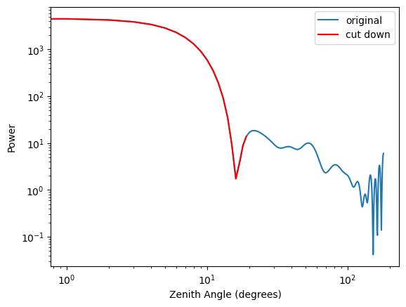
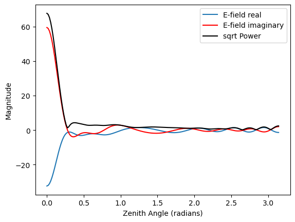
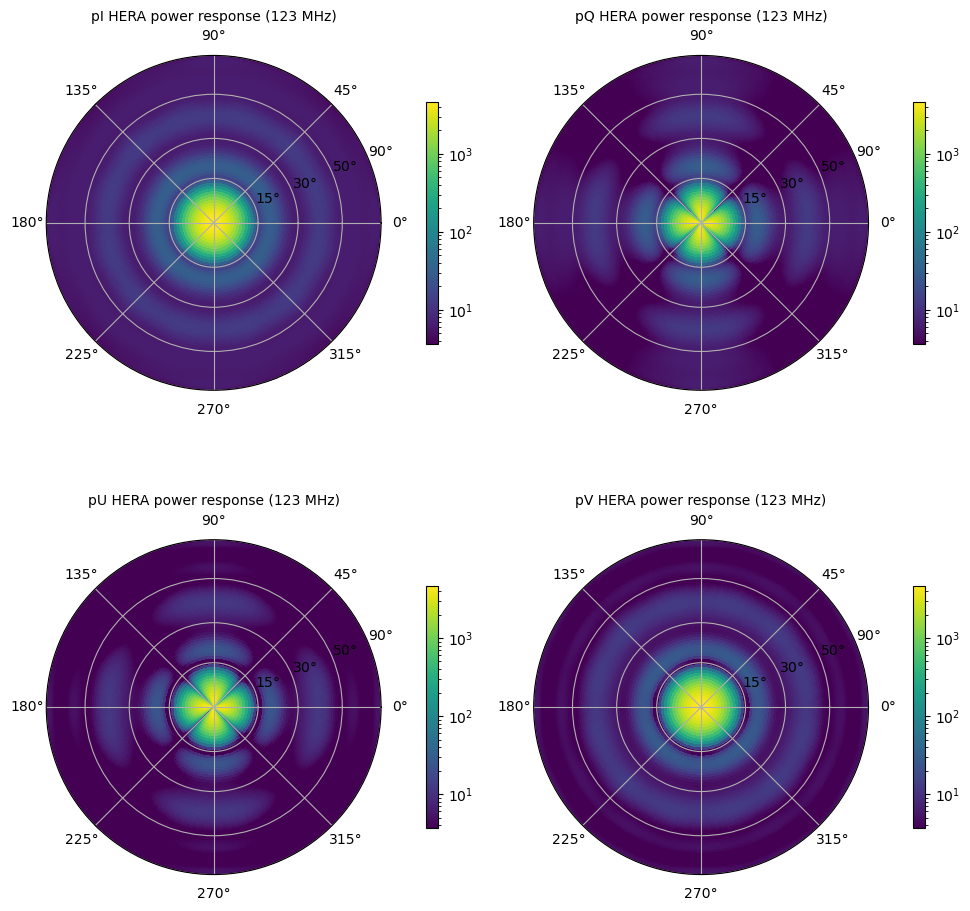

------
UVBeam
------

UVBeam objects hold all of the metadata and data required to work with primary beam
models for radio telescopes. UVBeam supports both E-field and power beams
(labeled by the ``beam_type`` attribute) in a few different coordinate and gridding
systems (e.g. regular azimuth/zenith angle grids, zenith-based HEALPix grids, labeled
by the ``pixel_coordinate_system`` attribute).

For E-field beams, UVBeam supports specifying the E-field components in two or three
directions which may not align with the pixel coordinate system (or even be orthogonal).
The mapping between the E-field component vectors and unit vectors aligned with the
pixel coordinate system is defined per pixel in the ``basis_vector_array``. That array
has an axis of length ``Naxes_vec`` which is the number of E-field components used to
specify the antenna response in each pixel, and an axis of length ``Ncomponents_vec``
which is the number of orthogonal unit vectors aligned with the pixel coordinate system
(in addition to the pixel coordinate system axis or axes). Some examples of these
parameters for common beam pixel and E-field coordinate systems include:

- pixels in regularly gridded azimuth and zenith angle, E-field in components aligned
  with azimuth and zenith angle in each pixel

  - ``Naxis_vec = 2``
  - ``Ncomponents_vec = 2``
  - ``basis_vector_array`` only contains ``1`` and ``0`` values, with ``1`` on the
    diagonal for each pixel.

    - ``basis_vector_array[0, 0, :, :] = 1``
    - ``basis_vector_array[0, 1, :, :] = 0``
    - ``basis_vector_array[1, 0, :, :] = 0``
    - ``basis_vector_array[1, 1, :, :] = 1``

- pixels in regularly gridded azimuth and zenith angle, Efield in (x,y,z) components.

  - ``Naxis_vec = 3``
  - ``Ncomponents_vec = 2``
  - ``basis_vector_array`` contains the mapping from (x, y, z) to (azimuth, zenith_angle)
    for the E-field (which is always orthogonal to the radial vector pointing to the
    pixel). The details of this mapping depend on the choice of how the (x, y, z) axes
    are labeled. UVBeam uses azimuth running from East to North. If +x points to East,
    +y points to North and +z points to the zenith:

    - ``basis_vector_array[0, 0, az, za] = -sin(az)``
    - ``basis_vector_array[0, 1, az, za] = cos(az)``
    - ``basis_vector_array[0, 2, az, za] = 0``
    - ``basis_vector_array[1, 0, az, za] = cos(za)cos(az)``
    - ``basis_vector_array[1, 1, az, za] = cos(za)sin(az)``
    - ``basis_vector_array[1, 2, az, za] = -sin(za)``

- pixels in an azimuth and zenith angle Healpix map (with zenith at the north pole) with
  E-field in components aligned with azimuth and zenith angle in each pixel.

  - ``Naxis_vec = 2``
  - ``Ncomponents_vec = 2``
  - ``basis_vector_array`` only contains ``1`` and ``0`` values, with ``1`` on the
    diagonal for each pixel.

    - ``basis_vector_array[0, 0, :] = 1``
    - ``basis_vector_array[0, 1, :] = 0``
    - ``basis_vector_array[1, 0, :] = 0``
    - ``basis_vector_array[1, 1, :] = 1``

UVBeam: Reading/writing
-----------------------
Reading and writing beam files using UVBeam.

The text files saved out of CST beam simulations do not have much of the
critical metadata needed for UVBeam objects. When reading in CST files, you
can either provide the required metadata using keywords to the :meth:`pyuvdata.UVBeam.read` method
and pass the raw CST files, or you can pass a settings yaml file which lists
the raw files and provides the required metadata to the :meth:`pyuvdata.UVBeam.read` method. Both
options are shown in the examples below. More details on creating a new yaml
settings files can be found in :doc:`cst_settings_yaml`.

UVBeam (like UVData) has a generic :meth:`pyuvdata.UVBeam.read` method and a
:meth:`pyuvdata.UVBeam.from_file` class method in addition to the file-type specific
methods.

a) Reading a CST power beam file
********************************
.. code-block:: python

  >>> import os
  >>> from pyuvdata import UVBeam
  >>> from pyuvdata.data import DATA_PATH

  # you can pass several filenames and the objects from each file will be
  # combined across the appropriate axis -- in this case frequency
  >>> filenames = [os.path.join(DATA_PATH, f) for f
  ...              in ['NicCSTbeams/HERA_NicCST_150MHz.txt',
  ...                  'NicCSTbeams/HERA_NicCST_123MHz.txt']]

  # You have to specify the telescope_name, feed_name, feed_version, model_name
  # and model_version because they are not included in the raw CST files.
  # You should also specify the polarization that the file represents and you can
  # set rotate_pol to generate the other polarization by rotating by 90 degrees.
  # The feed_pol defaults to 'x' and rotate_pol defaults to True.
  >>> beam = UVBeam.from_file(
  ...   filenames, beam_type='power', frequency=[150e6, 123e6],
  ...   feed_pol='x', rotate_pol=True, telescope_name='HERA',
  ...   feed_name='PAPER_dipole', feed_version='0.1',
  ...   model_name='E-field pattern - Rigging height 4.9m',
  ...   model_version='1.0', mount_type='fixed',
  ... )
  >>> print(beam.beam_type)
  power
  >>> print(beam.pixel_coordinate_system)
  az_za
  >>> print(beam.data_normalization)
  physical

  >>> # You can also use a yaml settings file.
  >>> # Note that using a yaml file requires that pyyaml is installed.
  >>> settings_file = os.path.join(DATA_PATH, 'NicCSTbeams/NicCSTbeams.yaml')
  >>> beam = UVBeam.from_file(settings_file, beam_type='power')
  >>> print(beam.beam_type)
  power
  >>> print(beam.pixel_coordinate_system)
  az_za
  >>> print(beam.data_normalization)
  physical

  >>> # number of beam polarizations and polarization type.
  >>> print((beam.Npols, beam.polarization_array))
  (2, array([-5, -6]))
  >>> print(beam.Nfreqs)
  2
  >>> print(beam.data_array.shape)
  (1, 2, 2, 181, 360)

b) Reading a CST E-field beam file
**********************************
.. code-block:: python

  >>> import os
  >>> from pyuvdata import UVBeam
  >>> from pyuvdata.data import DATA_PATH
  >>> import numpy as np

  >>> # the same interface as for power beams, just specify beam_type = 'efield'
  >>> settings_file = os.path.join(DATA_PATH, 'NicCSTbeams/NicCSTbeams.yaml')
  >>> beam = UVBeam.from_file(settings_file, beam_type='efield')
  >>> print(beam.beam_type)
  efield

  >>> # UVBeam also has a `from_file` class method we can call directly.
  >>> beam3 = UVBeam.from_file(settings_file, beam_type="efield")
  >>> beam == beam3
  True

c) Reading a FEKO beam file (Power & E-field)
**********************************
.. code-block:: python

  >>> import os
  >>> from pyuvdata import UVBeam
  >>> from pyuvdata.data import DATA_PATH
  >>> import numpy as np

  >>> filename_x = "OVRO_LWA_x.ffe"
  >>> filename_y = "OVRO_LWA_y.ffe"
  >>> feko_folder = "OVRO_LWA_FEKOBeams"
  >>> feko_filename_x = os.path.join(DATA_PATH, feko_folder, filename_x)
  >>> feko_filename_y = os.path.join(DATA_PATH, feko_folder, filename_y)

  >>> pbeam_feko = UVBeam.from_file(
  ...   [feko_filename_x, feko_filename_y], beam_type='power', feed_pol=['x', 'y'],
  ...   feed_angle=[np.pi/2, 0.0], telescope_name='LWA',feed_name='LWA', feed_version='1',
  ...   model_name='FEKO_MROsoil_test', model_version='1.0', mount_type="fixed"
  ... )
  >>> print(np.shape(pbeam_feko.data_array))
  (1, 2, 3, 181, 181)

  >>> ebeam_feko = UVBeam.from_file(
  ...   [feko_filename_x, feko_filename_y], beam_type='efield', feed_pol=['x', 'y'],
  ...   feed_angle=[np.pi/2, 0.0], telescope_name='LWA',feed_name='LWA', feed_version='1',
  ...   model_name='FEKO_MROsoil_test', model_version='1.0', mount_type="fixed"
  ... )
  >>> print(np.shape(ebeam_feko.data_array))
  (2, 2, 3, 181, 181)

d) Reading in the MWA full embedded element beam
************************************************
.. code-block:: python

  >>> # To get all the frequencies available for the MWA full embedded element beam
  >>> # you need to download the output simulation file via
  >>> # `wget http://cerberus.mwa128t.org/mwa_full_embedded_element_pattern.h5`
  >>> # For this tutorial we use the file saved in the test data which only
  >>> # contains a few frequencies.
  >>> # The `read_mwa_beam` method takes delay and amplitude arrays to generate beams
  >>> # pointed any where or with varying gains per dipole. Set a delay to 32
  >>> # to get a beam where that dipole is turned off (or set the amplitude to zero).
  >>> # The native format of the beam is spherical harmonic modes, so there is also
  >>> # an option `pixels_per_deg` to set the output beam resolution
  >>> # (default is 5 pixels per degree).

  >>> import os
  >>> import numpy as np
  >>> from pyuvdata import UVBeam
  >>> from pyuvdata.data import DATA_PATH

  >>> mwa_beam_file = os.path.join(DATA_PATH, 'mwa_full_EE_test.h5')
  >>> beam = UVBeam.from_file(mwa_beam_file)
  >>> print(beam.beam_type)
  efield

  >>> delays = np.zeros((2, 16), dtype='int')
  >>> delays[:, 0] = 32
  >>> beam = UVBeam.from_file(mwa_beam_file, pixels_per_deg=1, delays=delays)

d) Writing a regularly gridded beam FITS file
**********************************************
When reading a beam FITS file, you also have the option of selecting frequencies and
az/za values at the read step -- i.e. so that memory is never allocated for data outside
these ranges. Use the ``freq_range``, ``za_range`` and ``az_range`` parameters to
achieve this. The ``freq_range`` parameter will be effective for both HEALpix beamfits
files and az/za grid.

.. code-block:: python

  >>> import os
  >>> from pyuvdata import UVBeam
  >>> from pyuvdata.data import DATA_PATH
  >>> settings_file = os.path.join(DATA_PATH, 'NicCSTbeams/NicCSTbeams.yaml')
  >>> beam = UVBeam()
  >>> beam.read(
  ...    settings_file,
  ...    beam_type='power',
  ...    freq_range=(1e8, 1.5e8),
  ...    za_range=(0, 90.0),
  ... )
  >>> write_file = os.path.join('.', 'tutorial.fits')
  >>> beam.write_beamfits(write_file, clobber=True)

e) Writing a HEALPix beam FITS file
***********************************
See :ref:`uvbeam_to_healpix` for more details on the :meth:`pyuvdata.UVBeam.to_healpix` method.

.. code-block:: python

  >>> import os
  >>> import numpy as np
  >>> from pyuvdata import UVBeam
  >>> from pyuvdata.data import DATA_PATH
  >>> settings_file = os.path.join(DATA_PATH, 'NicCSTbeams/NicCSTbeams.yaml')
  >>> beam = UVBeam.from_file(settings_file, beam_type='power')

  >>> # note that the `to_healpix` method requires astropy_healpix to be installed
  >>> # this beam file is very large. Let's cut down the size to ease the computation
  >>> # More on the `select` method is covered in the following section
  >>> za_max = np.deg2rad(10.0)
  >>> za_inds_use = np.nonzero(beam.axis2_array <= za_max)[0]
  >>> beam.select(axis2_inds=za_inds_use)

  >>> beam.to_healpix()
  >>> write_file = os.path.join('.', 'tutorial.fits')
  >>> beam.write_beamfits(write_file, clobber=True)

UVBeam: Instantiating from arrays in memory
-------------------------------------------
``pyuvdata`` can also be used to create a UVBeam object from arrays in memory. This
is useful for mocking up data for testing or for creating a UVBeam object from
simulated data. Instead of instantiating a blank object and setting each required
parameter, you can use the ``.new()`` static method, which deals with the task
of creating a consistent object from a minimal set of inputs

.. code-block:: python

  >>> from pyuvdata import UVBeam
  >>> from astropy.coordinates import EarthLocation
  >>> import numpy as np
  >>> uvb = UVBeam.new(
  ...     telescope_name="test",
  ...     data_normalization="physical",
  ...     freq_array=np.linspace(100e6, 200e6, 10),
  ...     x_orientation = "east",
  ...     feed_array = ["x", "y"],
  ...     mount_type = "fixed",
  ...     axis1_array=np.deg2rad(np.linspace(-180, 179, 360)),
  ...     axis2_array=np.deg2rad(np.linspace(0, 90, 181)),
  ... )

Notice that you need only provide the required parameters, and the rest will be
filled in with sensible defaults.

See the full documentation for the method
:func:`pyuvdata.uvbeam.UVBeam.new` for more information.

UVBeam: Selecting data
----------------------
The :meth:`pyuvdata.UVBeam.select` method lets you select specific image axis indices
(or pixels if pixel_coordinate_system is HEALPix), frequencies and feeds
(or polarizations if beam_type is power) to keep in the object while removing others.
By default, :meth:`pyuvdata.UVBeam.select` will select data that matches the supplied
criteria, but by setting ``invert=True``, you can instead *deselect* this data and
preserve only that which does not match the selection.

a) Selecting a range of Zenith Angles
*************************************
.. code-block:: python

  >>> import os
  >>> import numpy as np
  >>> from pyuvdata import UVBeam
  >>> from pyuvdata.data import DATA_PATH
  >>> import matplotlib.pyplot as plt
  >>> settings_file = os.path.join(DATA_PATH, 'NicCSTbeams/NicCSTbeams.yaml')
  >>> beam = UVBeam.from_file(settings_file, beam_type='power')
  >>> # Make a new object with a reduced zenith angle range with the select method
  >>> new_beam = beam.select(axis2_inds=np.arange(0, 20), inplace=False)

  >>> # plot zenith angle cut through beams
  >>> fig, ax = plt.subplots(1, 1)
  >>> _ = ax.plot(np.rad2deg(beam.axis2_array), beam.data_array[0, 0, 0, :, 0], label="original")
  >>> _ = ax.plot(np.rad2deg(new_beam.axis2_array), new_beam.data_array[0, 0, 0, :, 0], 'r', label="cut down")
  >>> _ = ax.set_xscale('log')
  >>> _ = ax.set_yscale('log')
  >>> _ = ax.set_xlabel('Zenith Angle (degrees)')
  >>> _ = ax.set_ylabel('Power')
  >>> _ = fig.legend(loc="upper right", bbox_to_anchor=[0.9,0.88])
  >>> plt.show()  # doctest: +SKIP
  >>> plt.savefig("Images/select_beam_cut.png", bbox_inches='tight')
  >>> plt.clf()

a) Selecting Feeds or Polarizations
***********************************
Selecting feeds on E-field beams can be done using the feed name (e.g. "x" or "y").
Strings representing the physical orientation of the feed (e.g. "n" or "e) can also
be used if the feeds are oriented toward 0 or 90 degrees (as denoted by ``feed_angle``).

Selecting polarizations on power beams can be done either using the polarization
numbers or the polarization strings (e.g. "xx" or "yy" for linear polarizations or
"rr" or "ll" for circular polarizations). Strings representing the physical orientation
of the feed (e.g. "nn" or "ee") can also be used if the feeds are oriented toward 0 or
90 degrees (as denoted by ``feed_angle``).

.. code-block:: python

  >>> import os
  >>> import numpy as np
  >>> from pyuvdata import UVBeam
  >>> from pyuvdata.data import DATA_PATH
  >>> from pyuvdata import utils
  >>> settings_file = os.path.join(DATA_PATH, 'NicCSTbeams/NicCSTbeams.yaml')
  >>> uvb = UVBeam.from_file(settings_file, beam_type='efield')

  >>> # The feeds names can be found in the feed_array
  >>> print(uvb.feed_array)
  ['x' 'y']

  >>> # make a copy and select a feed
  >>> uvb2 = uvb.copy()
  >>> uvb2.select(feeds=["y"])
  >>> print(uvb2.feed_array)
  ['y']

  >>> # check the feed_angle
  >>> print(uvb2.feed_angle)
  [0.]

  >>> # check the x_orientation
  >>> print(uvb.get_x_orientation_from_feeds())
  east

  >>> # make a copy and select a feed by phyiscal orientation
  >>> uvb2 = uvb.copy()
  >>> uvb2.select(feeds=["n"])
  >>> print(uvb2.feed_array)
  ['y']

  >>> # Finally, try a deselect
  >>> uvb2 = uvb.copy()
  >>> uvb2.select(feeds=["x"], invert=True)
  >>> print(uvb2.feed_array)
  ['y']

  >>> # convert to a power beam for selecting on polarizations
  >>> uvb.efield_to_power()
  >>> # polarization numbers can be found in the polarization_array
  >>> print(uvb.polarization_array)
  [-5 -6 -7 -8]

  >>> # polarization numbers can be converted to strings using a utility function
  >>> print(utils.polnum2str(uvb.polarization_array))
  ['xx', 'yy', 'xy', 'yx']

  >>> # select polarizations using the polarization numbers
  >>> uvb.select(polarizations=[-5, -6, -7])

  >>> # print polarization numbers and strings after select
  >>> print(uvb.polarization_array)
  [-5 -6 -7]
  >>> print(utils.polnum2str(uvb.polarization_array))
  ['xx', 'yy', 'xy']

  >>> # select polarizations using the polarization strings
  >>> uvb.select(polarizations=["xx", "yy"])

  >>> # print polarization numbers and strings after select
  >>> print(uvb.polarization_array)
  [-5 -6]
  >>> print(utils.polnum2str(uvb.polarization_array))
  ['xx', 'yy']

  >>> # print feed_angle
  >>> print(uvb.feed_angle)
  [1.57079633 0.        ]

  >>> # print x_orientation
  >>> print(uvb.get_x_orientation_from_feeds())
  east

  >>> # select polarizations using the physical orientation strings
  >>> uvb.select(polarizations=["ee"])

  >>> # print polarization numbers and strings after select
  >>> print(uvb.polarization_array)
  [-5]
  >>> print(utils.polnum2str(uvb.polarization_array))
  ['xx']

.. _uvbeam_to_healpix:

UVBeam: Interpolating to HEALPix
--------------------------------
Note that interpolating from one gridding format to another incurs interpolation
errors. If the beam is going to be interpolated (e.g. to source locations) in
downstream code we urge the user use the beam in the original format to avoid incurring
extra interpolation errors.

.. code-block:: python

  >>> import os
  >>> import numpy as np
  >>> from astropy_healpix import HEALPix
  >>> import matplotlib.pyplot as plt
  >>> from matplotlib.colors import LogNorm
  >>> from pyuvdata import UVBeam
  >>> from pyuvdata.data import DATA_PATH
  >>> import pyuvdata.utils as uvutils
  >>> settings_file = os.path.join(DATA_PATH, 'NicCSTbeams/NicCSTbeams.yaml')
  >>> beam = UVBeam.from_file(settings_file, beam_type='power')

  >>> # Let's cut down to a small area near zenith so we can see the pixelization
  >>> za_max = np.deg2rad(20.0)
  >>> za_inds_use = np.nonzero(beam.axis2_array <= za_max)[0]
  >>> beam.select(axis2_inds=za_inds_use)

  >>> # Optionally specify which interpolation function to use.
  >>> hpx_beam = beam.to_healpix(inplace=False, interpolation_function="az_za_simple")

  >>> # Now plot the pixels on an polar projection with zenith in the center
  >>> radial_ticks_deg = [5, 10, 20]

  >>> az_array, za_array = np.meshgrid(beam.axis1_array, beam.axis2_array)
  >>> az_za_radial_val = np.sin(za_array)
  >>> fig, (ax1, ax2) = plt.subplots(1, 2, subplot_kw=dict(projection='polar'), figsize=(15, 15))
  >>> ax1.grid(True)
  >>> img1 = ax1.scatter(az_array, az_za_radial_val, c=beam.data_array[0,0,0,:], cmap="plasma", norm=LogNorm())
  >>> cbar=plt.colorbar(img1, ax=ax1, label="Beam power", orientation="vertical",shrink=.5, format="%4.1e")
  >>> _ = ax1.set_yticks(np.sin(np.deg2rad(radial_ticks_deg)))
  >>> _ = ax1.set_yticklabels([f"{rt}" + r"$\degree$" for rt in radial_ticks_deg])
  >>> _ = ax1.set_title("Az/ZA Beam")

  >>> hpx_obj = HEALPix(nside=hpx_beam.nside, order=hpx_beam.ordering)
  >>> hpx_lon, hpx_lat = hpx_obj.healpix_to_lonlat(hpx_beam.pixel_array)
  >>> za, az = uvutils.coordinates.hpx_latlon_to_zenithangle_azimuth(hpx_lat.rad, hpx_lon.rad)
  >>> hpx_radial_val = np.sin(za)

  >>> ax2.grid(True)
  >>> img2 = ax2.scatter(az, hpx_radial_val, c=hpx_beam.data_array[0,0,0,:], cmap="plasma", norm=LogNorm())
  >>> cbar=plt.colorbar(img2, ax=ax2, label="Beam power", orientation="vertical",shrink=.5, format="%4.1e")

  >>> _ = ax2.set_yticks(np.sin(np.deg2rad(radial_ticks_deg)))
  >>> _ = ax2.set_yticklabels([f"{rt}" + r"$\degree$" for rt in radial_ticks_deg])
  >>> _ = ax2.set_title("Healpix Beam")

  >>> fig.tight_layout()
  >>> plt.show() # doctest: +SKIP
  >>> plt.savefig("Images/hera_orig_healpix.png", bbox_inches='tight', dpi=80)
  >>> plt.clf()

.. image:: Images/hera_orig_healpix.png
  :width: 600

UVBeam: Converting from E-Field beams to Power Beams
----------------------------------------------------

a) Convert a regularly gridded efield beam to a power beam (leaving original intact).
*************************************************************************************
.. code-block:: python

  >>> import os
  >>> import numpy as np
  >>> import matplotlib.pyplot as plt
  >>> from pyuvdata import UVBeam
  >>> from pyuvdata.data import DATA_PATH
  >>> settings_file = os.path.join(DATA_PATH, 'NicCSTbeams/NicCSTbeams.yaml')
  >>> beam = UVBeam.from_file(settings_file, beam_type='efield')
  >>> new_beam = beam.efield_to_power(inplace=False)

  >>> # plot zenith angle cut through the beams
  >>> _ = plt.plot(beam.axis2_array, beam.data_array[1, 0, 0, :, 0].real, label='E-field real')
  >>> _ = plt.plot(beam.axis2_array, beam.data_array[1, 0, 0, :, 0].imag, 'r', label='E-field imaginary')
  >>> _ = plt.plot(new_beam.axis2_array, np.sqrt(new_beam.data_array[0, 0, 0, :, 0]), 'black', label='sqrt Power')
  >>> _ = plt.xlabel('Zenith Angle (radians)')
  >>> _ = plt.ylabel('Magnitude')
  >>> _ = plt.legend()
  >>> plt.show() # doctest: +SKIP
  >>> plt.savefig("Images/efield_power_beam_cut.png", bbox_inches='tight')
  >>> plt.clf()

b) Generating pseudo Stokes ('pI', 'pQ', 'pU', 'pV') beams
**********************************************************
.. code-block:: python

  >>> import os
  >>> import numpy as np
  >>> import matplotlib.pyplot as plt
  >>> from matplotlib.colors import LogNorm
  >>> from pyuvdata import UVBeam
  >>> from pyuvdata.data import DATA_PATH
  >>> from pyuvdata import utils
  >>> settings_file = os.path.join(DATA_PATH, 'NicCSTbeams/NicCSTbeams.yaml')
  >>> beam = UVBeam.from_file(settings_file, beam_type='efield')

  >>> # this beam file is very large. Let's cut down the size to ease the computation
  >>> za_max = np.deg2rad(90.0)
  >>> za_inds_use = np.nonzero(beam.axis2_array <= za_max)[0]
  >>> beam.select(axis2_inds=za_inds_use)

  >>> pstokes_beam = beam.efield_to_pstokes(inplace=False)

  >>> # plotting pseudo-stokes
  >>> pol_array = pstokes_beam.polarization_array
  >>> pI_ind = np.where(np.isin(pol_array, utils.polstr2num('pI')))[0][0]
  >>> pQ_ind = np.where(np.isin(pol_array, utils.polstr2num('pQ')))[0][0]

  >>> # Now plot the pixels on an polar projection with zenith in the center
  >>> radial_ticks_deg = [10, 30, 50, 90]
  >>> az_array, za_array = np.meshgrid(pstokes_beam.axis1_array, pstokes_beam.axis2_array)
  >>> az_za_radial_val = np.sin(za_array)
  >>> fig, (ax1, ax2) = plt.subplots(1, 2, subplot_kw=dict(projection='polar'), figsize=(15, 15))
  >>> ax1.grid(True)
  >>> img1 = ax1.scatter(az_array, az_za_radial_val, c=pstokes_beam.data_array[0,  pI_ind, 0], cmap="plasma", norm=LogNorm())
  >>> cbar=plt.colorbar(img1, ax=ax1, label="Beam power", orientation="vertical",shrink=.5, format="%4.1e")
  >>> _ = ax1.set_yticks(np.sin(np.deg2rad(radial_ticks_deg)))
  >>> _ = ax1.set_yticklabels([f"{rt}" + r"$\degree$" for rt in radial_ticks_deg])
  >>> _ = ax1.set_title("pI")

  >>> ax2.grid(True)
  >>> img2 = ax2.scatter(az_array, az_za_radial_val, c=pstokes_beam.data_array[0,  pQ_ind, 0], cmap="plasma", norm=LogNorm())
  >>> cbar=plt.colorbar(img2, ax=ax2, label="Beam power", orientation="vertical",shrink=.5, format="%4.1e")
  >>> _ = ax2.set_yticks(np.sin(np.deg2rad(radial_ticks_deg)))
  >>> _ = ax2.set_yticklabels([f"{rt}" + r"$\degree$" for rt in radial_ticks_deg])
  >>> _ = ax2.set_title("pQ")

  >>> fig.tight_layout()
  >>> plt.show() # doctest: +SKIP
  >>> plt.savefig("Images/hera_pstokes.png", bbox_inches='tight')
  >>> plt.clf()

UVBeam: Calculating beam areas
------------------------------
Calculations of the beam area and beam squared area are frequently required inputs for
Epoch of Reionization power spectrum calculations. These areas can be calculated for
either instrumental or pseudo Stokes beams using the :meth:`pyuvdata.UVBeam.get_beam_area`
and :meth:`pyuvdata.UVBeam.get_beam_sq_area` methods. Currently these methods do require
that the beams are in Healpix coordinates in order to take advantage of equal pixel areas.
They can be interpolated to HEALPix using the :meth:`pyuvdata.UVBeam.to_healpix` method.

a) Calculating pseudo Stokes ('pI', 'pQ', 'pU', 'pV') beam area and beam squared area
*************************************************************************************
.. code-block:: python

  >>> import os
  >>> import numpy as np
  >>> from pyuvdata import UVBeam
  >>> from pyuvdata.data import DATA_PATH
  >>> settings_file = os.path.join(DATA_PATH, 'NicCSTbeams/NicCSTbeams.yaml')
  >>> beam = UVBeam.from_file(settings_file, beam_type='efield')

  >>> # note that the `to_healpix` method requires astropy_healpix to be installed
  >>> # this beam file is very large. Let's cut down the size to ease the computation
  >>> za_max = np.deg2rad(10.0)
  >>> za_inds_use = np.nonzero(beam.axis2_array <= za_max)[0]
  >>> beam.select(axis2_inds=za_inds_use)

  >>> pstokes_beam = beam.to_healpix(inplace=False)
  >>> pstokes_beam.efield_to_pstokes()
  >>> pstokes_beam.peak_normalize()

  >>> # calculating beam area
  >>> freqs = pstokes_beam.freq_array
  >>> pI_area = pstokes_beam.get_beam_area('pI')
  >>> pQ_area = pstokes_beam.get_beam_area('pQ')
  >>> pU_area = pstokes_beam.get_beam_area('pU')
  >>> pV_area = pstokes_beam.get_beam_area('pV')
  >>> pI_area1, pI_area2 = round(pI_area[0].real, 5), round(pI_area[1].real, 5)
  >>> pQ_area1, pQ_area2 = round(pQ_area[0].real, 5), round(pQ_area[1].real, 5)
  >>> pU_area1, pU_area2 = round(pU_area[0].real, 5), round(pU_area[1].real, 5)
  >>> pV_area1, pV_area2 = round(pV_area[0].real, 5), round(pV_area[1].real, 5)

  >>> print (f'Beam area at {freqs[0]*1e-6} MHz for pseudo-stokes\nI: {pI_area1}\nQ: {pQ_area1}\nU: {pU_area1}\nV: {pV_area1}')
  Beam area at 123.0 MHz for pseudo-stokes
  I: 0.04674
  Q: 0.02904
  U: 0.02879
  V: 0.0464

  >>> print (f'Beam area at {freqs[1]*1e-6} MHz for pseudo-stokes\nI: {pI_area2}\nQ: {pQ_area2}\nU: {pU_area2}\nV: {pV_area2}')
  Beam area at 150.0 MHz for pseudo-stokes
  I: 0.03237
  Q: 0.01995
  U: 0.01956
  V: 0.03186

  >>> # calculating beam squared area
  >>> freqs = pstokes_beam.freq_array
  >>> pI_sq_area = pstokes_beam.get_beam_sq_area('pI')
  >>> pQ_sq_area = pstokes_beam.get_beam_sq_area('pQ')
  >>> pU_sq_area = pstokes_beam.get_beam_sq_area('pU')
  >>> pV_sq_area = pstokes_beam.get_beam_sq_area('pV')
  >>> pI_sq_area1, pI_sq_area2 = round(pI_sq_area[0].real, 5), round(pI_sq_area[1].real, 5)
  >>> pQ_sq_area1, pQ_sq_area2 = round(pQ_sq_area[0].real, 5), round(pQ_sq_area[1].real, 5)
  >>> pU_sq_area1, pU_sq_area2 = round(pU_sq_area[0].real, 5), round(pU_sq_area[1].real, 5)
  >>> pV_sq_area1, pV_sq_area2 = round(pV_sq_area[0].real, 5), round(pV_sq_area[1].real, 5)

  >>> print (f'Beam squared area at {freqs[0]*1e-6} MHz for pseudo-stokes\nI: {pI_sq_area1}\nQ: {pQ_sq_area1}\nU: {pU_sq_area1}\nV: {pV_sq_area1}')
  Beam squared area at 123.0 MHz for pseudo-stokes
  I: 0.02474
  Q: 0.01186
  U: 0.01179
  V: 0.0246

  >>> print (f'Beam squared area at {freqs[1]*1e-6} MHz for pseudo-stokes\nI: {pI_sq_area2}\nQ: {pQ_sq_area2}\nU: {pU_sq_area2}\nV: {pV_sq_area2}')
  Beam squared area at 150.0 MHz for pseudo-stokes
  I: 0.01696
  Q: 0.00798
  U: 0.00792
  V: 0.01686
