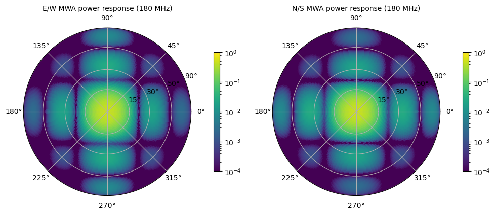
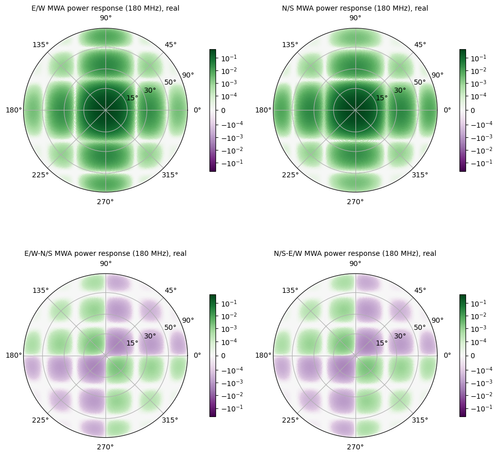
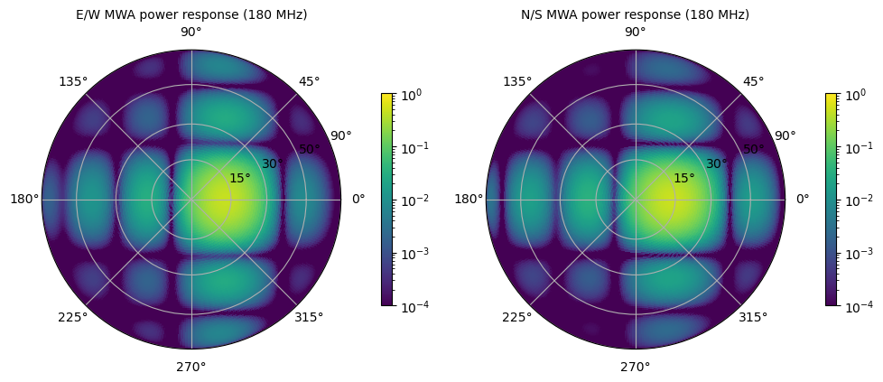
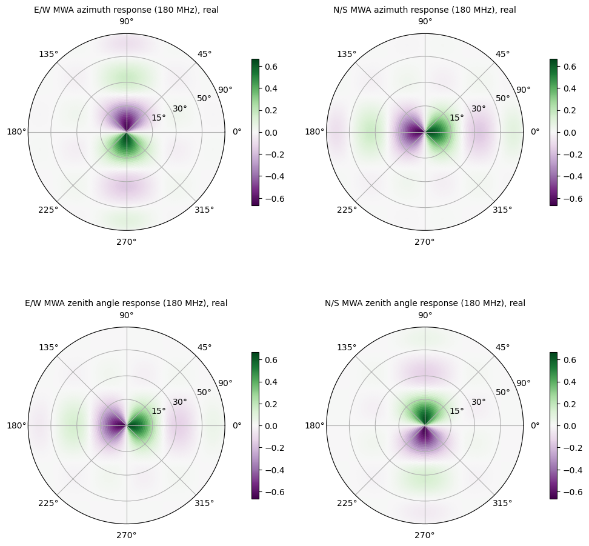
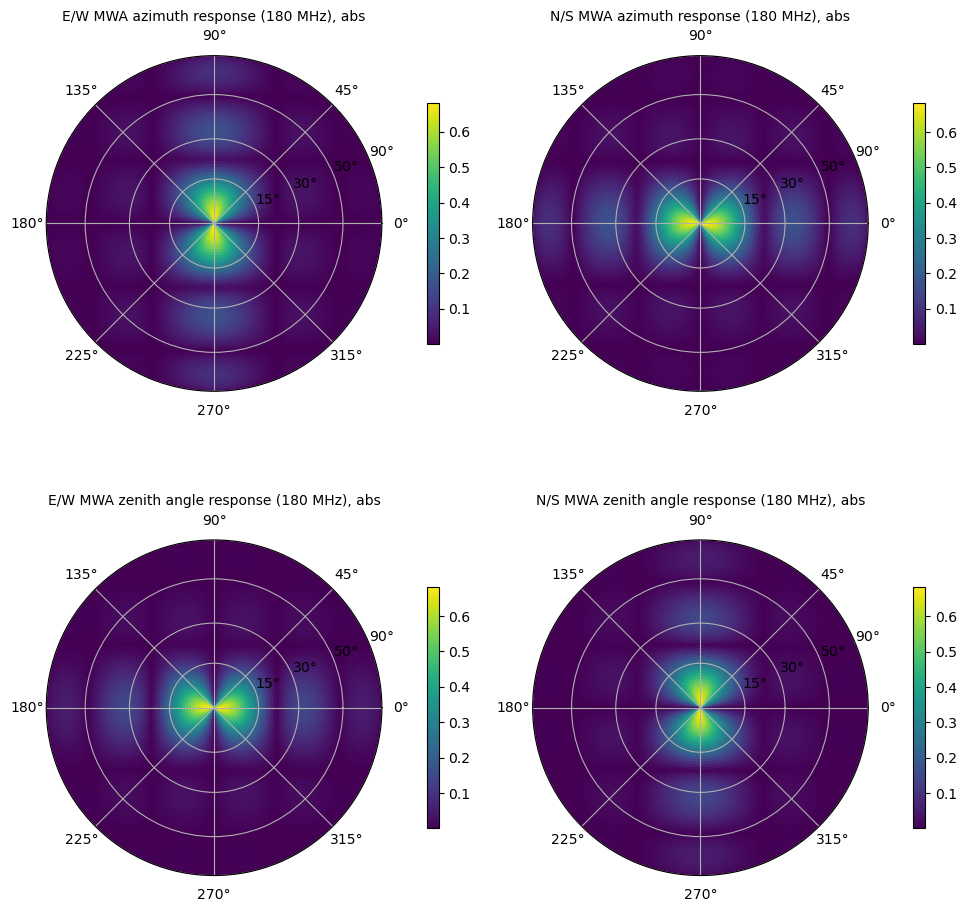
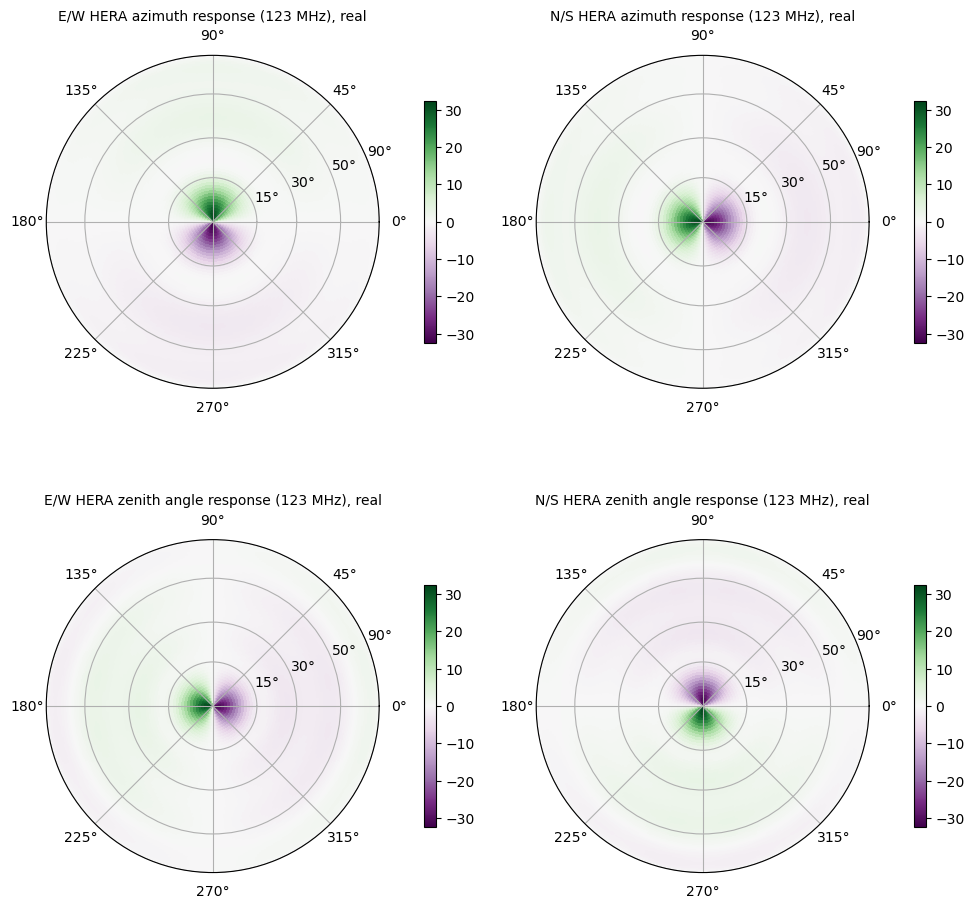
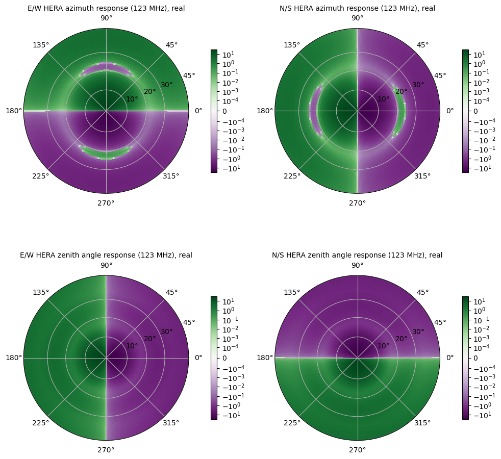
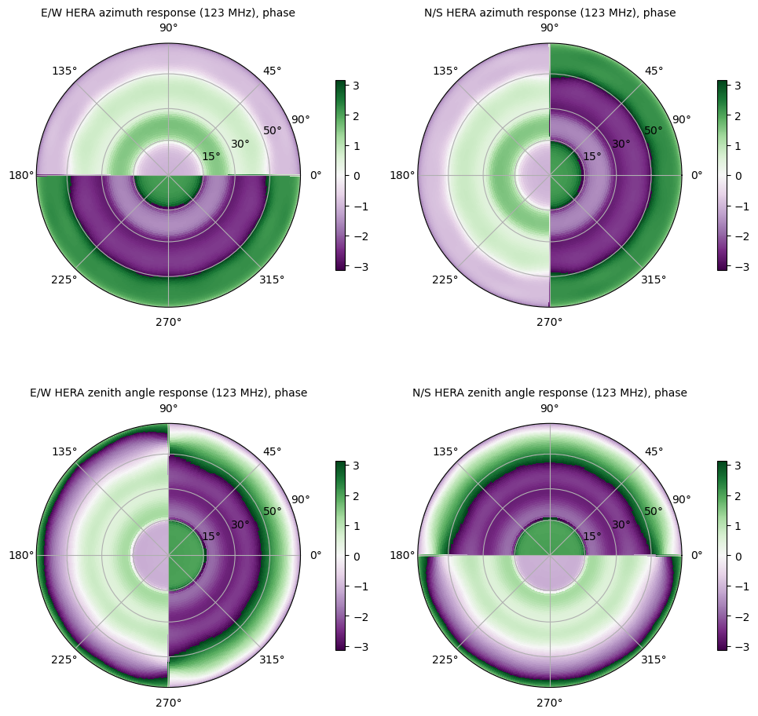
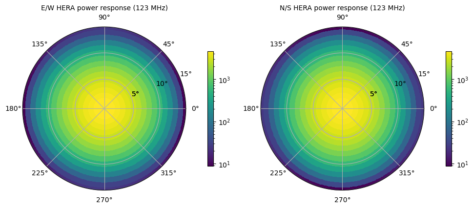
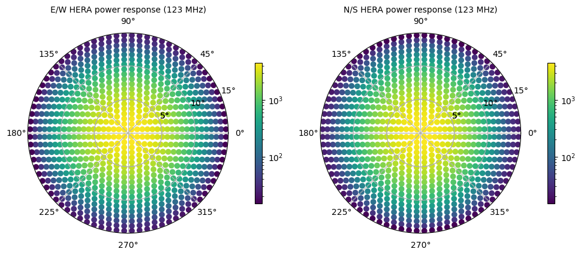

------
UVBeam
------

UVBeam objects hold all of the metadata and data required to work with primary beam
models for radio telescopes. UVBeam supports both E-field and power beams
(labeled by the ``beam_type`` attribute) in a few different coordinate and gridding
systems (e.g. regular azimuth/zenith angle grids, zenith-based HEALPix grids, labeled
by the ``pixel_coordinate_system`` attribute).

For E-field beams, UVBeam supports specifying the E-field components in two or three
directions which may not align with the pixel coordinate system (or even be orthogonal).
The mapping between the E-field component vectors and unit vectors aligned with the
pixel coordinate system is defined per pixel in the ``basis_vector_array``. That array
has an axis of length ``Naxes_vec`` which is the number of E-field components used to
specify the antenna response in each pixel, and an axis of length ``Ncomponents_vec``
which is the number of orthogonal unit vectors aligned with the pixel coordinate system
(in addition to the pixel coordinate system axis or axes). Some examples of these
parameters for common beam pixel and E-field coordinate systems include:

- pixels in regularly gridded azimuth and zenith angle, E-field in components aligned
  with azimuth and zenith angle in each pixel

  - ``Naxis_vec = 2``
  - ``Ncomponents_vec = 2``
  - ``basis_vector_array`` only contains ``1`` and ``0`` values, with ``1`` on the
    diagonal for each pixel.

    - ``basis_vector_array[0, 0, :, :] = 1``
    - ``basis_vector_array[0, 1, :, :] = 0``
    - ``basis_vector_array[1, 0, :, :] = 0``
    - ``basis_vector_array[1, 1, :, :] = 1``

- pixels in regularly gridded azimuth and zenith angle, Efield in (x,y,z) components.

  - ``Naxis_vec = 3``
  - ``Ncomponents_vec = 2``
  - ``basis_vector_array`` contains the mapping from (x, y, z) to (azimuth, zenith_angle)
    for the E-field (which is always orthogonal to the radial vector pointing to the
    pixel). The details of this mapping depend on the choice of how the (x, y, z) axes
    are labeled. UVBeam uses azimuth running from East to North. If +x points to East,
    +y points to North and +z points to the zenith:

    - ``basis_vector_array[0, 0, az, za] = -sin(az)``
    - ``basis_vector_array[0, 1, az, za] = cos(az)``
    - ``basis_vector_array[0, 2, az, za] = 0``
    - ``basis_vector_array[1, 0, az, za] = cos(za)cos(az)``
    - ``basis_vector_array[1, 1, az, za] = cos(za)sin(az)``
    - ``basis_vector_array[1, 2, az, za] = -sin(za)``

- pixels in an azimuth and zenith angle Healpix map (with zenith at the north pole) with
  E-field in components aligned with azimuth and zenith angle in each pixel.

  - ``Naxis_vec = 2``
  - ``Ncomponents_vec = 2``
  - ``basis_vector_array`` only contains ``1`` and ``0`` values, with ``1`` on the
    diagonal for each pixel.

    - ``basis_vector_array[0, 0, :] = 1``
    - ``basis_vector_array[0, 1, :] = 0``
    - ``basis_vector_array[1, 0, :] = 0``
    - ``basis_vector_array[1, 1, :] = 1``

.. include:: tutorial_data_note.rst

UVBeam: Instantiating a UVBeam object from a file (i.e. reading data)
---------------------------------------------------------------------

Use the :meth:`pyuvdata.UVBeam.from_file` to instantiate a UVBeam object from
data in a file (alternatively you can create an object with no inputs and then
call the :meth:`pyuvdata.UVBeam.read` method). Most file types require a single
file or folder to instantiate an object, FHD and raw MWA correlator data sets
require the user to specify multiple files for each dataset.

``pyuvdata`` can also be used to create a UVBeam object from arrays in memory
(see :ref:`new_uvbeam`) and to read in multiple datasets (files) into a single
object (see :ref:`multiple_files_uvbeam`).

a) Instantiate an object from a single file or folder
*****************************************************
BeamFITS and MWA beams are stored in a single file.

To get all the frequencies available for the MWA full embedded element beam
you need to download the output simulation file via
`wget http://cerberus.mwa128t.org/mwa_full_embedded_element_pattern.h5`
For this tutorial we use the file saved in the test data which only
contains a few frequencies.

For MWA beams, which are composed of phased arrays of dipoles, you can specify
delay and amplitude arrays to generate beams pointed any where or with varying
gains per dipole. Set a delay to 32 to get a beam where that dipole is turned
off (or set the amplitude to zero). The native format of the beam is spherical
harmonic modes, so there is also an option `pixels_per_deg` to set the output
beam resolution (default is 5 pixels per degree).

.. clear-namespace

.. code-block:: python

    import numpy as np
    from pyuvdata import UVBeam
    from pyuvdata.datasets import fetch_data

    filename = fetch_data("mwa_full_EE")
    # for a zenith pointed beam let the delays default to all zeros
    beam = UVBeam.from_file(filename)

    # to point the beam off zenith apply a delay slope across the tile
    # use the same pointing for both pols.
    delays = np.empty((2, 16), dtype=int)
    for pol in range(2):
        delays[pol] = np.tile(np.arange(0, 8, 2), 4)
    beam = UVBeam.from_file(filename, pixels_per_deg=1, delays=delays)

a) Instantiate an object from CST or FEKO beam files
****************************************************

The text files saved out of CST and FEKO beam simulations do not have much of the
critical metadata needed for UVBeam objects. When reading in these beams, you must
provide the required metadata. For both CST and FEKO beams, the metadata can be
specified using keywords to the :meth:`pyuvdata.UVBeam.from_file` method along
with the beam files. For CST beams, which have a file per frequency, another
option is to create a yaml file which lists the beam files and provides the
required metadata to the :meth:`pyuvdata.UVBeam.read` method. Both options are
shown in the examples below. More details on creating a new yaml settings files
can be found in :doc:`cst_settings_yaml`.

.. clear-namespace

.. code-block:: python

    import numpy as np
    from pyuvdata import UVBeam
    from pyuvdata.datasets import fetch_data

    feko_filenames = fetch_data(["ovro_lwa_feko_x", "ovro_lwa_feko_y"])

    # specify the feko files along with the required metadata. Specify either a
    # "efield" or "power beam type"
    feko_beam = UVBeam.from_file(
        feko_filenames, beam_type="efield", feed_pol=["x", "y"],
        feed_angle=[np.pi/2, 0.0], telescope_name="LWA",feed_name="LWA", feed_version="1",
        model_name="FEKO_MROsoil_test", model_version="1.0", mount_type="fixed"
    )

    # you can pass several filenames and the objects from each file will be
    # combined across the appropriate axis -- in this case frequency
    cst_filenames = fetch_data(["hera_fagnoni_dipole_123", "hera_fagnoni_dipole_150"])

    # specify the CST files along with the required metadata. Specify either a
    # "efield" or "power beam type"
    # If you only have one polarization, you can set rotate_pol to generate the
    # other polarization by rotating by 90 degrees.
    cst_beam = UVBeam.from_file(
        cst_filenames, beam_type="efield", frequency=[150e6, 123e6],
        feed_pol="x", rotate_pol=True, telescope_name="HERA",
        feed_name="PAPER_dipole", feed_version="0.1",
        model_name="E-field pattern - Rigging height 4.9m",
        model_version="1.0", mount_type="fixed",
    )

    # For CST beams you can also use a yaml specification file.
    # the first fetch is for the raw cst files to ensure we have those downloaded
    fetch_data(["hera_fagnoni_dipole_123", "hera_fagnoni_dipole_150"])
    cst_yml_file = fetch_data("hera_fagnoni_dipole_yaml")
    cst_beam = UVBeam.from_file(cst_yml_file, beam_type="power")

UVBeam: Writing UVBeam objects to disk
--------------------------------------

pyuvdata can write UVBeam objects to BeamFITS files using the
:meth:`pyuvdata.UVBeam.write_beamfits` method, which only requires a filename to
write the data to.

.. clear-namespace

.. code-block:: python

    import os
    from pyuvdata import UVBeam
    from pyuvdata.datasets import fetch_data

    fetch_data(["hera_fagnoni_dipole_123", "hera_fagnoni_dipole_150"])
    cst_yml_file = fetch_data("hera_fagnoni_dipole_yaml")
    beam = UVBeam.from_file(cst_yml_file, beam_type="power")

    # Write the data out to a uvfits file
    write_file = os.path.join(".", "tutorial.beamfits")
    beam.write_beamfits(write_file, clobber=True)

UVBeam: Plotting
----------------

Plotting beams can be extremely helpful to reason about their behavior and
whether they are implemented properly given the various conventions. To aid with
this, a basic plotting method has been added to the UVBeam class.

a) Plotting Zenith-pointed MWA power beams
******************************************

Same-polarization power beams are easiest to think about, partly because they
are real valued and positive definite, so we start with them. Note that the E/W
dipole has more sensitivity at the N/S horizon and vice-versa for the N/S dipole,
as expected.

.. clear-namespace

.. code-block:: python

    from pyuvdata import UVBeam
    from pyuvdata.datasets import fetch_data

    filename = fetch_data("mwa_full_EE")

    mwa_beam = UVBeam.from_file(filename, pixels_per_deg=1)
    mwa_power_beam = mwa_beam.efield_to_power(inplace=False, calc_cross_pols=False)
    # plot the highest available frequency, set freq_ind=-1
    mwa_power_beam.plot(
        freq_ind=-1,
        norm_kwargs={"vmin": 1e-4, "vmax": 1},
        savefile="Images/mwa_zenith_power.png"
    )

We can also include the cross-pol power beams in the plots, although these are a
bit harder to reason about.

.. code-block:: python

    mwa_cross_power_beam = mwa_beam.efield_to_power(inplace=False)
    mwa_cross_power_beam.plot(
        freq_ind=-1,
        norm_kwargs={"linthresh": 1e-4},
        savefile="Images/mwa_zenith_cross_power.png"
    )

b) Plotting Off-Zenith pointed MWA power beams
**********************************************

MWA beams are actually phased arrays of dipoles, which can be pointed around the
sky by delaying the dipoles in the tile by varying amounts. In the hardware, these
delays are set as integers that specify the delay factors. The MWA beam in pyuvdata
accepts a corresponding ``delay`` input point. For more details about the MWA
beam see: https://github.com/MWATelescope/mwa_pb, which the pyuvdata implementation
is based on. In this example, the delay input to MWA beams is set to create a
gradient of delays across the array, pointing the beam to the east.

.. clear-namespace

.. code-block:: python

    import numpy as np

    from pyuvdata import UVBeam
    from pyuvdata.datasets import fetch_data

    filename = fetch_data("mwa_full_EE")

    delays = np.empty((2, 16), dtype=int)
    for pol in range(2):
        delays[pol] = np.tile(np.arange(0,8,2), 4)

    mwa_beam = UVBeam.from_file(filename, pixels_per_deg=1, delays=delays)
    mwa_beam.efield_to_power(calc_cross_pols=False)
    # plot the highest available frequency, set freq_ind=-1
    mwa_beam.plot(
        freq_ind=-1,
        norm_kwargs={"vmin": 1e-4, "vmax": 1},
        savefile="Images/mwa_off_zenith_power.png"
    )

c) Plotting MWA E-Field Beams
*****************************

E-field beams are more complex because they represent the response from each
feed to 2 (usually orthogonal) directions on the sky. Looking at them carefully
though allows us to check that everything is set up properly.

We use the following figure to illustrate the conventions. The two orthogonal
polarization directions on the sky for an Az/ZA beam in pyuvdata are zenith angle,
with is zero at zenith and decreasing towards the horizon and azimuth, which is
zero at East and runs towards North, counter-clockwise as viewed from above. Note
that this is consistent with the coordinate system of many EM beam simulators but
different than the coordinate systems used in many radio astronomy contexts. The
zenith angle polarization direction is shown in pink in the figure below and the
azimuth angle polarization direction is shown in orange. We choose two locations,
noted in green and blue, just off of zenith to the East and North to check the
sign of the expected response for each feed. The expected signs are shown in the
table below the figure.

.. image:: Images/beam_coordinate_figure.png
  :width: 400

So the east dipole is expected to have a **positive** response to the
zenith-angle aligned polarization just off of zenith in the East direction and a
**negative** response to the azimuthal aligned polarization just of zenith in the
North direction, which matches what we see in the following plots. Below we plot
the real part for each feed and polarization orientation.

.. clear-namespace

.. code-block:: python

    from pyuvdata import UVBeam
    from pyuvdata.datasets import fetch_data

    filename = fetch_data("mwa_full_EE")

    mwa_beam = UVBeam.from_file(filename, pixels_per_deg=1, beam_type="efield")

    # plot the highest available frequency, set freq_ind=-1
    mwa_beam.plot(freq_ind=-1, savefile="Images/mwa_zenith_efield.png")

We can also check that the zenith-angle aligned polarization response goes to
zero faster near the horizon than the azimuthal aligned polarization response
for both feeds by plotting the absolute value of the responses.

.. code-block:: python

    mwa_beam.plot(
        freq_ind=-1,
        complex_type="abs",
        savefile="Images/mwa_zenith_efield_abs.png"
    )

d) Plotting HERA E-Field Beams
******************************

HERA beams are much more complex, but similar checks can be done by looking at
plots of their E-Field beams.

.. clear-namespace

.. code-block:: python

    from pyuvdata import UVBeam
    from pyuvdata.datasets import fetch_data

    fetch_data(["hera_fagnoni_dipole_150", "hera_fagnoni_dipole_123"])
    filename = fetch_data("hera_fagnoni_dipole_yaml")
    hera_beam = UVBeam.from_file(filename, beam_type="efield")
    hera_beam.plot(savefile="Images/hera_efield.png")

It's a bit hard to see the structure in the inner part of the beam. We can zoom
in using the ``max_zenith_deg`` keyword and we'll also use a symmetric log colorscale.

.. code-block:: python

    hera_beam.plot(
        max_zenith_deg=45.,
        logcolor=True,
        norm_kwargs={"linthresh": 1e-4},
        savefile="Images/hera_efield_zoom.png"
    )

Finally we can examine the phase structure of the HERA beam:

.. code-block:: python

    hera_beam.plot(complex_type="phase", savefile="Images/hera_efield_phase.png")

UVBeam: Selecting data
----------------------
The :meth:`pyuvdata.UVBeam.select` method lets you select specific image axis indices
(or pixels if pixel_coordinate_system is HEALPix), frequencies and feeds
(or polarizations if beam_type is power) to keep in the object while removing others.
By default, :meth:`pyuvdata.UVBeam.select` will select data that matches the supplied
criteria, but by setting ``invert=True``, you can instead *deselect* this data and
preserve only that which does not match the selection.

Note: When reading a beamFITS file, you also have the option of selecting
frequencies and az/za values at the read step -- i.e. so that memory is never
allocated for data outside these ranges.

a) Selecting a range of Zenith Angles
*************************************

.. clear-namespace

.. code-block:: python

    import matplotlib.pyplot as plt
    import numpy as np
    from pyuvdata import UVBeam
    from pyuvdata.datasets import fetch_data

    fetch_data(["hera_fagnoni_dipole_123", "hera_fagnoni_dipole_150"])
    cst_yml_file = fetch_data("hera_fagnoni_dipole_yaml")
    beam = UVBeam.from_file(cst_yml_file, beam_type="power")

    # Make a new object with a reduced zenith angle range with the select method
    new_beam = beam.select(axis2_inds=np.arange(0, 20), inplace=False)

    # plot zenith angle cut through beams
    fig, ax = plt.subplots(1, 1)
    _ = ax.plot(np.rad2deg(beam.axis2_array), beam.data_array[0, 0, 0, :, 0], label="original")
    _ = ax.plot(np.rad2deg(new_beam.axis2_array), new_beam.data_array[0, 0, 0, :, 0], "r", label="cut down")
    _ = ax.set_xscale("log")
    _ = ax.set_yscale("log")
    _ = ax.set_xlabel("Zenith Angle (degrees)")
    _ = ax.set_ylabel("Power")
    _ = fig.legend(loc="upper right", bbox_to_anchor=[0.9,0.88])

.. skip: next

    plt.show()
    plt.savefig("Images/select_beam_cut.png", bbox_inches="tight")
    plt.clf()

.. image:: Images/select_beam_cut.png
  :width: 600

a) Selecting Feeds or Polarizations
***********************************
Selecting feeds on E-field beams can be done using the feed name (e.g. "x" or "y").
Strings representing the physical orientation of the feed (e.g. "n" or "e) can also
be used if the feeds are oriented toward 0 or 90 degrees (as denoted by ``feed_angle``).

Selecting polarizations on power beams can be done either using the polarization
numbers or the polarization strings (e.g. "xx" or "yy" for linear polarizations or
"rr" or "ll" for circular polarizations). Strings representing the physical orientation
of the feed (e.g. "nn" or "ee") can also be used if the feeds are oriented toward 0 or
90 degrees (as denoted by ``feed_angle``).

.. clear-namespace

.. code-block:: python

    import numpy as np
    from pyuvdata import utils, UVBeam
    from pyuvdata.datasets import fetch_data

    fetch_data(["hera_fagnoni_dipole_123", "hera_fagnoni_dipole_150"])
    cst_yml_file = fetch_data("hera_fagnoni_dipole_yaml")
    uvb = UVBeam.from_file(cst_yml_file, beam_type="efield")

    # make a copy and select a feed
    uvb2 = uvb.copy()
    uvb2.select(feeds=["y"])
    assert uvb2.feed_array == ["y"]
    assert uvb2.feed_angle == [0.]

    # make a copy and select a feed by phyiscal orientation
    uvb2 = uvb.copy()
    uvb2.select(feeds=["n"])
    assert uvb2.feed_array == ["y"]
    assert uvb2.feed_angle == [0.]

    # Finally, try a deselect
    uvb2 = uvb.copy()
    uvb2.select(feeds=["y"], invert=True)
    assert uvb2.feed_array == ["x"]
    assert np.all(np.isclose(uvb2.feed_angle, 1.57079633))

    # convert to a power beam for selecting on polarizations
    uvb.efield_to_power()
    uvb.select(polarizations=[-5, -6, -7])
    assert uvb.polarization_array.tolist() == [-5, -6, -7]
    assert utils.polnum2str(uvb.polarization_array) == ['xx', 'yy', 'xy']

    # select polarizations using the polarization strings
    uvb.select(polarizations=["xx", "yy"])
    assert uvb.polarization_array.tolist() == [-5, -6]
    assert utils.polnum2str(uvb.polarization_array) == ['xx', 'yy']

    # select polarizations using the physical orientation strings
    uvb.select(polarizations=["ee"])
    assert uvb.polarization_array.tolist() == [-5]
    assert utils.polnum2str(uvb.polarization_array) == ['xx']

UVBeam: Combining data
----------------------
The :meth:`pyuvdata.UVBeam.__add__` method lets you combine UVBeam objects along
the frequency, polarization, and/or sky direction axes.

a) Combine frequencies.
***********************

.. clear-namespace

.. code-block:: python

    import numpy as np
    from pyuvdata import UVBeam
    from pyuvdata.datasets import fetch_data

    filename = fetch_data("mwa_full_EE")
    # for a zenith pointed beam let the delays default to all zeros
    beam1 = UVBeam.from_file(filename)
    beam2 = beam1.copy()

    # Downselect frequencies to recombine
    beam1.select(freq_chans=[0])
    assert beam1.Nfreqs == 1
    beam2.select(freq_chans=[1, 2])
    assert beam2.Nfreqs == 2
    beam3 = beam1 + beam2
    assert beam3.Nfreqs == 3

c) Combine in place
*******************
The following two commands are equivalent, and act on the beam object
directly without creating a third beam object.

.. clear-namespace

.. code-block:: python

    import numpy as np
    from pyuvdata import UVBeam
    from pyuvdata.datasets import fetch_data

    filename = fetch_data("mwa_full_EE")
    beam1 = UVBeam.from_file(filename)
    beam2 = beam1.copy()
    beam1.select(feeds="x")
    beam2.select(feeds="y")
    beam1.__add__(beam2, inplace=True)

    beam1 = UVBeam.from_file(filename)
    beam2 = beam1.copy()
    beam1.select(feeds="x")
    beam2.select(feeds="y")
    beam1 += beam2

.. _multiple_files_uvbeam:

d) Reading multiple files.
**************************
If the :meth:`pyuvdata.UVBeam.read` method is given a list of beam files each
file will be read in succession and combined with the previous file(s).

.. clear-namespace

.. code-block:: python

    import numpy as np
    from pyuvdata import UVBeam
    from pyuvdata.datasets import fetch_data

    uvb = UVBeam()
    uvb.read(fetch_data("mwa_full_EE"), pixels_per_deg=1, freq_range=[100e6, 200e6])

    # Break up beam object into 2 objects, divided in zenith angle and write out
    # to BeamFITS files so we can demonstrate that they get combined on read.
    uvb1 = uvb.select(axis2_inds=np.arange(0, uvb.Naxes2 // 2), inplace=False)
    uvb1.write_beamfits("test_beam0.beamfits")
    uvb1 = uvb.select(axis2_inds=np.arange(uvb.Naxes2 // 2, uvb.Naxes2), inplace=False)
    uvb1.write_beamfits("test_beam1.beamfits")

    uvb2 = UVBeam().from_file(["test_beam0.beamfits", "test_beam1.beamfits"])

.. _uvbeam_to_healpix:

UVBeam: Interpolating to HEALPix
--------------------------------
Note that interpolating from one gridding format to another incurs interpolation
errors. If the beam is going to be interpolated (e.g. to source locations) in
downstream code we urge the user use the beam in the original format to avoid incurring
extra interpolation errors.

.. clear-namespace

.. code-block:: python

    from pyuvdata import utils, UVBeam
    from pyuvdata.datasets import fetch_data

    fetch_data(["hera_fagnoni_dipole_123", "hera_fagnoni_dipole_150"])
    cst_yml_file = fetch_data("hera_fagnoni_dipole_yaml")
    beam = UVBeam.from_file(cst_yml_file, beam_type="power")

    # Let's cut down to a small area near zenith so we can see the pixelization
    beam.plot(max_zenith_deg=15, savefile="Images/hera_power_zoom.png")

    hpx_beam = beam.to_healpix(inplace=False)
    hpx_beam.plot(max_zenith_deg=15, savefile="Images/hera_power_healpix_zoom.png")

Note that the HEALPix scheme does not have a pixel exactly at zenith, so using
HEALPix for beams may lead to undesirable behavior at zenith -- interpolations
of healpix beams near zenith may give noticably weird results. These are likely
to be most problematic for E-field beams, which have a pole in the polarization
vector coordinates at zenith and beams with maximum sensitivity at zenith
because there is not point at the maximum response. However, the HEALPix scheme
is ideal when calculating beam and beam-squared volumes because the pixels are
equal area.

UVBeam: Converting from E-Field beams to Power Beams
----------------------------------------------------

a) Convert a regularly gridded efield beam to a power beam (leaving original intact).
*************************************************************************************

.. clear-namespace

.. code-block:: python

    import matplotlib.pyplot as plt
    import numpy as np
    from pyuvdata import UVBeam
    from pyuvdata.datasets import fetch_data

    fetch_data(["hera_fagnoni_dipole_123", "hera_fagnoni_dipole_150"])
    cst_yml_file = fetch_data("hera_fagnoni_dipole_yaml")
    beam = UVBeam.from_file(cst_yml_file, beam_type="efield")
    new_beam = beam.efield_to_power(inplace=False)

    # plot zenith angle cut through the beams
    _ = plt.plot(beam.axis2_array, beam.data_array[1, 0, 0, :, 0].real, label="E-field real")
    _ = plt.plot(beam.axis2_array, beam.data_array[1, 0, 0, :, 0].imag, "r", label="E-field imaginary")
    _ = plt.plot(new_beam.axis2_array, np.sqrt(new_beam.data_array[0, 0, 0, :, 0]), "black", label="sqrt Power")
    _ = plt.xlabel("Zenith Angle (radians)")
    _ = plt.ylabel("Magnitude")
    _ = plt.legend()

.. skip: next

    plt.show()
    plt.savefig("Images/efield_power_beam_cut.png", bbox_inches="tight")
    plt.clf()

.. image:: Images/efield_power_beam_cut.png
  :width: 600

b) Generating pseudo Stokes ("pI", "pQ", "pU", "pV") beams
**********************************************************

.. clear-namespace

.. code-block:: python

    from pyuvdata import utils, UVBeam
    from pyuvdata.datasets import fetch_data

    fetch_data(["hera_fagnoni_dipole_123", "hera_fagnoni_dipole_150"])
    cst_yml_file = fetch_data("hera_fagnoni_dipole_yaml")
    beam = UVBeam.from_file(cst_yml_file, beam_type="efield")

    pstokes_beam = beam.efield_to_pstokes(inplace=False)
    pstokes_beam.plot(savefile="Images/hera_pstokes.png")

.. image:: Images/hera_pstokes.png
  :width: 600

UVBeam: Calculating beam areas
------------------------------
Calculations of the beam area and beam squared area are frequently required inputs for
Epoch of Reionization power spectrum calculations. These areas can be calculated for
either instrumental or pseudo Stokes beams using the :meth:`pyuvdata.UVBeam.get_beam_area`
and :meth:`pyuvdata.UVBeam.get_beam_sq_area` methods. Currently these methods do require
that the beams are in Healpix coordinates in order to take advantage of equal pixel areas.
They can be interpolated to HEALPix using the :meth:`pyuvdata.UVBeam.to_healpix` method.

a) Calculating pseudo Stokes ("pI", "pQ", "pU", "pV") beam area and beam squared area
*************************************************************************************

.. clear-namespace

.. code-block:: python

    import numpy as np
    from pyuvdata import UVBeam
    from pyuvdata.datasets import fetch_data

    fetch_data(["hera_fagnoni_dipole_123", "hera_fagnoni_dipole_150"])
    cst_yml_file = fetch_data("hera_fagnoni_dipole_yaml")
    beam = UVBeam.from_file(cst_yml_file, beam_type="efield")

    # note that the `to_healpix` method requires astropy_healpix to be installed
    # this beam file is very large. Let's cut down the size to ease the computation
    za_max = np.deg2rad(10.0)
    za_inds_use = np.nonzero(beam.axis2_array <= za_max)[0]
    beam.select(axis2_inds=za_inds_use)

    pstokes_beam = beam.to_healpix(inplace=False)
    pstokes_beam.efield_to_pstokes()
    pstokes_beam.peak_normalize()

    # calculating beam area
    freqs = pstokes_beam.freq_array
    pI_area = pstokes_beam.get_beam_area("pI")
    pQ_area = pstokes_beam.get_beam_area("pQ")
    pU_area = pstokes_beam.get_beam_area("pU")
    pV_area = pstokes_beam.get_beam_area("pV")

    assert np.allclose(
      [pI_area[0].real, pQ_area[0].real, pU_area[0].real, pV_area[0].real],
      [0.04674, 0.02904, 0.02879, 0.0464],
      atol=1e-4
    )
    assert np.allclose(
      [pI_area[1].real, pQ_area[1].real, pU_area[1].real, pV_area[1].real],
      [0.03237, 0.01995, 0.01956, 0.03186],
      atol=1e-4
    )

    # calculating beam squared area
    freqs = pstokes_beam.freq_array
    pI_sq_area = pstokes_beam.get_beam_sq_area("pI")
    pQ_sq_area = pstokes_beam.get_beam_sq_area("pQ")
    pU_sq_area = pstokes_beam.get_beam_sq_area("pU")
    pV_sq_area = pstokes_beam.get_beam_sq_area("pV")

    assert np.allclose(
      [pI_sq_area[0].real, pQ_sq_area[0].real, pU_sq_area[0].real, pV_sq_area[0].real],
      [0.02474, 0.01186, 0.01179, 0.0246],
      atol=1e-4
    )
    assert np.allclose(
      [pI_sq_area[1].real, pQ_sq_area[1].real, pU_sq_area[1].real, pV_sq_area[1].real],
      [0.01696, 0.00798, 0.00792, 0.01686],
      atol=1e-4
    )

.. _new_uvbeam:

UVBeam: Instantiating from arrays in memory
-------------------------------------------
``pyuvdata`` can also be used to create a UVBeam object from arrays in memory. This
is useful for mocking up data for testing or for creating a UVBeam object from
simulated data. Instead of instantiating a blank object and setting each required
parameter, you can use the ``.new()`` static method, which deals with the task
of creating a consistent object from a minimal set of inputs

.. clear-namespace

.. code-block:: python

    from astropy.coordinates import EarthLocation
    import numpy as np
    from pyuvdata import UVBeam

    uvb = UVBeam.new(
        telescope_name="test",
        data_normalization="physical",
        freq_array=np.linspace(100e6, 200e6, 10),
        x_orientation = "east",
        feed_array = ["x", "y"],
        mount_type = "fixed",
        axis1_array=np.deg2rad(np.linspace(-180, 179, 360)),
        axis2_array=np.deg2rad(np.linspace(0, 90, 181)),
    )

Notice that you need only provide the required parameters, and the rest will be
filled in with sensible defaults.

See the full documentation for the method
:func:`pyuvdata.uvbeam.UVBeam.new` for more information.
