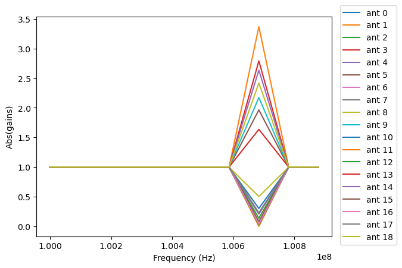

------
UVCal
------

UVCal objects hold all of the metadata and data required to work with calibration
solutions for interferometric data sets. Calibration solutions are tied to antennas
rather than baselines. There are many different kinds of calibration solutions, UVCal
has support for many of the most common ones, but this flexibility leads to some
complexity in the definition of UVCal objects. The ``cal_type`` attribute on UVCal
objects indicates whether calibration solutions are "gain" (a complex number per
antenna, polarization and frequency) or "delay" (a real number per antenna and
polarization) type solutions. The ``cal_style`` attribute indicates whether the solution
came from a "sky" or "redundant" style of calibration solution. Some metadata items only
apply to one ``cal_type`` or ``cal_style``.

The antennas are described in two ways: with antenna numbers and antenna names. The
antenna numbers should **not** be confused with indices -- they are not required to start
at zero or to be contiguous, although it is not uncommon for some telescopes to number
them like indices. On UVCal objects, the names and numbers are held in the
``antenna_names`` and ``antenna_numbers`` attributes respectively. These are arranged
in the same order so that an antenna number can be used to identify an antenna name and
vice versa.
Note that not all the antennas listed in ``antenna_numbers`` and ``antenna_names`` are
guaranteed to have calibration solutions associated with them in the ``gain_array``
(or ``delay_array`` for delay type solutions). The antenna numbers associated with each
calibration solution is held in the ``ant_array`` attribute (which has the same length
as the ``gain_array`` or ``delay_array`` along the antenna axis).

For most users, the convenience methods for quick data access (see
`UVCal: Quick data access`_) are the easiest way to get data for particular antennas.
Those methods take the antenna numbers (i.e. numbers listed in ``antenna_numbers``)
as inputs.

UVCal: parameter shape changes
-------------------------------
As detailed in :ref:`uvdata_future_shapes`, UVData objects now support flexible spectral
windows and will have several of their parameter shapes change in version 3.0. They also
have a method to convert to the planned future array shapes now to support an orderly
conversion of code and packages that use UVData objects to the future shapes.

UVCal objects now also support flexible spectral windows and will see parameter shape
changes in version 3.0.

Spectral windows are implemented on standard "gain" type UVCal objects in a similar way
to the UVData implementation, where windows are defined as sets of frequency channels
with some extra parameters to track which channels are in each spectral window. This
allows for spectral windows to have arbitrary numbers of frequency channels and makes
the ``channel_width`` parameter be an array of length ``Nfreqs`` rather than a scalar,
but only when the UVCal object contains flexible spectral windows. Supporting multiple
spectral windows in this way removes the need for the spectral window axis on several
UVCal parameters, but the axis was left as a length 1 axis for backwards compatibility.

Spectral windows are treated a little differently for wide-band style UVCal objects,
which do not have an explicit frequency axis. For those objects, which include all
"delay" type UVCal objects as well as wide-band gain objects, the ``freq_array``
and ``channel_width`` parameters are not required but the ``freq_range`` parameter is
required. UVCal objects that are wide-band and use the future array shapes
can support multiple spectral windows, see details below.

In version 3.0, several parameters will change shape. For standard "gain" type
UVCal objects, the length 1 axis that was originally intended for the spectral windows
axis will be removed from the ``gain_array`` , ``flag_array``, ``quality_array``,
``input_flag_array``, ``total_quality_array`` and ``freq_array`` parameters and the
``channel_width`` parameter will always be an array of length ``Nfreqs``. For
wide-band and "delay" type UVCal objects, the spectral window axis will be retained but
the axis corresponding to the frequency axis will be removed from the ``gain_array`` ,
``delay_array``, ``flag_array``, ``quality_array``, ``input_flag_array`` and the
``total_quality_array`` and the ``freq_range`` parameter will gain a spectral window
axis. In addition, the ``integration_time`` parameter will always be an array of
length ``Ntimes``.

In order to support an orderly conversion of code and packages that use the ``UVCal``
object to these new parameter shapes, we have created the
:meth:`pyuvdata.UVCal.use_future_array_shapes` method which will change the parameters
listed above to have their future shapes. Users writing new code that uses ``UVCal``
objects are encouraged to call that method immediately after creating a UVCal object
or reading in data from a file to ensure that the code will be compatible with the
forthcoming changes. Developers and maintainers of existing code that uses ``UVCal``
objects are encouraged to similarly add that method call and convert their code to use
the new shapes at their earliest convenience to ensure future compatibility. The method
will be deprecated but not removed in version 3.0 (it will just become a no-op) so
that code that calls it will continue to function.

UVCal: Reading/writing
----------------------
Calibration files using UVCal.

a) Reading a cal fits gain calibration file.
********************************************
.. code-block:: python

  >>> import os
  >>> import numpy as np
  >>> import matplotlib.pyplot as plt
  >>> from pyuvdata import UVCal
  >>> from pyuvdata.data import DATA_PATH
  >>> filename = os.path.join(DATA_PATH, 'zen.2457698.40355.xx.gain.calfits')
  >>> # Here we use the ``from_file`` class method, can also use the ``read`` method.
  >>> # Can optionally specify the ``file_type`` to either method
  >>> cal = UVCal.from_file(filename, use_future_array_shapes=True)
  >>> cal = UVCal()
  >>> cal.read(filename, file_type="calfits", use_future_array_shapes=True)

  >>> # Cal type:
  >>> print(cal.cal_type)
  gain

  >>> # number of calibration jones components and component type.
  >>> print((cal.Njones, cal.jones_array))
  (1, array([-5]))

  >>> # Number of antennas with data
  >>> print(cal.Nants_data)
  19

  >>> # Number of frequencies
  >>> print(cal.Nfreqs)
  10

  >>> # Shape of the gain_array
  >>> print(cal.gain_array.shape)
  (19, 10, 5, 1)

  >>> # plot abs of all gains for first time and first jones component.
  >>> fig, ax = plt.subplots(1, 1)
  >>> for ant in range(cal.Nants_data):
  ...    _ = ax.plot(cal.freq_array.flatten(), np.abs(cal.gain_array[ant, :, 0, 0]), label=f"ant {ant}")
  >>> _ = ax.set_xlabel('Frequency (Hz)')
  >>> _ = ax.set_ylabel('Abs(gains)')
  >>> _ = fig.legend(bbox_to_anchor=(1.08, 0.5), loc="outside center right")
  >>> plt.show() # doctest: +SKIP
  >>> plt.savefig("Images/abs_gains.png", bbox_inches='tight')
  >>> plt.clf()

b) FHD cal to cal fits
***********************
.. code-block:: python

  >>> import os
  >>> from pyuvdata import UVCal
  >>> from pyuvdata.data import DATA_PATH
  >>> obs_testfile = os.path.join(DATA_PATH, 'fhd_cal_data/1061316296_obs.sav')
  >>> cal_testfile = os.path.join(DATA_PATH, 'fhd_cal_data/1061316296_cal.sav')
  >>> settings_testfile = os.path.join(DATA_PATH, 'fhd_cal_data/1061316296_settings.txt')
  >>> layout_testfile = os.path.join(DATA_PATH, 'fhd_cal_data/1061316296_layout.sav')

  >>> # Here we use the ``from_file`` class method, can also use the ``read`` method.
  >>> # Can optionally specify the ``file_type`` to either method
  >>> fhd_cal = UVCal.from_file(
  ...    cal_testfile,
  ...    obs_file=obs_testfile,
  ...    settings_file=settings_testfile,
  ...    layout_file=layout_testfile,
  ...    use_future_array_shapes=True,
  ... )
  >>> fhd_cal = UVCal()
  >>> fhd_cal.read(
  ...    cal_testfile,
  ...    obs_file=obs_testfile,
  ...    settings_file=settings_testfile,
  ...    layout_file=layout_testfile,
  ...    file_type="fhd",
  ...    use_future_array_shapes=True,
  ... )
  >>> fhd_cal.write_calfits(os.path.join('.', 'tutorial_cal.fits'), clobber=True)

UVCal: Initializing from a UVData object
----------------------------------------
The :meth:`pyuvdata.UVCal.initialize_from_uvdata` method allows you to initialize a UVCal
object from the metadata in a UVData object. This is useful for codes that are calculating
calibration solutions from UVData objects. There are many optional parameters to allow
users to specify additional metadata or changes from the uvdata metadata. By default,
this method creats a metadata only UVCal object, but it can optionally create the
data-like arrays as well, filled with zeros.

.. code-block:: python

  >>> import os
  >>> from pyuvdata import UVData, UVCal
  >>> from pyuvdata.data import DATA_PATH
  >>> uvd_file = os.path.join(DATA_PATH, "zen.2458098.45361.HH.uvh5_downselected")
  >>> uvd = UVData.from_file(uvd_file, file_type="uvh5", use_future_array_shapes=True)
  >>> uvc = UVCal.initialize_from_uvdata(uvd, "multiply", "redundant")
  >>> print(uvc.ant_array)
  [ 0  1 11 12 13 23 24 25]

UVCal: Instantiating from arrays in memory
------------------------------------------
``pyuvdata`` can also be used to create a UVCal object from arrays in memory. This
is useful for mocking up data for testing or for creating a UVCal object from
simulated data. Instead of instantiating a blank object and setting each required
parameter, you can use the ``.new()`` static method, which deals with the task
of creating a consistent object from a minimal set of inputs

.. code-block:: python

  >>> from pyuvdata import UVCal
  >>> from astropy.coordinates import EarthLocation
  >>> import numpy as np
  >>> uvc = UVCal.new(
  ...     gain_convention = "multiply",
  ...     x_orientation = "east",
  ...     cal_style = "redundant",
  ...     freq_array = np.linspace(1e8, 2e8, 100),
  ...     jones_array = ["ee", "nn"],
  ...     antenna_positions = {
  ...         0: [0.0, 0.0, 0.0],
  ...         1: [0.0, 0.0, 1.0],
  ...         2: [0.0, 0.0, 2.0],
  ...     },
  ...     telescope_location = EarthLocation.from_geodetic(0, 0, 0),
  ...     telescope_name = "test",
  ...     time_array = np.linspace(2459855, 2459856, 20),
  ... )

Notice that you need only provide the required parameters, and the rest will be
filled in with sensible defaults.

See the full documentation for the method
:func:`pyuvdata.uvcal.UVCal.new` for more information.

UVCal: Quick data access
------------------------
Method for quick data access, similar to those on :class:`pyuvdata.UVData`
(:ref:`quick_access`), are available for :class:`pyuvdata.UVCal`.
There are three specific methods that will return numpy arrays:
:meth:`pyuvdata.UVCal.get_gains`, :meth:`pyuvdata.UVCal.get_flags`, and
:meth:`pyuvdata.UVCal.get_quality`. When possible, these methods will return numpy
MemoryView objects, which is relatively fast and adds minimal memory overhead.

a) Data for a single antenna and instrumental polarization
**********************************************************
.. code-block:: python

  >>> import os
  >>> import numpy as np
  >>> from pyuvdata import UVCal
  >>> from pyuvdata.data import DATA_PATH
  >>> filename = os.path.join(DATA_PATH, 'zen.2457555.42443.HH.uvcA.omni.calfits')
  >>> uvc = UVCal.from_file(filename, use_future_array_shapes=True)
  >>> gain = uvc.get_gains(9, 'Jxx')  # gain for ant=9, pol='Jxx'

  >>> # One can equivalently make any of these calls with the input wrapped in a tuple.
  >>> gain = uvc.get_gains((9, 'Jxx'))

  >>> # If no polarization is fed, then all polarizations are returned
  >>> gain = uvc.get_gains(9)

  >>> # One can also request flags and quality arrays in a similar manner
  >>> flags = uvc.get_flags(9, 'Jxx')
  >>> quals = uvc.get_quality(9, 'Jxx')

UVCal: Calibrating UVData
-------------------------
Calibration solutions in a :class:`pyuvdata.UVCal` object can be applied to a
:class:`pyuvdata.UVData` object using the :func:`pyuvdata.utils.uvcalibrate` function.

a) Calibration of UVData by UVCal
*********************************
.. code-block:: python

  >>> # We can calibrate directly using a UVCal object
  >>> import os
  >>> from pyuvdata import UVData, UVCal, utils
  >>> from pyuvdata.data import DATA_PATH
  >>> uvd = UVData.from_file(
  ...    os.path.join(DATA_PATH, "zen.2458098.45361.HH.uvh5_downselected"),
  ...    file_type="uvh5",
  ...    use_future_array_shapes=True
  ... )
  >>> uvc = UVCal.from_file(
  ...    os.path.join(DATA_PATH, "zen.2458098.45361.HH.omni.calfits_downselected"),
  ...    use_future_array_shapes=True
  ... )
  >>> # this is an old calfits file which has the wrong antenna names, so we need to fix them first.
  >>> # fix the antenna names in the uvcal object to match the uvdata object
  >>> uvc.antenna_names = np.array(
  ...     [name.replace("ant", "HH") for name in uvc.antenna_names]
  ... )
  >>> uvd_calibrated = utils.uvcalibrate(uvd, uvc, inplace=False)

  >>> # We can also un-calibrate using the same UVCal
  >>> uvd_uncalibrated = utils.uvcalibrate(uvd_calibrated, uvc, inplace=False, undo=True)

UVCal: Selecting data
---------------------
The :meth:`pyuvdata.UVCal.select` method lets you select specific antennas
(by number or name), frequencies (in Hz or by channel number), times or jones components
(by number or string) to keep in the object while removing others.

a) Select antennas to keep on UVCal object using the antenna number.
********************************************************************
.. code-block:: python

  >>> import os
  >>> from pyuvdata import UVCal
  >>> from pyuvdata.data import DATA_PATH
  >>> import numpy as np
  >>> filename = os.path.join(DATA_PATH, "zen.2458098.45361.HH.omni.calfits_downselected")
  >>> cal = UVCal.from_file(filename, use_future_array_shapes=True)

  >>> # print all the antennas numbers with data in the original file
  >>> print(cal.ant_array)
  [ 0  1 11 12 13 23 24 25]
  >>> cal.select(antenna_nums=[1, 13, 25])

  >>> # print all the antennas numbers with data after the select
  >>> print(cal.ant_array)
  [ 1 13 25]

b) Select antennas to keep using the antenna names, also select frequencies to keep.
************************************************************************************
.. code-block:: python

  >>> import os
  >>> import numpy as np
  >>> from pyuvdata import UVCal
  >>> from pyuvdata.data import DATA_PATH
  >>> filename = os.path.join(DATA_PATH, "zen.2458098.45361.HH.omni.calfits_downselected")
  >>> cal = UVCal.from_file(filename, use_future_array_shapes=True)

  >>> # print all the antenna names with data in the original file
  >>> print([cal.antenna_names[np.where(cal.antenna_numbers==a)[0][0]] for a in cal.ant_array])
  ['ant0', 'ant1', 'ant11', 'ant12', 'ant13', 'ant23', 'ant24', 'ant25']

  >>> # print the first 10 frequencies in the original file
  >>> print(cal.freq_array[0:10])
  [1.000000e+08 1.015625e+08 1.031250e+08 1.046875e+08 1.062500e+08
   1.078125e+08 1.093750e+08 1.109375e+08 1.125000e+08 1.140625e+08]
  >>> cal.select(antenna_names=['ant11', 'ant13', 'ant25'], freq_chans=np.arange(0, 4))

  >>> # print all the antenna names with data after the select
  >>> print([cal.antenna_names[np.where(cal.antenna_numbers==a)[0][0]] for a in cal.ant_array])
  ['ant11', 'ant13', 'ant25']

  >>> # print all the frequencies after the select
  >>> print(cal.freq_array)
  [1.000000e+08 1.015625e+08 1.031250e+08 1.046875e+08]

d) Select times
***************
.. code-block:: python

  >>> import os
  >>> import numpy as np
  >>> from pyuvdata import UVCal
  >>> from pyuvdata.data import DATA_PATH
  >>> filename = os.path.join(DATA_PATH, "zen.2458098.45361.HH.omni.calfits_downselected")
  >>> cal = UVCal.from_file(filename, use_future_array_shapes=True)

  >>> # print all the times in the original file
  >>> print(cal.time_array)
  [2458098.45677626 2458098.45690053 2458098.45702481 2458098.45714908
   2458098.45727336 2458098.45739763 2458098.45752191 2458098.45764619
   2458098.45777046 2458098.45789474]

  >>> # select the first 3 times
  >>> cal.select(times=cal.time_array[0:3])

  >>> print(cal.time_array)
  [2458098.45677626 2458098.45690053 2458098.45702481]

d) Select Jones components
**************************
Selecting on Jones component can be done either using the component numbers or
the component strings (e.g. "Jxx" or "Jyy" for linear polarizations or "Jrr" or
"Jll" for circular polarizations). If ``x_orientation`` is set on the object, strings
represting the physical orientation of the dipole can also be used (e.g. "Jnn" or "ee).

.. code-block:: python

  >>> import os
  >>> import numpy as np
  >>> from pyuvdata import UVCal
  >>> from pyuvdata.data import DATA_PATH
  >>> import pyuvdata.utils as uvutils
  >>> filename = os.path.join(DATA_PATH, "zen.2458098.45361.HH.omni.calfits_downselected")
  >>> cal = UVCal.from_file(filename, use_future_array_shapes=True)

  >>> # Jones component numbers can be found in the jones_array
  >>> print(cal.jones_array)
  [-5 -6]

  >>> # Jones component numbers can be converted to strings using a utility function
  >>> print(uvutils.jnum2str(cal.jones_array))
  ['Jxx', 'Jyy']

  >>> # make a copy of the object and select Jones components using the component numbers
  >>> cal2 = cal.copy()
  >>> cal2.select(jones=[-5])

  >>> # print Jones component numbers and strings after select
  >>> print(cal2.jones_array)
  [-5]
  >>> print(uvutils.jnum2str(cal2.jones_array))
  ['Jxx']

  >>> # make a copy of the object and select Jones components using the component strings
  >>> cal2 = cal.copy()
  >>> cal2.select(jones=["Jxx"])

  >>> # print Jones component numbers and strings after select
  >>> print(cal2.jones_array)
  [-5]
  >>> print(uvutils.jnum2str(cal2.jones_array))
  ['Jxx']

  >>> # print x_orientation
  >>> print(cal.x_orientation)
  east

  >>> # make a copy of the object and select Jones components using the physical orientation strings
  >>> cal2 = cal.copy()
  >>> cal2.select(jones=["Jee"])

  >>> # print Jones component numbers and strings after select
  >>> print(cal2.jones_array)
  [-5]
  >>> print(uvutils.jnum2str(cal2.jones_array))
  ['Jxx']

UVCal: Adding data
------------------
The :meth:`~pyuvdata.UVCal.__add__` method lets you combine UVCal objects along
the antenna, time, frequency, and/or polarization axis.

a) Add frequencies.
*******************
.. code-block:: python

  >>> import os
  >>> import numpy as np
  >>> from pyuvdata import UVCal
  >>> from pyuvdata.data import DATA_PATH
  >>> filename = os.path.join(DATA_PATH, 'zen.2457698.40355.xx.gain.calfits')
  >>> cal1 = UVCal.from_file(filename, use_future_array_shapes=True)
  >>> cal2 = cal1.copy()

  >>> # Downselect frequencies to recombine
  >>> cal1.select(freq_chans=np.arange(0, 5))
  >>> cal2.select(freq_chans=np.arange(5, 10))
  >>> cal3 = cal1 + cal2
  >>> print((cal1.Nfreqs, cal2.Nfreqs, cal3.Nfreqs))
  (5, 5, 10)

b) Add times.
****************
.. code-block:: python

  >>> import os
  >>> import numpy as np
  >>> from pyuvdata import UVCal
  >>> from pyuvdata.data import DATA_PATH
  >>> filename = os.path.join(DATA_PATH, 'zen.2457698.40355.xx.gain.calfits')
  >>> cal1 = UVCal.from_file(filename, use_future_array_shapes=True)
  >>> cal2 = cal1.copy()

  >>> # Downselect times to recombine
  >>> times = np.unique(cal1.time_array)
  >>> cal1.select(times=times[0:len(times) // 2])
  >>> cal2.select(times=times[len(times) // 2:])
  >>> cal3 = cal1 + cal2
  >>> print((cal1.Ntimes, cal2.Ntimes, cal3.Ntimes))
  (2, 3, 5)

c) Adding in place.
*******************
The following two commands are equivalent, and act on cal1
directly without creating a third uvcal object.

.. code-block:: python

  >>> import os
  >>> import numpy as np
  >>> from pyuvdata import UVCal
  >>> from pyuvdata.data import DATA_PATH
  >>> filename = os.path.join(DATA_PATH, 'zen.2457698.40355.xx.gain.calfits')
  >>> cal1 = UVCal.from_file(filename, use_future_array_shapes=True)
  >>> cal2 = cal1.copy()
  >>> times = np.unique(cal1.time_array)
  >>> cal1.select(times=times[0:len(times) // 2])
  >>> cal2.select(times=times[len(times) // 2:])
  >>> cal1.__add__(cal2, inplace=True)

  >>> cal1.read(filename, use_future_array_shapes=True)
  >>> cal2 = cal1.copy()
  >>> cal1.select(times=times[0:len(times) // 2])
  >>> cal2.select(times=times[len(times) // 2:])
  >>> cal1 += cal2

d) Reading multiple files.
**************************
If you pass a list of files to the read or from_file methods (:meth:`pyuvdata.UVCal.read`,
:meth:`pyuvdata.UVCal.from_file`), each file will be read in succession and combined
with the previous file(s).

.. code-block:: python

  >>> import os
  >>> import numpy as np
  >>> from pyuvdata import UVCal
  >>> from pyuvdata.data import DATA_PATH
  >>> filename = os.path.join(DATA_PATH, 'zen.2457698.40355.xx.gain.calfits')
  >>> cal = UVCal.from_file(filename, use_future_array_shapes=True)
  >>> cal1 = cal.select(freq_chans=np.arange(0, 2), inplace=False)
  >>> cal2 = cal.select(freq_chans=np.arange(2, 4), inplace=False)
  >>> cal3 = cal.select(freq_chans=np.arange(4, 7), inplace=False)
  >>> cal1.write_calfits(os.path.join('.', 'tutorial1.fits'))
  >>> cal2.write_calfits(os.path.join('.', 'tutorial2.fits'))
  >>> cal3.write_calfits(os.path.join('.', 'tutorial3.fits'))
  >>> filenames = [os.path.join('.', f) for f
  ...              in ['tutorial1.fits', 'tutorial2.fits', 'tutorial3.fits']]
  >>> cal.read(filenames, use_future_array_shapes=True)

  >>> # For FHD cal datasets pass lists for each file type
  >>> obs_testfiles = [
  ...   os.path.join(DATA_PATH, 'fhd_cal_data/1061316296_obs.sav'),
  ...   os.path.join(DATA_PATH, 'fhd_cal_data/set2/1061316296_obs.sav'),
  ... ]
  >>> cal_testfiles = [
  ...   os.path.join(DATA_PATH, 'fhd_cal_data/1061316296_cal.sav'),
  ...   os.path.join(DATA_PATH, 'fhd_cal_data/set2/1061316296_cal.sav'),
  ... ]
  >>> settings_testfiles = [
  ...   os.path.join(DATA_PATH, 'fhd_cal_data/1061316296_settings.txt'),
  ...   os.path.join(DATA_PATH, 'fhd_cal_data/set2/1061316296_settings.txt'),
  ... ]
  >>> layout_testfiles = [
  ...   os.path.join(DATA_PATH, 'fhd_cal_data/1061316296_layout.sav'),
  ...   os.path.join(DATA_PATH, 'fhd_cal_data/1061316296_layout.sav'),
  ... ]
  >>> fhd_cal = UVCal.from_file(
  ...    cal_testfiles,
  ...    obs_file=obs_testfiles,
  ...    settings_file=settings_testfiles,
  ...    layout_file=layout_testfiles,
  ...    use_future_array_shapes=True,
  ... )

e) Fast concatenation
*********************
As an alternative to the :meth:`pyuvdata.UVCal.__add__` method,
the :meth:`pyuvdata.UVCal.fast_concat` method can be used.
The user specifies a UVCal object to combine with the existing one,
along with the axis along which they should be combined. Fast concatenation can
be invoked implicitly when reading in multiple files as above by passing the
``axis`` keyword argument. This will use the ``fast_concat`` method instead of
the ``__add__`` method to combine the data contained in the files into a single
UVCal object.

**WARNING**: There is no guarantee that two objects combined in this fashion
will result in a self-consistent object after concatenation. Basic checking is
done, but time-consuming robust checks are eschewed for the sake of speed. The
data will also *not* be reordered or sorted as part of the concatenation, and so
this must be done manually by the user if a reordering is desired
(see :ref:`uvcal_sorting_data`).

.. code-block:: python

  >>> import os
  >>> import numpy as np
  >>> from pyuvdata import UVCal
  >>> from pyuvdata.data import DATA_PATH
  >>> filename = os.path.join(DATA_PATH, 'zen.2457698.40355.xx.gain.calfits')
  >>> cal = UVCal.from_file(filename, use_future_array_shapes=True)
  >>> cal1 = cal.select(freq_chans=np.arange(0, 2), inplace=False)
  >>> cal2 = cal.select(freq_chans=np.arange(2, 4), inplace=False)
  >>> cal3 = cal.select(freq_chans=np.arange(4, 7), inplace=False)
  >>> cal1.write_calfits(os.path.join('.', 'tutorial1.fits'), clobber=True)
  >>> cal2.write_calfits(os.path.join('.', 'tutorial2.fits'), clobber=True)
  >>> cal3.write_calfits(os.path.join('.', 'tutorial3.fits'), clobber=True)
  >>> filenames = [os.path.join('.', f) for f
  ...              in ['tutorial1.fits', 'tutorial2.fits', 'tutorial3.fits']]
  >>> cal.read(filenames, axis="freq", use_future_array_shapes=True)

.. _uvcal_sorting_data:

UVCal: Sorting data along various axes
---------------------------------------
Methods exist for sorting data along all the data axes to support comparisons between
UVCal objects and software access patterns.

a) Sorting along the antenna axis
*********************************
The :meth:`pyuvdata.UVCal.reorder_antennas` method will reorder the antenna axis by
sorting by antenna names or numbers, in ascending or descending order, or in an order
specified by passing an index array.

.. code-block:: python

  >>> import os
  >>> import numpy as np
  >>> from pyuvdata import UVCal
  >>> from pyuvdata.data import DATA_PATH
  >>> filename = os.path.join(DATA_PATH, 'zen.2457698.40355.xx.gain.calfits')
  >>> cal = UVCal.from_file(filename, use_future_array_shapes=True)
  >>> # Default is to order by antenna number
  >>> cal.reorder_antennas()
  >>> print(np.min(np.diff(cal.ant_array)) >= 0)
  True

  >>> # Prepend a ``-`` to the sort string to sort in descending order.
  >>> cal.reorder_antennas('-number')
  >>> print(np.min(np.diff(cal.ant_array)) <= 0)
  True

b) Sorting along the frequency axis
***********************************

The :meth:`pyuvdata.UVCal.reorder_freqs` method will reorder the frequency axis by
sorting by spectral windows or channels (or even just the channels within specific
spectral windows). Spectral windows or channels can be sorted by ascending or descending
number or in an order specified by passing an index array for spectral window or
channels.

.. code-block:: python

  >>> import os
  >>> import numpy as np
  >>> from pyuvdata import UVCal
  >>> from pyuvdata.data import DATA_PATH
  >>> filename = os.path.join(DATA_PATH, 'zen.2457698.40355.xx.gain.calfits')
  >>> cal = UVCal.from_file(filename, use_future_array_shapes=True)
  >>> # First create a multi-spectral window UVCal object:
  >>> cal._set_flex_spw()
  >>> cal.channel_width = np.zeros(cal.Nfreqs, dtype=np.float64) + cal.channel_width
  >>> cal.Nspws = 2
  >>> cal.flex_spw_id_array = np.concatenate((np.ones(cal.Nfreqs // 2, dtype=int), np.full(cal.Nfreqs // 2, 2, dtype=int)))
  >>> cal.spw_array = np.array([1, 2])
  >>> spw2_inds = np.nonzero(cal.flex_spw_id_array == 2)[0]
  >>> spw2_chan_width = cal.channel_width[0] * 2
  >>> cal.freq_array[spw2_inds] = cal.freq_array[spw2_inds[0]] + spw2_chan_width * np.arange(spw2_inds.size)
  >>> cal.channel_width[spw2_inds] = spw2_chan_width

  >>> # Sort by spectral window number and by frequency within the spectral window
  >>> # Now the spectral windows are in ascending order and the frequencies in each window
  >>> # are in ascending order.
  >>> cal.reorder_freqs(spw_order="number", channel_order="freq")
  >>> print(cal.spw_array)
  [1 2]

  >>> print(np.min(np.diff(cal.freq_array[np.nonzero(cal.flex_spw_id_array == 1)])) >= 0)
  True

  >>> # Prepend a ``-`` to the sort string to sort in descending order.
  >>> # Now the spectral windows are in descending order but the frequencies in each window
  >>> # are in ascending order.
  >>> cal.reorder_freqs(spw_order="-number", channel_order="freq")
  >>> print(cal.spw_array)
  [2 1]

  >>> print(np.min(np.diff(cal.freq_array[np.nonzero(cal.flex_spw_id_array == 1)])) >= 0)
  True

  >>> # Use the ``select_spw`` keyword to sort only one spectral window.
  >>> # Now the frequencies in spectral window 1 are in descending order but the frequencies
  >>> # in spectral window 2 are in ascending order
  >>> cal.reorder_freqs(select_spw=1, channel_order="-freq")
  >>> print(np.min(np.diff(cal.freq_array[np.nonzero(cal.flex_spw_id_array == 1)])) <= 0)
  True

  >>> print(np.min(np.diff(cal.freq_array[np.nonzero(cal.flex_spw_id_array == 2)])) >= 0)
  True

c) Sorting along the time axis
******************************

The :meth:`pyuvdata.UVCal.reorder_times` method will reorder the time axis by
sorting by time (ascending or descending) or in an order specified by passing an index
array for the time axis.

.. code-block:: python

  >>> import os
  >>> import numpy as np
  >>> from pyuvdata import UVCal
  >>> from pyuvdata.data import DATA_PATH
  >>> filename = os.path.join(DATA_PATH, 'zen.2457698.40355.xx.gain.calfits')
  >>> cal = UVCal.from_file(filename, use_future_array_shapes=True)

  >>> # Default is to order by ascending time
  >>> cal.reorder_times()
  >>> print(np.min(np.diff(cal.time_array)) >= 0)
  True

  >>> # Prepend a ``-`` to the sort string to sort in descending order.
  >>> cal.reorder_times('-time')
  >>> print(np.min(np.diff(cal.time_array)) <= 0)
  True

d) Sorting along the Jones component axis
*****************************************

The :meth:`pyuvdata.UVCal.reorder_jones` method will reorder the Jones component axis
by the Jones component number or name, or by an explicit index ordering set by the user.

.. code-block:: python

  >>> import os
  >>> import numpy as np
  >>> from pyuvdata import UVCal
  >>> from pyuvdata.data import DATA_PATH
  >>> filename = os.path.join(DATA_PATH, "zen.2458098.45361.HH.omni.calfits_downselected")
  >>> cal = UVCal.from_file(filename, use_future_array_shapes=True)
  >>> # Default is to order by Jones component name
  >>> cal.reorder_jones()
  >>> print(cal.jones_array)
  [-5 -6]

UVCal: Changing cal_type from 'delay' to 'gain'
-----------------------------------------------
UVCal includes the method :meth:`pyuvdata.UVCal.convert_to_gain`, which changes a
UVCal object's ``cal_type`` parameter from "delay" to "gain", and accordingly sets the
object's ``gain_array`` to an array consistent with its pre-existing ``delay_array``.

.. code-block:: python

  >>> import os
  >>> from pyuvdata import UVCal
  >>> from pyuvdata.data import DATA_PATH

  >>> # This file has a cal_type of 'delay'.
  >>> filename = os.path.join(DATA_PATH, 'zen.2457698.40355.xx.delay.calfits')
  >>> cal = UVCal.from_file(filename, use_future_array_shapes=True)
  >>> print(cal.cal_type)
  delay

  >>> # But we can convert it to a 'gain' type calibration.
  >>> channel_width = 1e8 # 1 MHz
  >>> n_freqs = (cal.freq_range[0, 1] - cal.freq_range[0, 0]) / channel_width
  >>> freq_array = np.arange(n_freqs) * channel_width + cal.freq_range[0]
  >>> channel_width = np.full(freq_array.size, channel_width, dtype=float) # 1 MHz
  >>> cal.convert_to_gain(freq_array=freq_array, channel_width=channel_width)
  >>> print(cal.cal_type)
  gain

  >>> # If we want the calibration to use a positive value in its exponent, rather
  >>> # than the default negative value:
  >>> cal = UVCal.from_file(filename, use_future_array_shapes=True)
  >>> cal.convert_to_gain(delay_convention='plus', freq_array=freq_array, channel_width=channel_width)

  >>> # Convert to gain *without* running the default check that internal arrays are
  >>> # of compatible shapes:
  >>> cal.read(filename, use_future_array_shapes=True)
  >>> cal.convert_to_gain(freq_array=freq_array, channel_width=channel_width, run_check=False)

  >>> # Convert to gain *without* running the default check that optional parameters
  >>> # are properly shaped and typed:
  >>> cal.read(filename, use_future_array_shapes=True)
  >>> cal.convert_to_gain(freq_array=freq_array, channel_width=channel_width, check_extra=False)

  >>> # Convert to gain *without* running the default checks on the reasonableness
  >>> # of the resulting calibration's parameters.
  >>> cal.read(filename, use_future_array_shapes=True)
  >>> cal.convert_to_gain(freq_array=freq_array, channel_width=channel_width, run_check_acceptability=False)
