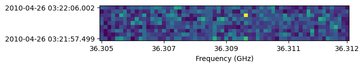

------
UVData
------

UVData objects hold all of the metadata and data required to analyze interferometric
data sets. Interferometric data is fundamentally tied to baselines, which are composed
of pairs of antennas. Visibilities, the measured quantity recorded from interferometers,
are complex numbers per baseline, time, frequency and instrumental polarization. On
UVData objects, visibilities are held in the ``data_array``. The ``data_array`` has axes
corresponding to baseline-time, frequency and instrumental polarization, so the baselines
and times are indexed together. This is because it is not uncommon for interferometers
not to record every baseline at every time for several reasons (including
baseline-dependent averaging). Note that UVData can also support combining the frequency
and polarization axis, which can be useful in certain circumstances, objects represented
this way are called ``flex_pol`` objects and are more fully described in :ref:`flex_pol`.

The antennas are described in two ways: with antenna numbers and antenna names. The
antenna numbers should **not** be confused with indices -- they are not required to start
at zero or to be contiguous, although it is not uncommon for some telescopes to number
them like indices. On UVData objects, the names and numbers are held in the
``antenna_names`` and ``antenna_numbers`` attributes respectively. These are arranged
in the same order so that an antenna number can be used to identify an antenna name and
vice versa.
Note that not all the antennas listed in ``antenna_numbers`` and ``antenna_names`` are
guaranteed to have visibilities associated with them in the ``data_array``. The antenna
numbers associated with each visibility is held in the ``ant_1_array`` and ``ant_2_array``
attributes. These arrays hold the antenna numbers for each visibility (they have the
same length as the ``data_array`` along the baseline-time axis) and which array they appear
in (``ant_1_array`` vs ``ant_2_array``) indicates the direction of the baseline. On
UVData objects, the baseline vector is defined to point from antenna 1 to antenna 2, so
it is given by the position of antenna 2 minus the position of antenna 1. Since the
``ant_1_array`` and ``ant_2_array`` attributes have the length of the baseline-time axis,
when there is more than one time integration in the data there are many repetitions of
each baseline. The times for each visibility are given by the ``time_array`` attribute
which also has the same length (the length of the baseline-time axis on the ``data_array``).

There is also a ``baseline_array`` attribute with baseline numbers defined from the
``ant_1_array`` and ``ant_2_array`` as
:math:`baseline = 2048 \times (antenna_1) + (antenna_2) + 2^{16}`.
This gives a unique baseline number for each antenna pair and can be a useful way to
identify visibilities associated with particular baselines. The ``baseline_array``
attribute has the same length as the ``ant_1_array`` and ``ant_2_array`` (the length of
the baseline-time axis on the ``data_array``). Note: earlier versions of pyuvdata added 1
to the antenna arrays before calculating the baseline numbers. Reference issues here?

For most users, the convenience methods for quick data access (see :ref:`quick_access`)
are the easiest way to get data for particular sets of baselines. Those methods take
the antenna numbers (i.e. numbers listed in ``antenna_numbers``) as inputs.

.. _uvdata_future_shapes:

UVData: parameter shape changes
-------------------------------
Initially, UVData objects were designed to support spectral windows as a separate axis,
although support for more than one spectral window was never implemented
(so the spectral window axis was always constrained to be length 1). This structure
would have required that all spectral windows had the same number of channels. In
version 2.1.2 we introduced flexible spectral windows, which implemented spectral
windows as sets of frequency channels with some extra parameters to track which
channels were in each spectral window. This structure allows for spectral windows to
have arbitrary numbers of frequency channels. This structure made the ``channel_width``
parameter be an array of length ``Nfreqs`` rather than a scalar, but only when the
UVData object contained flexible spectral windows. Supporting multiple spectral windows
in this way removes the need for the spectral window axis on several UVData parameters,
but the axis was left as a length 1 axis for backwards compatibility.

In version 3.0, we will remove the length 1 axis that was originally intended
for the spectral windows axis from the ``data_array``, ``flag_array``, ``nsample_array``
and ``freq_array`` parameters and the ``channel_width`` parameter will always be an
array of length ``Nfreqs``.

In order to support an orderly conversion of code and packages that use the ``UVData``
object to these new parameter shapes, we have created the
:meth:`pyuvdata.UVData.use_future_array_shapes` method and option on the read method,
which will change the parameters listed above to have their future shapes. Users writing
new code that uses ``UVData`` objects are encouraged to use the option in the read
methods or call that method immediately after creating a UVData object to ensure that
the code will be compatible with the forthcoming changes. Developers and maintainers of
existing code that uses ``UVData`` objects are encouraged to similarly add that option
or method call and convert their code to use the new shapes at their earliest
convenience to ensure future compatibility. The method and option will be deprecated
but not removed in version 3.0 (it will just become a no-op) so that code that calls it
will continue to function.

UVData: File conversion
-----------------------
Converting between tested data formats.
Note that it is possible to create a new :class:`pyuvdata.UVData` object
with the class method :meth:`pyuvdata.UVData.from_file` as well.

a) miriad -> uvfits
*******************
.. code-block:: python

  >>> import os
  >>> from pyuvdata import UVData
  >>> from pyuvdata.data import DATA_PATH

  >>> # This miriad file is known to be a drift scan.
  >>> # Use the `read` or `from_file` method, optionally specify the file type.
  >>> miriad_file = os.path.join(DATA_PATH, 'new.uvA')
  >>> uvd = UVData.from_file(miriad_file, use_future_array_shapes=True)
  >>> uvd = UVData.from_file(
  ...    miriad_file, file_type='miriad', use_future_array_shapes=True,
  ... )

  >>> # Write out the uvfits file
  >>> write_file = os.path.join('.', 'tutorial.uvfits')
  >>> uvd.write_uvfits(write_file, force_phase=True)
  The data are not all phased to a sidereal source. Phasing to zenith of the first timestamp.

b) uvfits -> miriad
*******************
.. code-block:: python

  >>> import os
  >>> from pyuvdata import UVData
  >>> from pyuvdata.data import DATA_PATH
  >>> import shutil
  >>> uvfits_file = os.path.join(DATA_PATH, 'day2_TDEM0003_10s_norx_1src_1spw.uvfits')

  >>> # Use the `read` or `from_file` method, optionally specify the file type.
  >>> uvd.read(uvfits_file, use_future_array_shapes=True)
  >>> uvd.read(uvfits_file, file_type='uvfits', use_future_array_shapes=True)
  >>> # Here we use the ``from_file`` class method without needing to initialize a new object.
  >>> uvd = UVData.from_file(uvfits_file, use_future_array_shapes=True)

  >>> # Write out the miriad file
  >>> write_file = os.path.join('.', 'tutorial.uv')
  >>> if os.path.exists(write_file):
  ...    shutil.rmtree(write_file)
  >>> uvd.write_miriad(write_file)

c) FHD -> uvfits
****************
When reading FHD format, we need to point to several files for each observation.

.. code-block:: python

  >>> import os
  >>> from pyuvdata import UVData
  >>> from pyuvdata.data import DATA_PATH
  >>> uvd = UVData()

  >>> # Construct the list of files
  >>> fhd_prefix = os.path.join(DATA_PATH, 'fhd_vis_data/1061316296_')
  >>> fhd_files = [fhd_prefix + f for f in ['flags.sav', 'vis_XX.sav', 'params.sav',
  ...                                       'vis_YY.sav', 'vis_model_XX.sav',
  ...                                       'vis_model_YY.sav', 'settings.txt',
  ...                                       'layout.sav']]

  # Use the `read` method, optionally specify the file type.
  >>> uvd = UVData.from_file(fhd_files, use_future_array_shapes=True)
  >>> uvd = UVData.from_file(fhd_files, file_type='fhd', use_future_array_shapes=True)
  >>> write_file = os.path.join('.', 'tutorial.uvfits')
  >>> uvd.write_uvfits(write_file)

d) FHD -> miriad
****************
.. code-block:: python

  >>> import os
  >>> from pyuvdata import UVData
  >>> from pyuvdata.data import DATA_PATH
  >>> import shutil
  >>> import os

  >>> # Construct the list of files
  >>> fhd_prefix = os.path.join(DATA_PATH, 'fhd_vis_data/1061316296_')
  >>> fhd_files = [fhd_prefix + f for f in ['flags.sav', 'vis_XX.sav', 'params.sav',
  ...                                       'vis_YY.sav', 'vis_model_XX.sav',
  ...                                       'vis_model_YY.sav', 'settings.txt',
  ...                                       'layout.sav']]
  >>> uvd = UVData.from_file(fhd_files, use_future_array_shapes=True)
  >>> write_file = os.path.join('.','tutorial.uv')
  >>> if os.path.exists(write_file):
  ...    shutil.rmtree(write_file)
  >>> uvd.write_miriad(write_file)

e) CASA -> uvfits
*****************
.. code-block:: python

  >>> import os
  >>> from pyuvdata import UVData
  >>> from pyuvdata.data import DATA_PATH
  >>> ms_file = os.path.join(DATA_PATH, 'day2_TDEM0003_10s_norx_1src_1spw.ms')

  >>> # Use the `read` method, optionally specify the file type. Can also use the
  >>> # file type specific `read_ms` method, but only if reading a single file.
  >>> # note that reading CASA measurement sets requires casacore to be installed
  >>> uvd = UVData.from_file(ms_file, use_future_array_shapes=True)
  >>> uvd = UVData.from_file(ms_file, file_type='ms', use_future_array_shapes=True)

  >>> # Write out uvfits file
  >>> write_file = os.path.join('.', 'tutorial.uvfits')
  >>> uvd.write_uvfits(write_file)

f) CASA -> miriad
*****************
.. code-block:: python

  >>> import os
  >>> from pyuvdata import UVData
  >>> from pyuvdata.data import DATA_PATH
  >>> import shutil
  >>> import os
  >>> ms_file = os.path.join(DATA_PATH, 'day2_TDEM0003_10s_norx_1src_1spw.ms')

  >>> # note that reading CASA measurement sets requires casacore to be installed
  >>> uvd = UVData.from_file(ms_file, use_future_array_shapes=True)

  >>> # Write out Miriad file
  >>> write_file = os.path.join('.', 'tutorial.uv')
  >>> if os.path.exists(write_file):
  ...    shutil.rmtree(write_file)
  >>> uvd.write_miriad(write_file)

g) miriad -> uvh5
*****************
.. code-block:: python

  >>> import os
  >>> from pyuvdata import UVData
  >>> from pyuvdata.data import DATA_PATH

  >>> # This miriad file is known to be a drift scan.
  >>> miriad_file = os.path.join(DATA_PATH, 'new.uvA')
  >>> uvd = UVData.from_file(miriad_file, use_future_array_shapes=True)

  >>> # Write out the uvh5 file
  >>> uvd.write_uvh5(os.path.join('.', 'tutorial.uvh5'))

h) uvfits -> uvh5
*****************
.. code-block:: python

  >>> import os
  >>> from pyuvdata import UVData
  >>> from pyuvdata.data import DATA_PATH
  >>> import os
  >>> uvfits_file = os.path.join(DATA_PATH, 'day2_TDEM0003_10s_norx_1src_1spw.uvfits')
  >>> uvd = UVData.from_file(uvfits_file, use_future_array_shapes=True)

  >>> # Write out the uvh5 file
  >>> write_file = os.path.join('.', 'tutorial.uvh5')
  >>> if os.path.exists(write_file):
  ...    os.remove(write_file)
  >>> uvd.write_uvh5(write_file)

  >>> # Read the uvh5 file back in.
  >>> # Use the `read` or `from_file` method, optionally specify the file type.
  >>> uvd = UVData.from_file(write_file, use_future_array_shapes=True)
  >>> uvd = UVData.from_file(write_file, file_type='uvh5', use_future_array_shapes=True)

i) MWA correlator -> uvfits
***************************
The MWA correlator writes FITS files containing the correlator dumps (but
lacking metadata and not conforming to the uvfits format). pyuvdata can read
these files from both the Legacy and MWAX correlator versions, along with MWA
metafits files (containing the required metadata), into a UVData object which can then
be written out to uvfits or any other supported file type. There are also options for
applying cable length corrections, dividing out digital gains, dividing out the coarse
band shape, common flagging patterns, using AOFlagger flag files, and phasing the data
to the pointing center. It is also optional to apply a Van Vleck correction for Legacy
correlator data. The default for this correction is to use a Chebyshev polynomial
approximation, and there is an option to instead use a slower integral implementation.

.. code-block:: python

  >>> import os
  >>> from pyuvdata import UVData
  >>> from pyuvdata.data import DATA_PATH
  >>> uvd = UVData()

  >>> # Construct the list of files
  >>> data_path = os.path.join(DATA_PATH, 'mwa_corr_fits_testfiles/')
  >>> filelist = [data_path + i for i in ['1131733552.metafits',
  ... '1131733552_20151116182537_mini_gpubox01_00.fits']]

  >>> # Use the `read` or `from_file` method, optionally specify the file type.
  >>> # Apply cable corrections and phase data before writing to uvfits
  >>> # Skip routine time/frequency flagging - see flag_init and associated keywords in documentation
  >>> uvd.read(filelist, correct_cable_len=True, phase_to_pointing_center=True, flag_init=False, use_future_array_shapes=True)
  >>> uvd = UVData.from_file(filelist, file_type='mwa_corr_fits', correct_cable_len=True, phase_to_pointing_center=True, flag_init=False, use_future_array_shapes=True)

  >>> # Write out uvfits file
  >>> write_file = os.path.join('.', 'tutorial.uvfits')
  >>> uvd.write_uvfits(write_file)

j) SMA MIR -> ms
****************
The SMA has its own bespoke format known as MIR (no relation to MIRIAD), which most
users prefer to convert to the CASA-based Measurement Set (MS) format for further
processing. The :meth:`pyuvdata.UVData.read_mir` method (and by extension,
:meth:`pyuvdata.UVData.read` as well) has support for a few extra keywords that are
specific to the MIR format. These keywords fall broadly into two groups: selection, and
visibility handling.

In addition to the selection keywords supported with UVData objects, there are a few
extra keywords supported for MIR data sets:
-   ``corrchunk``: Specifies (typically DSB) correlator window(s) to load.

-   ``receiver``: Specifies a receiver type (generally some combination of '230', '240',
    '345', and/or '400') to load, with different receivers typically used to target
    different bands and/or polarizations.

-   ``sideband``: Specifies which sideband to load, with the two options being 'l' for
    lower and 'u' for upper.

-   ``pseudo_cont`` : Specifies whether to load the "pseudo-continuum" data, which is
    constructed as the average of all channels across a single spectral window (set to
    ``False`` by default).

-   ``select_where`` : An keyword which allows for more advanced selection criterion.
    See the documentation in :meth:`pyuvdata.mir_parser.MirParser` for more details.

Some example use cases for the selection keywords:

.. code-block:: python

  >>> import os
  >>> from pyuvdata import UVData
  >>> from pyuvdata.data import DATA_PATH
  >>> uvd = UVData()

  >>> # Create a path to the SMA MIR test data set in pyuvdata
  >>> data_path = os.path.join(DATA_PATH, 'sma_test.mir')
  >>> # Let's first try loading just the '230' receivers.
  >>> uvd.read(data_path, receivers='230')
  >>> print((uvd.Npols, uvd.Nfreqs))
  (1, 131072)

  >>> # Now try one sideband, say the lower ('l')
  >>> uvd.read(data_path, sidebands='l')
  >>> print((uvd.Npols, uvd.Nfreqs))
  (2, 65536)

  >>> # Now try one just one chunk (2)
  >>> uvd.read(data_path, corrchunk=2)
  >>> print((uvd.Npols, uvd.Nfreqs))
  (2, 32768)

  >>> # Now all together -- '230' receiver, 'l' sideband, chunks 1 and 3
  >>> uvd.read(data_path, receivers='230', sidebands='l', corrchunk=[1, 3])
  >>> print((uvd.Npols, uvd.Nfreqs))
  (1, 32768)

  >>> # Write out a measurement set file
  >>> write_file = os.path.join('.', 'sma_mir_select.ms')
  >>> uvd.write_ms(write_file)

As for visibility handling keywords:

- ``rechunk``: Number of channels to spectrally average the data over on read. This is
  generally the most commonly used keyword, as it reduces the memory/disk space needed
  to complete read/write operations.

- ``apply_tsys``: Normalize the data using system temperature measurements to produces
  values in (uncalibrated) Jy (default is ``True``).

- ``apply_flags``: Apply on-line flags (default is ``True``).

For example, the native resolution of the test MIR dataset is 140 kHz -- to average this
down by a factor of 64 (8.96 MHz resolution) and write it out in MS format can be done
via the following:

.. code-block:: python

  >>> import os
  >>> from pyuvdata import UVData
  >>> from pyuvdata.data import DATA_PATH
  >>> uvd = UVData()

  >>> # Build a path to the test SMA data set
  >>> data_path = os.path.join(DATA_PATH, 'sma_test.mir')
  >>> # Set things up to average over 64-channel blocks.
  >>> uvd.read(data_path, rechunk=64)

  >>> # Write out uvfits file
  >>> write_file = os.path.join('.', 'sma_mir_rechunk.ms')
  >>> uvd.write_ms(write_file)

.. warning::
    Reading and writing of MIR data will on occasion generate a warning message about
    the LSTs not being correct. This warning is spurious, and a byproduct how LST values
    are calculated at time of write (polled average versus calculated based on the
    timestamp/integration midpoint), and can safely be ignored.

UVData: Instantiating from arrays in memory
-------------------------------------------
``pyuvdata`` can also be used to create a UVData object from arrays in memory. This
is useful for mocking up data for testing or for creating a UVData object from
simulated data. Instead of instantiating a blank object and setting each required
parameter, you can use the ``.new()`` static method, which deals with the task
of creating a consistent object from a minimal set of inputs

.. code-block:: python

  >>> from pyuvdata import UVData
  >>> from astropy.coordinates import EarthLocation
  >>> import numpy as np
  >>> uvd = UVData.new(
  ...     freq_array = np.linspace(1e8, 2e8, 100),
  ...     polarization_array = ["xx", "yy"],
  ...     antenna_positions = {
  ...         0: [0.0, 0.0, 0.0],
  ...         1: [0.0, 0.0, 1.0],
  ...         2: [0.0, 0.0, 2.0],
  ...     },
  ...     telescope_location = EarthLocation.from_geodetic(0, 0, 0),
  ...     telescope_name = "test",
  ...     times = np.linspace(2459855, 2459856, 20),
  ... )

Notice that you need only provide the required parameters, and the rest will be
filled in with sensible defaults. Importantly, the times and baselines can be provided
either as unique values, with the intention that their cartesian outer product should be
used (i.e. the combination of each provided time with each baseline), or as full
length-Nblt arrays (if you don't require all combinations). While this behaviour can
be inferred, it is best to set the ``do_blt_outer`` keyword to ``True`` or ``False``
to enable this. Let us for example create an unusual object with 4 times and 4 baselines,
where each baseline observed one time each. This case is ambiguous without the
``do_blt_outer`` keyword, so we must set it:

.. code-block:: python

  >>> from pyuvdata import UVData
  >>> from astropy.coordinates import EarthLocation
  >>> import numpy as np
  >>> times = np.array([2459855.0, 2459855.1, 2459855.2, 2459855.3])
  >>> antpairs = [(0, 1), (0, 2), (1, 2), (1, 1)]
  >>> uvd = UVData.new(
  ...     freq_array = np.linspace(1e8, 2e8, 100),
  ...     polarization_array = ["xx", "yy"],
  ...     antenna_positions = {
  ...         0: [0.0, 0.0, 0.0],
  ...         1: [0.0, 0.0, 1.0],
  ...         2: [0.0, 0.0, 2.0],
  ...     },
  ...     telescope_location = EarthLocation.from_geodetic(0, 0, 0),
  ...     telescope_name = "test",
  ...     times = times,
  ...     antpairs=antpairs,
  ...     do_blt_outer=False,
  ... )
  >>> uvd.time_array
  array([2459855. , 2459855.1, 2459855.2, 2459855.3])

Notice that the resulting ``time_array`` only has 4 values. If we had set
``do_blt_outer = True``, we would have gotten the cartesian outer product of the
provided times and baselines, which would have resulted in 16 times:

.. code-block:: python

  >>> from pyuvdata import UVData
  >>> from astropy.coordinates import EarthLocation
  >>> import numpy as np
  >>> uvd_rect = UVData.new(
  ...     freq_array = np.linspace(1e8, 2e8, 100),
  ...     polarization_array = ["xx", "yy"],
  ...     antenna_positions = {
  ...         0: [0.0, 0.0, 0.0],
  ...         1: [0.0, 0.0, 1.0],
  ...         2: [0.0, 0.0, 2.0],
  ...     },
  ...     telescope_location = EarthLocation.from_geodetic(0, 0, 0),
  ...     telescope_name = "test",
  ...     times = times,
  ...     antpairs=antpairs,
  ...     do_blt_outer=True,
  ... )
  >>> uvd_rect.time_array
  array([2459855. , 2459855. , 2459855. , 2459855. , 2459855.1, 2459855.1,
         2459855.1, 2459855.1, 2459855.2, 2459855.2, 2459855.2, 2459855.2,
         2459855.3, 2459855.3, 2459855.3, 2459855.3])

To change the order of the blt-axis, set the ``time_axis_faster_than_bls`` keyword:

.. code-block:: python

  >>> from pyuvdata import UVData
  >>> from astropy.coordinates import EarthLocation
  >>> import numpy as np
    >>> uvd_rect = UVData.new(
    ...   freq_array = np.linspace(1e8, 2e8, 100),
    ...   polarization_array = ["xx", "yy"],
    ...   antenna_positions = {
    ...       0: [0.0, 0.0, 0.0],
    ...       1: [0.0, 0.0, 1.0],
    ...       2: [0.0, 0.0, 2.0],
    ...   },
    ...   telescope_location = EarthLocation.from_geodetic(0, 0, 0),
    ...   telescope_name = "test",
    ...   times = times,
    ...   antpairs=antpairs,
    ...   do_blt_outer=True,
    ...   time_axis_faster_than_bls=True,
    ... )
    >>> uvd_rect.time_array
    array([2459855. , 2459855.1, 2459855.2, 2459855.3, 2459855. , 2459855.1,
           2459855.2, 2459855.3, 2459855. , 2459855.1, 2459855.2, 2459855.3,
           2459855. , 2459855.1, 2459855.2, 2459855.3])

See the full documentation for the method
:func:`pyuvdata.uvdata.UVData.new` for more information.

.. _quick_access:

UVData: Quick data access
-------------------------
A small suite of functions are available to quickly access the underlying numpy
arrays of data, flags, and nsamples. Although the user can perform this indexing
by hand, several convenience functions exist to easily extract specific subsets
corresponding to antenna-pair and/or polarization combinations. There are three
specific methods that will return numpy arrays: :meth:`pyuvdata.UVData.get_data`,
:meth:`pyuvdata.UVData.get_flags`, and :meth:`pyuvdata.UVData.get_nsamples`.
When possible, these methods will return numpy MemoryView
objects, which is relatively fast and adds minimal memory overhead. There are
also corresponding methods :meth:`pyuvdata.UVData.set_data`,
:meth:`pyuvdata.UVData.set_flags`, and :meth:`pyuvdata.UVData.set_nsamples`
which will overwrite sections of these datasets with user-provided data.

a) Data for single antenna pair / polarization combination.
************************************************************
.. code-block:: python

  >>> import os
  >>> import numpy as np
  >>> from pyuvdata import UVData
  >>> from pyuvdata.data import DATA_PATH
  >>> filename = os.path.join(DATA_PATH, 'day2_TDEM0003_10s_norx_1src_1spw.uvfits')
  >>> uvd = UVData.from_file(filename, use_future_array_shapes=True)
  >>> data = uvd.get_data(1, 2, 'rr')  # data for ant1=1, ant2=2, pol='rr'
  >>> times = uvd.get_times(1, 2)  # times corresponding to 0th axis in data
  >>> print(data.shape)
  (9, 64)
  >>> print(times.shape)
  (9,)

  >>> # One can equivalently make any of these calls with the input wrapped in a tuple.
  >>> data = uvd.get_data((1, 2, 'rr'))
  >>> times = uvd.get_times((1, 2))

b) Flags and nsamples for above data.
*************************************
.. code-block:: python

  >>> import os
  >>> import numpy as np
  >>> from pyuvdata import UVData
  >>> from pyuvdata.data import DATA_PATH
  >>> filename = os.path.join(DATA_PATH, 'day2_TDEM0003_10s_norx_1src_1spw.uvfits')
  >>> uvd = UVData.from_file(filename, use_future_array_shapes=True)

  >>> flags = uvd.get_flags(1, 2, 'rr')
  >>> nsamples = uvd.get_nsamples(1, 2, 'rr')
  >>> print(flags.shape)
  (9, 64)
  >>> print(nsamples.shape)
  (9, 64)

c) Data for single antenna pair, all polarizations.
***************************************************
.. code-block:: python

  >>> import os
  >>> import numpy as np
  >>> from pyuvdata import UVData
  >>> from pyuvdata.data import DATA_PATH
  >>> filename = os.path.join(DATA_PATH, 'day2_TDEM0003_10s_norx_1src_1spw.uvfits')
  >>> uvd = UVData.from_file(filename, use_future_array_shapes=True)

  >>> data = uvd.get_data(1, 2)
  >>> print(data.shape)
  (9, 64, 4)

  >>> # Can also give baseline number
  >>> data2 = uvd.get_data(uvd.antnums_to_baseline(1, 2))
  >>> print(np.all(data == data2))
  True

d) Data for single polarization, all baselines.
***********************************************
.. code-block:: python

  >>> import os
  >>> import numpy as np
  >>> from pyuvdata import UVData
  >>> from pyuvdata.data import DATA_PATH
  >>> filename = os.path.join(DATA_PATH, 'day2_TDEM0003_10s_norx_1src_1spw.uvfits')
  >>> uvd = UVData.from_file(filename, use_future_array_shapes=True)

  >>> data = uvd.get_data('rr')
  >>> print(data.shape)
  (1360, 64)

e) Update data arrays in place for UVData
*****************************************
There are methods on UVData objects which allow for updating the data, flags, or
nsamples arrays in place. We show how to use the :meth:`pyuvdata.UVData.set_data`
method below, and note there are analogous :meth:`pyuvdata.UVData.set_flags`
and :meth:`pyuvdata.UVData.set_nsamples` methods.
.. code-block:: python

  >>> import os
  >>> from pyuvdata import UVData
  >>> from pyuvdata.data import DATA_PATH
  >>> filename = os.path.join(DATA_PATH, "day2_TDEM0003_10s_norx_1src_1spw.uvfits")
  >>> uvd = UVData.from_file(filename, use_future_array_shapes=True)

  >>> data = uvd.get_data(1, 2, "rr", force_copy=True, squeeze="none")
  >>> data *= 2
  >>> uvd.set_data(data, 1, 2, "rr")

f) Iterate over all antenna pair / polarizations.
*************************************************
.. code-block:: python

  >>> import os
  >>> import numpy as np
  >>> from pyuvdata import UVData
  >>> from pyuvdata.data import DATA_PATH
  >>> filename = os.path.join(DATA_PATH, 'day2_TDEM0003_10s_norx_1src_1spw.uvfits')
  >>> uvd = UVData.from_file(filename, use_future_array_shapes=True)

  >>> for key, data in uvd.antpairpol_iter():
  ...  flags = uvd.get_flags(key)
  ...  nsamples = uvd.get_nsamples(key)

    >>> # Do something with the data, flags, nsamples

g) Convenience functions to ask what antennas, baselines, and pols are in the data.
***********************************************************************************
.. code-block:: python

  >>> import os
  >>> import numpy as np
  >>> from pyuvdata import UVData
  >>> from pyuvdata.data import DATA_PATH
  >>> filename = os.path.join(DATA_PATH, 'day2_TDEM0003_10s_norx_1src_1spw.uvfits')
  >>> uvd = UVData.from_file(filename, use_future_array_shapes=True)

  >>> # Get all unique antennas in data
  >>> print(uvd.get_ants())
  [ 1  2  3  4  7  8  9 12 15 19 20 21 22 23 24 25 27 28]

  >>> # Get all baseline nums in data, print first 10.
  >>> print(uvd.get_baseline_nums()[0:10])
  [67586 67587 67588 67591 67592 67593 67596 67599 67603 67604]

  >>> # Get all (ordered) antenna pairs in data (same info as baseline_nums), print first 10.
  >>> print(uvd.get_antpairs()[0:10])
  [(1, 2), (1, 3), (1, 4), (1, 7), (1, 8), (1, 9), (1, 12), (1, 15), (1, 19), (1, 20)]

  >>> # Get all antenna pairs and polarizations, i.e. keys produced in UVData.antpairpol_iter(), print first 5.
  >>> print(uvd.get_antpairpols()[0:5])
  [(1, 2, 'rr'), (1, 2, 'll'), (1, 2, 'rl'), (1, 2, 'lr'), (1, 3, 'rr')]

h) Quick access to file attributes of a UV* object (UVData, UVCal, UVBeam)
**************************************************************************
.. code-block:: python

  ## in bash ##
  >>> # Print data_array.shape to stdout
  pyuvdata_inspect.py --attr=data_array.shape <uv*_file>

  >>> # Print Ntimes,Nfreqs,Nbls to stdout
  pyuvdata_inspect.py --attr=Ntimes,Nfreqs,Nbls <uv*_file>

  >>> # Load object to instance name "uv" and will remain in interpreter
  pyuvdata_inspect.py -i <uv*_file>

UVData: Phasing
---------------
Phasing/unphasing data

.. code-block:: python

  >>> import os
  >>> from astropy.time import Time
  >>> from numpy import pi
  >>> from pyuvdata import UVData
  >>> from pyuvdata.data import DATA_PATH
  >>> uvh5_file = os.path.join(DATA_PATH, "zen.2458661.23480.HH.uvh5")
  >>> uvd = UVData.from_file(uvh5_file, use_future_array_shapes=True)

  >>> # We can get information on the sources in the data set by using the
  >>> # `print_phase_center_info` command. This object is initially unprojected (unphased)
  >>> uvd.print_phase_center_info()
     ID     Cat Entry          Type      Az/Lon/RA    El/Lat/Dec  Frame
      #          Name                          deg           deg
  ----------------------------------------------------------------------
      0        zenith   unprojected     0:00:00.00  +90:00:00.00  altaz

  >>> # When phasing, the user needs to supply a name for each phase
  >>> # center, though it does not need to be unique. We are specifying that the type
  >>> # here is "sidereal", which means that the position is represented by a fixed set
  >>> # of coordinates in a sidereal coordinate frame (e.g., ICRS, FK5, etc).
  >>> uvd.phase(5.23368, 0.710940, epoch="J2000", cat_name='target1', cat_type="sidereal")
  >>> uvd.print_phase_center_info()
     ID     Cat Entry          Type     Az/Lon/RA    El/Lat/Dec  Frame    Epoch
      #          Name                       hours           deg
  ------------------------------------------------------------------------------
      1       target1      sidereal   19:59:28.27  +40:44:01.90   icrs  J2000.0

  >>> # You can use the `phase_to_time` method to phase to zenith at a particular time.
  >>> # The time can be passed as an astropy Time object or as a float which will be
  >>> # interpreted as a JD
  >>> uvd.phase_to_time(Time(uvd.time_array[0], format='jd'))
  >>> uvd.print_phase_center_info()
     ID     Cat Entry          Type     Az/Lon/RA    El/Lat/Dec  Frame    Epoch
      #          Name                       hours           deg
  ------------------------------------------------------------------------------
      0  zenith_at_jd2458661.234803      sidereal   13:20:57.92  -30:37:09.44   icrs  J2000.0

  >>> # You can also now phase to "ephem" objects, which
  >>> # move with time, e.g. solar system bodies. The phase method has a `lookup_name`
  >>> # option which, if set to true, will allow you to search JPL-Horizons for coords
  >>> uvd.phase(0, 0, epoch="J2000", cat_name="Sun", lookup_name=True)
  >>> uvd.print_phase_center_info()
     ID     Cat Entry          Type     Az/Lon/RA    El/Lat/Dec  Frame    Epoch        Ephem Range        Dist   V_rad
      #          Name                       hours           deg                  Start-MJD    End-MJD       pc    km/s
  ---------------------------------------------------------------------------------------------------------------------
      1           Sun         ephem    6:19:28.68  +23:21:44.63   icrs  J2000.0   58660.25   58661.00  1.0e+00  0.2157

  >>> # Finally, we can use a selection mask to only phase part of the data at a time,
  >>> # like only the data belonging to the first integration
  >>> select_mask = uvd.time_array == uvd.time_array[0]

  >>> # Let's use this to create a 'driftscan' target, which is phased to a particular
  >>> # azimuth and elevation (note this is different than "unprojected" data -- which
  >>> # used to be designated with phase_type="drift" -- in that it is still phased and
  >>> # can be to any azimuth and elevation, not just zenith). Note that we need to
  >>> # supply `phase_frame` as "altaz", since driftscans are always in that frame.
  >>> uvd.phase(0, pi/2, cat_name="zenith", phase_frame='altaz', cat_type="driftscan", select_mask=select_mask)

  >>> # Now when using `print_phase_center_info`, we'll see that there are multiple
  >>> # phase centers present in the data
  >>> uvd.print_phase_center_info()
     ID     Cat Entry          Type      Az/Lon/RA    El/Lat/Dec  Frame    Epoch        Ephem Range        Dist   V_rad
      #          Name                          deg           deg                  Start-MJD    End-MJD       pc    km/s
  ----------------------------------------------------------------------------------------------------------------------
      0        zenith     driftscan     0:00:00.00  +90:00:00.00  altaz  J2000.0
      1           Sun         ephem    94:52:10.21  +23:21:44.63   icrs  J2000.0   58660.25   58661.00  1.0e+00  0.2157

  >>> # We can unproject (unphase) data using the `unproject_phase` method
  >>> uvd.unproject_phase()

  >>> # Now when using `print_phase_center_info`, we'll see that all the data are unprojected
  >>> uvd.print_phase_center_info()
     ID     Cat Entry          Type      Az/Lon/RA    El/Lat/Dec  Frame
      #          Name                          deg           deg
  ----------------------------------------------------------------------
      2   unprojected   unprojected     0:00:00.00  +90:00:00.00  altaz

UVData: Averaging and Resampling
--------------------------------
pyuvdata has methods to average (downsample) in time and frequency and also to
upsample in time (useful to get all baselines on the shortest time integration
for a data set that has had baseline dependent time averaging applied).

Use the :meth:`pyuvdata.UVData.downsample_in_time`,
:meth:`pyuvdata.UVData.upsample_in_time` and :meth:`pyuvdata.UVData.resample_in_time`
methods to average (downsample) and upsample in time or to do both at once on data
that have had baseline dependent averaging (BDA) applied to put all the baselines
on the same time integrations. Resampling in time is done on phased data by default,
drift mode data are phased, resampled, and then unphased. Set ``allow_drift=True``
to do resampling without phasing.

Use the :meth:`pyuvdata.UVData.frequency_average` method to average along the frequency
axis.

a) Averaging (Downsampling) in time
***********************************
Use either the ``n_times_to_avg`` keyword to specify an integer factor to average
by or ``min_int_time`` to specify a minimum final integration time. Specifying
``min_int_time`` is most appropriate when the integration time varies, e.g. if
the data have had baseline-dependent averaging applied.

.. code-block:: python

  >>> import os
  >>> import numpy as np
  >>> from pyuvdata import UVData
  >>> from pyuvdata.data import DATA_PATH
  >>> datafile = os.path.join(DATA_PATH, "zen.2458661.23480.HH.uvh5")
  >>> uvd = UVData.from_file(datafile, use_future_array_shapes=True)
  >>> uvd2 = uvd.copy()
  >>> print("Range of integration times: ", np.amin(uvd.integration_time),
  ...       "-", np.amax(uvd.integration_time))
  Range of integration times:  1.879048192 - 1.879048192

  >>> # first use n_times_to_avg to average by a factor of 2 in time.
  >>> uvd.downsample_in_time(n_times_to_avg=2)
  Data are unprojected or phased as a driftscan, phasing before resampling.
  Undoing phasing.

  >>> print("Range of integration times after downsampling: ", np.amin(uvd.integration_time),
  ...       "-", np.amax(uvd.integration_time))
  Range of integration times after downsampling:  3.758096384 - 3.758096384

  >>> # Now use min_int_time to average by a factor of 2 in time.
  >>> min_integration_time = np.amax(uvd2.integration_time) * 2.0
  >>> uvd2.downsample_in_time(min_int_time=min_integration_time)
  Data are unprojected or phased as a driftscan, phasing before resampling.
  Undoing phasing.

  >>> print("Range of integration times after downsampling: ", np.amin(uvd2.integration_time),
  ...       "-", np.amax(uvd2.integration_time))
  Range of integration times after downsampling:  3.758096384 - 3.758096384

b) Upsampling in time
*********************
.. code-block:: python

  >>> import os
  >>> import numpy as np
  >>> from pyuvdata import UVData
  >>> from pyuvdata.data import DATA_PATH
  >>> datafile = os.path.join(DATA_PATH, "zen.2458661.23480.HH.uvh5")
  >>> uvd = UVData.from_file(datafile, use_future_array_shapes=True)
  >>> print("Range of integration times: ", np.amin(uvd.integration_time),
  ...       "-", np.amax(uvd.integration_time))
  Range of integration times:  1.879048192 - 1.879048192

  >>> max_integration_time = np.amin(uvd.integration_time) / 2.0
  >>> uvd.upsample_in_time(max_integration_time)
  Data are unprojected or phased as a driftscan, phasing before resampling.
  Undoing phasing.

  >>> print("Range of integration times after upsampling: ", np.amin(uvd.integration_time),
  ...       "-", np.amax(uvd.integration_time))
  Range of integration times after upsampling:  0.939524096 - 0.939524096

c) Resampling a BDA dataset in time
***********************************
.. code-block:: python

  >>> import os
  >>> import numpy as np
  >>> from pyuvdata import UVData
  >>> from pyuvdata.data import DATA_PATH
  >>> testfile = os.path.join(DATA_PATH, "simulated_bda_file.uvh5")
  >>> uvd = UVData.from_file(testfile, use_future_array_shapes=True)
  >>> print(
  ...    "Range of integration times: ", np.amin(uvd.integration_time), "-", np.amax(uvd.integration_time)
  ... )
  Range of integration times:  2.0 - 16.0

  >>> # Resample all baselines to an 8s integration time
  >>> uvd.resample_in_time(8, allow_drift=True)
  Data are unprojected or phased as a driftscan and allow_drift is True, so resampling will be done without phasing.
  Data are unprojected or phased as a driftscan and allow_drift is True, so resampling will be done without phasing.

  >>> print("Range of integration times after resampling: ", np.amin(uvd.integration_time),
  ...       "-", np.amax(uvd.integration_time))
  Range of integration times after resampling:  8.0 - 8.0

d) Averaging in frequency
*************************
The :meth:`pyuvdata.UVData.frequency_average` method takes a number of channels to
average together. Use the `keep_ragged` parameter to control the handling if the
number of frequencies in each spectral window does not divide evenly by the number of
channels to be averaged together. Use the `respect_spws` parameter to control whether
averaging will be done over spectral window boundaries.

.. code-block:: python

  >>> import os
  >>> import numpy as np
  >>> from pyuvdata import UVData
  >>> from pyuvdata.data import DATA_PATH
  >>> datafile = os.path.join(DATA_PATH, "zen.2458661.23480.HH.uvh5")
  >>> uvd = UVData.from_file(datafile, use_future_array_shapes=True)
  >>> print("Channel width: ", uvd.channel_width)
  Channel width:  [122070.3125 122070.3125 122070.3125 122070.3125]

  >>> # Average by a factor of 2 in frequency
  >>> uvd.frequency_average(n_chan_to_avg=2, keep_ragged=True)
  >>> print("Channel width after frequency averaging: ", uvd.channel_width)
  Channel width after frequency averaging:  [244140.625 244140.625]

UVData: Plotting
----------------
Making a simple waterfall plot.

Note: there is now support for reading in only part of a uvfits, uvh5 or miriad file
(see :ref:`large_files`), so you need not read in the entire file to plot one waterfall.

.. code-block:: python

  >>> import os
  >>> from astropy.time import Time
  >>> import numpy as np
  >>> import matplotlib.pyplot as plt
  >>> from pyuvdata import UVData
  >>> from pyuvdata.data import DATA_PATH
  >>> filename = os.path.join(DATA_PATH, 'day2_TDEM0003_10s_norx_1scan.uvfits')
  >>> uvd = UVData.from_file(filename, use_future_array_shapes=True)

  >>> print(uvd.data_array.shape)
  (1414, 128, 4)
  >>> print(uvd.Ntimes)
  17
  >>> print(uvd.Nfreqs)
  128
  >>> # get the data for a single baseline and polarization
  >>> waterfall_data = uvd.get_data((1, 2, uvd.polarization_array[0]))
  >>> # get the corresponding times for this waterfall
  >>> waterfall_times = Time(uvd.get_times((1, 2, uvd.polarization_array[0])), format="jd").iso

  >>> # Amplitude waterfall for all spectral channels and 0th polarization
  >>> fig, ax = plt.subplots(1, 1)
  >>> _ = ax.imshow(np.abs(waterfall_data), interpolation='none')
  >>> _ = ax.set_yticks([0, waterfall_times.size - 1])
  >>> _ = ax.set_yticklabels([waterfall_times[0], waterfall_times[1]])
  >>> freq_tick_inds = np.concatenate((np.arange(0, uvd.Nfreqs, 16), [uvd.Nfreqs-1]))
  >>> _ = ax.set_xticks(freq_tick_inds)
  >>> _ = ax.set_xticklabels([f"{val:.3f}" for val in uvd.freq_array[freq_tick_inds]*1e-9])
  >>> _ = ax.set_xlabel("Frequency (GHz)")
  >>> fig.show() # doctest: +SKIP
  >>> plt.savefig("Images/amplitude_waterfall.png", bbox_inches='tight')
  >>> plt.clf()

.. code-block:: python

  >>> # The plot above has a discontinuity in the frequency axis because this
  >>> # data set has spectral windows. Let's just plot the 0th one
  >>> window_sel = uvd.flex_spw_id_array == 0
  >>> freqs_use = uvd.freq_array[window_sel]
  >>> fig, ax = plt.subplots(1, 1)
  >>> _ = plt.imshow(np.abs(waterfall_data[:,  window_sel]))
  >>> _ = ax.set_yticks([0, waterfall_times.size - 1])
  >>> _ = ax.set_yticklabels([waterfall_times[0], waterfall_times[1]])
  >>> freq_tick_inds = np.concatenate((np.arange(0, freqs_use.size, 16), [freqs_use.size-1]))
  >>> _ = ax.set_xticks(freq_tick_inds)
  >>> _ = ax.set_xticklabels([f"{val:.3f}" for val in freqs_use[freq_tick_inds]*1e-9])
  >>> _ = ax.set_xlabel("Frequency (GHz)")
  >>> plt.show() # doctest: +SKIP
  >>> plt.savefig("Images/amplitude_waterfall_spw0.png", bbox_inches='tight')
  >>> plt.clf()

UVData: Location conversions
----------------------------
A number of conversion methods exist to map between different coordinate systems
for locations on the earth.

a) Getting antenna positions in topocentric frame in units of meters
********************************************************************
.. code-block:: python

  >>> # directly from UVData object
  >>> import os
  >>> from pyuvdata import UVData
  >>> from pyuvdata.data import DATA_PATH
  >>> data_file = os.path.join(DATA_PATH, 'new.uvA')
  >>> uvd = UVData.from_file(data_file, use_future_array_shapes=True)
  >>> antpos, ants = uvd.get_ENU_antpos()

  >>> # using utils
  >>> from pyuvdata import utils

  >>> # get antennas positions in ECEF
  >>> antpos = uvd.antenna_positions + uvd.telescope_location

  >>> # convert to topocentric (East, North, Up or ENU) coords.
  >>> antpos = utils.ENU_from_ECEF(antpos, *uvd.telescope_location_lat_lon_alt)

UVData: Selecting data
----------------------
The :meth:`pyuvdata.UVData.select` method lets you select specific antennas (by number or name),
antenna pairs, frequencies (in Hz or by channel number), times (or time range),
local sidereal time (LST) (or LST range), or polarizations to keep in the object
while removing others.

Note: The same select interface is now supported on the read for many file types
(see :ref:`large_files`), so you need not read in the entire file before doing the select.

a) Select 3 antennas to keep using the antenna number.
******************************************************
.. code-block:: python

  >>> import os
  >>> import numpy as np
  >>> from pyuvdata import UVData
  >>> from pyuvdata.data import DATA_PATH
  >>> filename = os.path.join(DATA_PATH, 'day2_TDEM0003_10s_norx_1src_1spw.uvfits')
  >>> uvd = UVData.from_file(filename, use_future_array_shapes=True)

  >>> # print all the antennas numbers with data in the original file
  >>> print(np.unique(uvd.ant_1_array.tolist() + uvd.ant_2_array.tolist()))
  [ 1  2  3  4  7  8  9 12 15 19 20 21 22 23 24 25 27 28]
  >>> uvd.select(antenna_nums=[1, 12, 21])

  >>> # print all the antennas numbers with data after the select
  >>> print(np.unique(uvd.ant_1_array.tolist() + uvd.ant_2_array.tolist()))
  [ 1 12 21]

b) Select 3 antennas to keep using the antenna names, also select 5 frequencies to keep.
****************************************************************************************
.. code-block:: python

  >>> import os
  >>> import numpy as np
  >>> from pyuvdata import UVData
  >>> from pyuvdata.data import DATA_PATH
  >>> filename = os.path.join(DATA_PATH, 'day2_TDEM0003_10s_norx_1src_1spw.uvfits')
  >>> uvd = UVData.from_file(filename, use_future_array_shapes=True)

  >>> # print all the antenna names with data in the original file
  >>> unique_ants = np.unique(uvd.ant_1_array.tolist() + uvd.ant_2_array.tolist())
  >>> print([uvd.antenna_names[np.where(uvd.antenna_numbers==a)[0][0]] for a in unique_ants])
  ['W09', 'E02', 'E09', 'W01', 'N06', 'N01', 'E06', 'E08', 'W06', 'W04', 'N05', 'E01', 'N04', 'E07', 'W05', 'N02', 'E03', 'N08']

  >>> # print how many frequencies in the original file
  >>> print(uvd.freq_array.size)
  64
  >>> uvd.select(antenna_names=['N02', 'E09', 'W06'], frequencies=uvd.freq_array[0:4])

  >>> # print all the antenna names with data after the select
  >>> unique_ants = np.unique(uvd.ant_1_array.tolist() + uvd.ant_2_array.tolist())
  >>> print([uvd.antenna_names[np.where(uvd.antenna_numbers==a)[0][0]] for a in unique_ants])
  ['E09', 'W06', 'N02']

  >>> # print all the frequencies after the select
  >>> print(uvd.freq_array)
  [3.6304542e+10 3.6304667e+10 3.6304792e+10 3.6304917e+10]

c) Select a few antenna pairs to keep
*************************************
.. code-block:: python

  >>> import os
  >>> from pyuvdata import UVData
  >>> from pyuvdata.data import DATA_PATH
  >>> filename = os.path.join(DATA_PATH, 'day2_TDEM0003_10s_norx_1src_1spw.uvfits')
  >>> uvd = UVData.from_file(filename, use_future_array_shapes=True)

  >>> # print how many antenna pairs with data in the original file
  >>> print(len(set(zip(uvd.ant_1_array, uvd.ant_2_array))))
  153
  >>> uvd.select(bls=[(1, 2), (7, 1), (1, 21)])

  >>> # note that order of the values in the pair does not matter
  >>> # print all the antenna pairs after the select
  >>> print(sorted(set(zip(uvd.ant_1_array, uvd.ant_2_array))))
  [(1, 2), (1, 7), (1, 21)]

d) Select antenna pairs using baseline numbers
**********************************************
.. code-block:: python

  >>> import os
  >>> import numpy as np
  >>> from pyuvdata import UVData
  >>> from pyuvdata.data import DATA_PATH
  >>> filename = os.path.join(DATA_PATH, 'day2_TDEM0003_10s_norx_1src_1spw.uvfits')
  >>> uvd = UVData.from_file(filename, use_future_array_shapes=True)

  >>> # baseline numbers can be found in the baseline_array
  >>> print(len(uvd.baseline_array))
  1360

  >>> # select baselines using the baseline numbers
  >>> uvd.select(bls=[73736, 73753, 81945])

  >>> # print unique baselines and antennas after select
  >>> print(np.unique(uvd.baseline_array))
  [73736 73753 81945]
  >>> print(list(set(zip(uvd.ant_1_array, uvd.ant_2_array))))
  [(8, 25), (4, 25), (4, 8)]

e) Select polarizations
***********************
Selecting on polarizations can be done either using the polarization numbers or the
polarization strings (e.g. "xx" or "yy" for linear polarizations or "rr" or "ll" for
circular polarizations). If ``x_orientation`` is set on the object, strings representing
the physical orientation of the dipole can also be used (e.g. "nn" or "ee).

.. code-block:: python

  >>> import os
  >>> import numpy as np
  >>> from pyuvdata import UVData
  >>> from pyuvdata.data import DATA_PATH
  >>> import pyuvdata.utils as uvutils
  >>> filename = os.path.join(DATA_PATH, 'day2_TDEM0003_10s_norx_1src_1spw.uvfits')
  >>> uvd = UVData.from_file(filename, use_future_array_shapes=True)

  >>> # polarization numbers can be found in the polarization_array
  >>> print(uvd.polarization_array)
  [-1 -2 -3 -4]

  >>> # polarization numbers can be converted to strings using a utility function
  >>> print(uvutils.polnum2str(uvd.polarization_array))
  ['rr', 'll', 'rl', 'lr']

  >>> # select polarizations using the polarization numbers
  >>> uvd.select(polarizations=[-1, -2, -3])

  >>> # print polarization numbers and strings after select
  >>> print(uvd.polarization_array)
  [-1 -2 -3]
  >>> print(uvutils.polnum2str(uvd.polarization_array))
  ['rr', 'll', 'rl']

  >>> # select polarizations using the polarization strings
  >>> uvd.select(polarizations=["rr", "ll"])

  >>> # print polarization numbers and strings after select
  >>> print(uvd.polarization_array)
  [-1 -2]
  >>> print(uvutils.polnum2str(uvd.polarization_array))
  ['rr', 'll']

  >>> # read in a file with linear polarizations and an x_orientation
  >>> filename = os.path.join(DATA_PATH, 'zen.2458661.23480.HH.uvh5')
  >>> uvd = UVData.from_file(filename, use_future_array_shapes=True)

  >>> # print polarization numbers and strings
  >>> print(uvd.polarization_array)
  [-5 -6]
  >>> print(uvutils.polnum2str(uvd.polarization_array))
  ['xx', 'yy']

  >>> # print x_orientation
  >>> print(uvd.x_orientation)
  NORTH

  >>> # select polarizations using the physical orientation strings
  >>> uvd.select(polarizations=["ee"])

  >>> # print polarization numbers and strings after select
  >>> print(uvd.polarization_array)
  [-6]
  >>> print(uvutils.polnum2str(uvd.polarization_array))
  ['yy']

f) Select antenna pairs and polarizations using ant_str argument
****************************************************************

Basic options are "auto", "cross", or "all". "auto" returns just the
autocorrelations (all pols), while "cross" returns just the cross-correlations
(all pols).  The ant_str can also contain:

1. Individual antenna number(s):
________________________________

- 1: returns all antenna pairs containing antenna number 1 (including the auto correlation)
- 1,2: returns all antenna pairs containing antennas 1 and/or 2

.. code-block:: python

  >>> import os
  >>> from pyuvdata import UVData
  >>> from pyuvdata.data import DATA_PATH
  >>> filename = os.path.join(DATA_PATH, 'day2_TDEM0003_10s_norx_1src_1spw.uvfits')
  >>> uvd = UVData.from_file(filename, use_future_array_shapes=True)

  >>> # Print the number of antenna pairs in the original file
  >>> print(len(uvd.get_antpairs()))
  153

  >>> # Apply select to UVData object
  >>> uvd.select(ant_str='1,2,3')

  >>> # Print the number of antenna pairs after the select
  >>> print(len(uvd.get_antpairs()))
  48

2. Individual baseline(s):
___________________________

- 1_2: returns only the antenna pair (1,2)
- 1_2,1_3,1_10: returns antenna pairs (1,2),(1,3),(1,10)
- (1,2)_3: returns antenna pairs (1,3),(2,3)
- 1_(2,3): returns antenna pairs (1,2),(1,3)

.. code-block:: python

  >>> import os
  >>> from pyuvdata import UVData
  >>> from pyuvdata.data import DATA_PATH
  >>> filename = os.path.join(DATA_PATH, 'day2_TDEM0003_10s_norx_1src_1spw.uvfits')
  >>> uvd = UVData.from_file(filename, use_future_array_shapes=True)

  >>> # Print the number of antenna pairs in the original file
  >>> print(len(uvd.get_antpairs()))
  153

  >>> # Apply select to UVData object
  >>> uvd.select(ant_str='(1,2)_(3,7)')

  >>> # Print the antennas pairs with data after the select
  >>> print(uvd.get_antpairs())
  [(1, 3), (1, 7), (2, 3), (2, 7)]

3. Antenna number(s) and polarization(s):
__________________________________________

When polarization information is passed with antenna numbers,
all antenna pairs kept in the object will retain data for each specified polarization

- 1x: returns all antenna pairs containing antenna number 1 and polarizations xx and xy
- 2x_3y: returns the antenna pair (2,3) and polarization xy
- 1r_2l,1l_3l,1r_4r: returns antenna pairs (1,2), (1,3), (1,4) and polarizations rr, ll, and rl.  This yields a complete list of baselines with polarizations of 1r_2l, 1l_2l, 1r_2r, 1r_3l, 1l_3l, 1r_3r, 1r_11l, 1l_11l, and 1r_11r.
- (1x,2y)_(3x,4y): returns antenna pairs (1,3),(1,4),(2,3),(2,4) and polarizations xx, yy, xy, and yx
- 2l_3: returns antenna pair (2,3) and polarizations ll and lr
- 2r_3: returns antenna pair (2,3) and polarizations rr and rl
- 1l_3,2x_3: returns antenna pairs (1,3), (2,3) and polarizations ll, lr, xx, and xy
- 1_3l,2_3x: returns antenna pairs (1,3), (2,3) and polarizations ll, rl, xx, and yx

.. code-block:: python

  >>> import os
  >>> from pyuvdata import UVData
  >>> from pyuvdata.data import DATA_PATH
  >>> filename = os.path.join(DATA_PATH, 'day2_TDEM0003_10s_norx_1src_1spw.uvfits')
  >>> uvd = UVData.from_file(filename, use_future_array_shapes=True)

  >>> # Print the number of antennas and polarizations with data in the original file
  >>> print((len(uvd.get_antpairs()), uvd.get_pols()))
  (153, ['rr', 'll', 'rl', 'lr'])

  >>> # Apply select to UVData object
  >>> uvd.select(ant_str='1r_2l,1l_3l,1r_7r')

  >>> # Print all the antennas numbers and polarizations with data after the select
  >>> print((uvd.get_antpairs(), uvd.get_pols()))
  ([(1, 2), (1, 3), (1, 7)], ['rr', 'll', 'rl'])

4. Stokes parameter(s):
________________________

Can be passed lowercase or uppercase

- i,I: keeps only Stokes I
- q,V: keeps both Stokes Q and V

5. Minus sign(s):
________________________

If a minus sign is present in front of an antenna number, it will not be kept in the data

- 1,-3: returns all antenna pairs containing antenna 1, but removes any containing antenna 3
- 1,-1_3: returns all antenna pairs containing antenna 1, except the antenna pair (1,3)
- 1x_(-3y,10x): returns antenna pair (1,10) and polarization xx

.. code-block:: python

  >>> import os
  >>> from pyuvdata import UVData
  >>> from pyuvdata.data import DATA_PATH
  >>> filename = os.path.join(DATA_PATH, 'day2_TDEM0003_10s_norx_1src_1spw.uvfits')
  >>> uvd = UVData.from_file(filename, use_future_array_shapes=True)

  >>> # Print the number of antenna pairs in the original file
  >>> print(len(uvd.get_antpairs()))
  153

  >>> # Apply select to UVData object
  >>> uvd.select(ant_str='1,-1_3')

  >>> # Print the number of antenna pairs with data after the select
  >>> print(len(uvd.get_antpairs()))
  16

g) Select based on time or local sidereal time (LST)
****************************************************
You can select times to keep on an object by specifying exact times to keep or
time ranges to keep or the desired LSTs or LST range. Note that the LST is expected to
be in radians (**not** hours), consistent with how the LSTs are stored on the
object. When specifying an LST range, if the first number is larger than the
second, the range is assumed to wrap around LST = 0 = 2*pi.

.. code-block:: python

  >>> import os
  >>> import numpy as np
  >>> from pyuvdata import UVData
  >>> from pyuvdata.data import DATA_PATH
  >>> filename = os.path.join(DATA_PATH, 'day2_TDEM0003_10s_norx_1src_1spw.uvfits')
  >>> uvd = UVData.from_file(filename, use_future_array_shapes=True)

  >>> # Times can be found in the time_array, which is length Nblts.
  >>> # Use unique to find the unique times
  >>> print(np.unique(uvd.time_array))
  [2455312.64023149 2455312.64023727 2455312.64024305 2455312.64024884
   2455312.64034724 2455312.64046293 2455312.64057797 2455312.64057869
   2455312.64069444 2455312.64069492 2455312.64081019 2455312.64092547
   2455312.64092594 2455312.6410417  2455312.64115739]

  >>> # make a copy and select some times that are on the object
  >>> uvd2 = uvd.copy()
  >>> uvd2.select(times=np.unique(uvd.time_array)[0:5])

  >>> # print the unique times after the select
  >>> print(np.unique(uvd2.time_array))
  [2455312.64023149 2455312.64023727 2455312.64024305 2455312.64024884
   2455312.64034724]

  >>> # make a copy and select a time range
  >>> uvd2 = uvd.copy()
  >>> uvd2.select(time_range=[2455312.64023, 2455312.6406])

  >>> # print the unique times after the select
  >>> print(np.unique(uvd2.time_array))
  [2455312.64023149 2455312.64023727 2455312.64024305 2455312.64024884
   2455312.64034724 2455312.64046293 2455312.64057797 2455312.64057869]

  >>> # LSTs can be found in the lst_array
  >>> lsts = np.unique(uvd.lst_array)
  >>> print(len(lsts))
  15

  >>> # select LSTs that are on the object
  >>> uvd.select(lsts=lsts[0:len(lsts) // 2])

  >>> # print length of unique LSTs after select
  >>> print(len(np.unique(uvd.lst_array)))
  7

h) Select data and return new object (leaving original intact).
***************************************************************
.. code-block:: python

  >>> import os
  >>> import numpy as np
  >>> from pyuvdata import UVData
  >>> from pyuvdata.data import DATA_PATH
  >>> filename = os.path.join(DATA_PATH, 'day2_TDEM0003_10s_norx_1src_1spw.uvfits')
  >>> uvd = UVData.from_file(filename, use_future_array_shapes=True)
  >>> uvd2 = uvd.select(antenna_nums=[1, 12, 21], inplace=False)

  >>> # print all the antennas numbers with data in the original file
  >>> print(np.unique(uvd.ant_1_array.tolist() + uvd.ant_2_array.tolist()))
  [ 1  2  3  4  7  8  9 12 15 19 20 21 22 23 24 25 27 28]

  >>> # print all the antennas numbers with data after the select
  >>> print(np.unique(uvd2.ant_1_array.tolist() + uvd2.ant_2_array.tolist()))
  [ 1 12 21]

UVData: Combining and concatenating data
----------------------------------------
The :meth:`pyuvdata.UVData.__add__` method lets you combine UVData objects along
the baseline-time, frequency, and/or polarization axis.

a) Combine frequencies.
***********************
.. code-block:: python

  >>> import os
  >>> import numpy as np
  >>> from pyuvdata import UVData
  >>> from pyuvdata.data import DATA_PATH
  >>> filename = os.path.join(DATA_PATH, 'day2_TDEM0003_10s_norx_1src_1spw.uvfits')
  >>> uvd1 = UVData.from_file(filename, use_future_array_shapes=True)
  >>> uvd2 = uvd1.copy()

  >>> # Downselect frequencies to recombine
  >>> uvd1.select(freq_chans=np.arange(0, 32))
  >>> uvd2.select(freq_chans=np.arange(32, 64))
  >>> uvd3 = uvd1 + uvd2
  >>> print((uvd1.Nfreqs, uvd2.Nfreqs, uvd3.Nfreqs))
  (32, 32, 64)

b) Combine times.
*****************
.. code-block:: python

  >>> import os
  >>> import numpy as np
  >>> from pyuvdata import UVData
  >>> from pyuvdata.data import DATA_PATH
  >>> filename = os.path.join(DATA_PATH, 'day2_TDEM0003_10s_norx_1src_1spw.uvfits')
  >>> uvd1 = UVData.from_file(filename, use_future_array_shapes=True)
  >>> uvd2 = uvd1.copy()

  >>> # Downselect times to recombine
  >>> times = np.unique(uvd1.time_array)
  >>> uvd1.select(times=times[0:len(times) // 2])
  >>> uvd2.select(times=times[len(times) // 2:])
  >>> uvd3 = uvd1 + uvd2
  >>> print((uvd1.Ntimes, uvd2.Ntimes, uvd3.Ntimes))
  (7, 8, 15)
  >>> print((uvd1.Nblts, uvd2.Nblts, uvd3.Nblts))
  (459, 901, 1360)

c) Combine in place.
********************
The following two commands are equivalent, and act on uvd1
directly without creating a third uvdata object.

.. code-block:: python

  >>> import os
  >>> from pyuvdata import UVData
  >>> from pyuvdata.data import DATA_PATH
  >>> filename = os.path.join(DATA_PATH, 'day2_TDEM0003_10s_norx_1src_1spw.uvfits')
  >>> uvd1 = UVData.from_file(filename, use_future_array_shapes=True)
  >>> uvd2 = uvd1.copy()
  >>> uvd1.select(times=times[0:len(times) // 2])
  >>> uvd2.select(times=times[len(times) // 2:])
  >>> uvd1.__add__(uvd2, inplace=True)

  >>> uvd1 = UVData.from_file(filename, use_future_array_shapes=True)
  >>> uvd2 = uvd1.copy()
  >>> uvd1.select(times=times[0:len(times) // 2])
  >>> uvd2.select(times=times[len(times) // 2:])
  >>> uvd1 += uvd2

d) Reading multiple files.
**************************
If the :meth:`pyuvdata.UVData.read` method is given a list of files
(or list of lists for FHD or MWA correlator files), each file will be read in succession
and combined with the previous file(s).

.. code-block:: python

  >>> import os
  >>> import numpy as np
  >>> from pyuvdata import UVData
  >>> from pyuvdata.data import DATA_PATH
  >>> filename = os.path.join(DATA_PATH, 'day2_TDEM0003_10s_norx_1src_1spw.uvfits')
  >>> uvd = UVData.from_file(filename, use_future_array_shapes=True)
  >>> uvd1 = uvd.select(freq_chans=np.arange(0, 20), inplace=False)
  >>> uvd2 = uvd.select(freq_chans=np.arange(20, 40), inplace=False)
  >>> uvd3 = uvd.select(freq_chans=np.arange(40, 64), inplace=False)
  >>> uvd1.write_uvfits(os.path.join('.', 'tutorial1.uvfits'))
  >>> uvd2.write_uvfits(os.path.join('.', 'tutorial2.uvfits'))
  >>> uvd3.write_uvfits(os.path.join('.', 'tutorial3.uvfits'))
  >>> filenames = [os.path.join('.', f) for f
  ...             in ['tutorial1.uvfits', 'tutorial2.uvfits', 'tutorial3.uvfits']]
  >>> uvd = UVData.from_file(filenames, use_future_array_shapes=True)

e) Fast concatenation
*********************
As an alternative to the :meth:`pyuvdata.UVData.__add__` method,
the :meth:`pyuvdata.UVData.fast_concat` method can be used.
The user specifies a UVData object to combine with the existing one,
along with the axis along which they should be combined. Fast concatenation can
be invoked implicitly when reading in multiple files as above by passing the
``axis`` keyword argument. This will use the ``fast_concat`` method instead of
the ``__add__`` method to combine the data contained in the files into a single
UVData object.

**WARNING**: There is no guarantee that two objects combined in this fashion
will result in a self-consistent object after concatenation. Basic checking is
done, but time-consuming robust checks are eschewed for the sake of speed. The
data will also *not* be reordered or sorted as part of the concatenation, and so
this must be done manually by the user if a reordering is desired
(see :ref:`uvdata_sorting_data`).

The :meth:`pyuvdata.UVData.fast_concat` method is significantly faster than
:meth:`pyuvdata.UVData.__add__`, especially for large UVData objects.
Preliminary benchmarking shows that reading in
time-ordered visibilities from disk using the ``axis`` keyword argument can
improve throughput by nearly an order of magnitude for 100 HERA data files
stored in the uvh5 format.

.. code-block:: python

  >>> import os
  >>> import numpy as np
  >>> from pyuvdata import UVData
  >>> from pyuvdata.data import DATA_PATH
  >>> filename = os.path.join(DATA_PATH, 'day2_TDEM0003_10s_norx_1src_1spw.uvfits')
  >>> uvd = UVData.from_file(filename, use_future_array_shapes=True)
  >>> uvd1 = uvd.select(freq_chans=np.arange(0, 20), inplace=False)
  >>> uvd2 = uvd.select(freq_chans=np.arange(20, 40), inplace=False)
  >>> uvd3 = uvd.select(freq_chans=np.arange(40, 64), inplace=False)
  >>> uvd1.write_uvfits(os.path.join('.', 'tutorial1.uvfits'))
  >>> uvd2.write_uvfits(os.path.join('.', 'tutorial2.uvfits'))
  >>> uvd3.write_uvfits(os.path.join('.', 'tutorial3.uvfits'))
  >>> filenames = [os.path.join('.', f) for f
  ...             in ['tutorial1.uvfits', 'tutorial2.uvfits', 'tutorial3.uvfits']]
  >>> uvd = UVData.from_file(filenames, axis='freq', use_future_array_shapes=True)

UVData: Summing and differencing visibilities
---------------------------------------------
Simple summing and differencing of visibilities can be done with the :meth:`pyuvdata.UVData.sum_vis`
and :meth:`pyuvdata.UVData.diff_vis` methods.

.. code-block:: python

  >>> import os
  >>> from pyuvdata import UVData
  >>> from pyuvdata.data import DATA_PATH
  >>> filename = os.path.join(DATA_PATH, 'day2_TDEM0003_10s_norx_1src_1spw.uvfits')
  >>> uvd1 = UVData.from_file(filename, use_future_array_shapes=True)
  >>> uvd2 = uvd1.copy()

  >>> # sum visibilities
  >>> uvd1 = uvd1.sum_vis(uvd2)

  >>> # diff visibilities
  >>> uvd1 = uvd1.diff_vis(uvd2)

  >>> # in place option
  >>> uvd1.sum_vis(uvd2, inplace=True)

  >>> # override a particular parameter
  >>> uvd1.instrument = "test instrument"
  >>> uvd1.sum_vis(uvd2, inplace=True, override_params=["instrument"])

.. _large_files:

UVData: Working with large files
--------------------------------
To save on memory and time, pyuvdata supports reading only parts of uvfits, uvh5,
miriad, and MWA correlator fits files.

a) Reading just the metadata of a file
******************************************
For uvh5, uvfits, FHD and MWA correlator fits files, reading in the only the
metadata results in a metadata only
UVData object (which has every attribute except the data_array,
flag_array and nsample_array filled out). For Miriad files, less of the
metadata can be read without reading the data, but many of the attributes
are available.

Measurement set (ms) files do not support reading only the metadata
(the read_data keyword is ignored for ms files).

.. code-block:: python

  >>> import os
  >>> from pyuvdata import UVData
  >>> from pyuvdata.data import DATA_PATH
  >>> filename = os.path.join(DATA_PATH, 'day2_TDEM0003_10s_norx_1src_1spw.uvfits')

  >>> # read the metadata but not the data
  >>> uvd = UVData.from_file(filename, read_data=False, use_future_array_shapes=True)

  >>> print(uvd.metadata_only)
  True

  >>> print(uvd.time_array.size)
  1360

  >>> print(uvd.data_array)
  None

b) Reading only parts of uvfits, uvh5 or miriad data
****************************************************
The same options that are available for the :meth:`pyuvdata.UVData.select` method can
also be passed to the :meth:`pyuvdata.UVData.read`` method to do the select on the read,
saving memory and time if only a portion of the data are needed.

Note that these keywords can be used for any file type, but for FHD,
MWA correlator FITS files, and
measurement set (ms) files, the select is done after the read, which does not
save memory. Miriad only supports some of the selections on the read, the
unsupported ones are done after the read.
Any of the select keywords can be used for any file type, but selects for keywords
that are not supported by the select on read for a given file type will be
done after the read, which does not save memory.

.. code-block:: python

  >>> import os
  >>> import numpy as np
  >>> from pyuvdata import UVData
  >>> from pyuvdata.data import DATA_PATH
  >>> filename = os.path.join(DATA_PATH, 'day2_TDEM0003_10s_norx_1src_1spw.uvfits')
  >>> uvd = UVData.from_file(filename, freq_chans=np.arange(32), use_future_array_shapes=True)
  >>> print(uvd.data_array.shape)
  (1360, 32, 4)

  >>> # Reading in the metadata can help with specifying what data to read in
  >>> uvd = UVData.from_file(filename, read_data=False, use_future_array_shapes=True)
  >>> unique_times = np.unique(uvd.time_array)
  >>> print(unique_times.shape)
  (15,)

  >>> times_to_keep = unique_times[[0, 2, 4]]
  >>> uvd = UVData.from_file(filename, times=times_to_keep, use_future_array_shapes=True)
  >>> print(uvd.data_array.shape)
  (179, 64, 4)

  >>> # Select a few baselines from a miriad file
  >>> filename = os.path.join(DATA_PATH, 'zen.2457698.40355.xx.HH.uvcA')
  >>> uvd = UVData.from_file(filename, bls=[(9, 10), (9, 20)], use_future_array_shapes=True)
  >>> print(uvd.get_antpairs())
  [(9, 10), (9, 20)]

  >>> # Select certain frequencies from a uvh5 file
  >>> filename = os.path.join(DATA_PATH, "zen.2458661.23480.HH.uvh5")
  >>> uvd = UVData.from_file(filename, freq_chans=np.arange(2), use_future_array_shapes=True)
  >>> print(uvd.data_array.shape)
  (200, 2, 2)

c) Writing to a uvh5 file in parts
**********************************

It is possible to write to a uvh5 file in parts, so not all of the file needs to
be in memory at once. This is very useful when combined with partial reading
described above, so that operations that in principle require all of the data,
such as applying calibration solutions, can be performed even in situations where
the available memory is smaller than the size of the file.

Partial writing requires two steps: initializing an empty file on disk with the
correct metadata for the final object, and then subsequently writing the data in
stages to that same file. In this latter stage, the same syntax for performing a
selective read operation is used, so that the user can precisely specify which
parts of the data, flags, and nsample arrays should be written to. The user then
also provides the data, flags, and nsample arrays of the proper size, and they
are written to the appropriate parts of the file on disk.

.. code-block:: python

  >>> import os
  >>> import numpy as np
  >>> from pyuvdata import UVData
  >>> from pyuvdata.data import DATA_PATH
  >>> filename = os.path.join(DATA_PATH, "zen.2458661.23480.HH.uvh5")
  >>> uvd = UVData.from_file(filename, read_data=False, use_future_array_shapes=True)
  >>> partfile = os.path.join('.', 'tutorial_partial_io.uvh5')
  >>> uvd.initialize_uvh5_file(partfile, clobber=True)

  >>> # read in the lower and upper halves of the band separately, and apply different scalings
  >>> Nfreqs = uvd.Nfreqs
  >>> Hfreqs = Nfreqs // 2
  >>> freq_inds1 = np.arange(Hfreqs)
  >>> freq_inds2 = np.arange(Hfreqs, Nfreqs)
  >>> uvd2 = UVData()
  >>> uvd2 = UVData.from_file(filename, freq_chans=freq_inds1, use_future_array_shapes=True)
  >>> data_array = 0.5 * uvd2.data_array
  >>> flag_array = uvd2.flag_array
  >>> nsample_array = uvd2.nsample_array
  >>> uvd.write_uvh5_part(partfile, data_array, flag_array, nsample_array, freq_chans=freq_inds1)

  >>> uvd2 = UVData.from_file(filename, freq_chans=freq_inds2, use_future_array_shapes=True)
  >>> data_array = 2.0 * uvd2.data_array
  >>> flag_array = uvd2.flag_array
  >>> nsample_array = uvd2.nsample_array
  >>> uvd.write_uvh5_part(partfile, data_array, flag_array, nsample_array, freq_chans=freq_inds2)

.. _uvdata_sorting_data:

UVData: Sorting data along various axes
---------------------------------------
Methods exist for sorting (and conjugating) data along all the data axes to
support comparisons between UVData objects and software access patterns.

a) Conjugating baselines
************************

The :meth:`pyuvdata.UVData.conjugate_bls` method will conjugate baselines to conform to
various conventions (``'ant1<ant2'``, ``'ant2<ant1'``, ``'u<0'``, ``'u>0'``, ``'v<0'``,
``'v>0'``) or it can just conjugate a set of specific baseline-time indices.

.. code-block:: python

  >>> import os
  >>> import numpy as np
  >>> from pyuvdata import UVData
  >>> from pyuvdata.data import DATA_PATH
  >>> uvfits_file = os.path.join(DATA_PATH, 'day2_TDEM0003_10s_norx_1src_1spw.uvfits')
  >>> uvd = UVData.from_file(uvfits_file, use_future_array_shapes=True)
  >>> uvd.conjugate_bls('ant1<ant2')
  >>> print(np.min(uvd.ant_2_array - uvd.ant_1_array) >= 0)
  True

  >>> uvd2.conjugate_bls(convention='u<0', use_enu=False)
  >>> print(np.max(uvd2.uvw_array[:, 0]) <= 0)
  True

b) Sorting along the baseline-time axis
***************************************

The :meth:`pyuvdata.UVData.reorder_blts` method will reorder the baseline-time axis by
sorting by ``'time'``, ``'baseline'``, ``'ant1'`` or ``'ant2'`` or according to an order
preferred for data that have baseline dependent averaging ``'bda'``. A user can also
just specify a desired order by passing an array of baseline-time indices. There is also
an option to sort the auto visibilities before the cross visibilities (``autos_first``).

.. code-block:: python

  >>> import os
  >>> import numpy as np
  >>> from pyuvdata import UVData
  >>> from pyuvdata.data import DATA_PATH
  >>> uvfits_file = os.path.join(DATA_PATH, 'day2_TDEM0003_10s_norx_1src_1spw.uvfits')
  >>> uvd = UVData.from_file(uvfits_file, use_future_array_shapes=True)

  >>> # The default is to sort first by time, then by baseline
  >>> uvd.reorder_blts()
  >>> print(np.min(np.diff(uvd.time_array)) >= 0)
  True

  >>> # Explicity sorting by 'time' then 'baseline' gets the same result
  >>> uvd2 = uvd.copy()
  >>> uvd2.reorder_blts(order='time', minor_order='baseline')
  >>> print(uvd == uvd2)
  True

  >>> uvd.reorder_blts(order='ant1', minor_order='ant2')
  >>> print(np.min(np.diff(uvd.ant_1_array)) >= 0)
  True

  >>> # You can also sort and conjugate in a single step for the purposes of comparing two objects
  >>> uvd.reorder_blts(order='bda', conj_convention='ant1<ant2')
  >>> uvd2.reorder_blts(order='bda', conj_convention='ant1<ant2')
  >>> print(uvd == uvd2)
  True

c) Sorting along the frequency axis
***********************************

The :meth:`pyuvdata.UVData.reorder_freqs` method will reorder the frequency axis by
sorting by spectral windows or channels (or even just the channels within specific
spectral windows). Spectral windows or channels can be sorted by ascending or descending
number or in an order specified by passing an index array for spectral window or
channels.

.. code-block:: python

  >>> import os
  >>> import numpy as np
  >>> from pyuvdata import UVData
  >>> from pyuvdata.data import DATA_PATH
  >>> testfile = os.path.join(DATA_PATH, "sma_test.mir")
  >>> uvd = UVData.from_file(testfile, use_future_array_shapes=True)

  >>> # Sort by spectral window number and by frequency within the spectral window
  >>> # Now the spectral windows are in ascending order and the frequencies in each window
  >>> # are in ascending order.
  >>> uvd.reorder_freqs(spw_order="number", channel_order="freq")
  >>> print(uvd.spw_array)
  [-4 -3 -2 -1  1  2  3  4]

  >>> print(np.min(np.diff(uvd.freq_array[np.nonzero(uvd.flex_spw_id_array == 1)])) >= 0)
  True

  >>> # Prepend a ``-`` to the sort string to sort in descending order.
  >>> # Now the spectral windows are in descending order but the frequencies in each window
  >>> # are in ascending order.
  >>> uvd.reorder_freqs(spw_order="-number", channel_order="freq")
  >>> print(uvd.spw_array)
  [ 4  3  2  1 -1 -2 -3 -4]

  >>> print(np.min(np.diff(uvd.freq_array[np.nonzero(uvd.flex_spw_id_array == 1)])) >= 0)
  True

  >>> # Use the ``select_spw`` keyword to sort only one spectral window.
  >>> # Now the frequencies in spectral window 1 are in descending order but the frequencies
  >>> # in spectral window 2 are in ascending order
  >>> uvd.reorder_freqs(select_spw=1, channel_order="-freq")
  >>> print(np.min(np.diff(uvd.freq_array[np.nonzero(uvd.flex_spw_id_array == 1)])) <= 0)
  True

  >>> print(np.min(np.diff(uvd.freq_array[np.nonzero(uvd.flex_spw_id_array == 2)])) >= 0)
  True

c) Sorting along the polarization axis
**************************************

The :meth:`pyuvdata.UVData.reorder_pols` method will reorder the polarization axis
either following the ``'AIPS'`` or ``'CASA'`` convention, or by an explicit index
ordering set by the user.

.. code-block:: python

  >>> import os
  >>> from pyuvdata import UVData
  >>> from pyuvdata.data import DATA_PATH
  >>> import pyuvdata.utils as uvutils
  >>> uvfits_file = os.path.join(DATA_PATH, 'day2_TDEM0003_10s_norx_1src_1spw.uvfits')
  >>> uvd = UVData.from_file(uvfits_file, use_future_array_shapes=True)
  >>> print(uvutils.polnum2str(uvd.polarization_array))
  ['rr', 'll', 'rl', 'lr']

  >>> uvd.reorder_pols('CASA')
  >>> print(uvutils.polnum2str(uvd.polarization_array))
  ['rr', 'rl', 'lr', 'll']

.. _flex_pol:

UVData: flex_pol objects
------------------------

Support for flex_pol objects was initially developed to support data sets where
spectral windows have different polarizations, which can be generated by some telescopes
(e.g. the SMA). In these objects, it makes sense to combine the polarization and
frequency axis. To represent this on a UVData object, the ``flex_spw_polarization_array``
is set to an array of length ``Nspws`` containing the polarization number for each
spectral window and the ``polarization_array`` is set to a length-1 array containing 0,
which is not polarization number that is used for any existing polarization, and the
``Npols`` parameter is set to 1. A consequence of this is that each spectral window can
only have one polarization, which is standard for the SMA when the spectral windows are
divided (because cross polarization visibilities do not make sense across frequencies
and are not recorded). To represent this kind of data without the flex_pol structure,
the data-like arrays would need to be padded out with flagged data for the polarizations
that were not observed, making the object much larger than required. This padding and
flagging can be done with the :meth:`pyuvdata.UVData.remove_flex_pol` method, but it can
substantially increase the size of the object in memory. This is done in the write
methods for some data file types (i.e. uvfits, miriad) which do not support flex_pol
style data.

Subsequently it was realized that this infrastructure could also be leveraged to write
a file with the polarization axis changing slowest, which was desired for the HERA
telescope because the most common data access pattern was to operate on only some of the
polarizations at a time. In that situation, all polarizations are observed in all the
spectral windows, but each polarization can be split into separate spectral windows and
the data-like arrays can be reshaped to make the polarization axis change slowest.
The :meth:`pyuvdata.UVData.convert_to_flex_pol` method can be used to convert a standard
UVData object into a flex_pol object by splitting the polarizations into separate
spectral windows. The :meth:`pyuvdata.UVData.remove_flex_pol` method with the
``combine_spws`` parameter set to ``True`` (which is the default) can be used to
convert back to a standard UVData object.

a) Working with an SMA flex_pol object
**************************************
We do not currently have an SMA flex_pol file in the repo, so we first generate one
using some low-level Mir interfaces, then explore some of its properties and convert it
into a standard UVData object (which doubles its size).

.. code-block:: python

  >>> import os
  >>> import numpy as np
  >>> from pyuvdata import UVData
  >>> from pyuvdata.data import DATA_PATH
  >>> from pyuvdata.uvdata.mir import Mir
  >>> from pyuvdata.uvdata.mir_parser import MirParser

  >>> mir_file = os.path.join(DATA_PATH, "sma_test.mir")
  >>> mir_data = MirParser(mir_file, load_cross=True, load_auto=True, has_auto=True)

  >>> # Read in the raw data so that we can manipulate it, and make it look like the
  >>> # test data set was recorded with split-tuning
  >>> mir_data.sp_data._data["gunnLO"][np.isin(mir_data.sp_data["blhid"], [1, 3])] += 30.0
  >>> mir_data.sp_data._data["fsky"][np.isin(mir_data.sp_data["blhid"], [1, 3])] += 30.0

  >>> # Convert MirParser object into a UVData object with flex-pol enabled.
  >>> mir_uv = UVData()
  >>> mir_obj = Mir()
  >>> mir_obj._init_from_mir_parser(mir_data)
  >>> mir_uv._convert_from_filetype(mir_obj)

  >>> # Start exploring SMA flex_pol object
  >>> print(mir_uv.spw_array)
  [-255   -4   -3   -2   -1    1    2    3    4  255  257  508  509  510
    511  513  514  515  516  767]
  >>> print(mir_uv.flex_spw_polarization_array)
  [-5 -5 -5 -5 -5 -5 -5 -5 -5 -5 -6 -6 -6 -6 -6 -6 -6 -6 -6 -6]
  >>> print(mir_uv.polarization_array)
  [0]
  >>> print(mir_uv.data_array.shape)
  (1, 262160, 1)

  >>> # Use the ``remove_flex_pol`` method to get a standard object. Note that it
  >>> # doubles the data_array size
  >>> mir_uv.remove_flex_pol(combine_spws=False)
  >>> print(mir_uv.spw_array)
  [-255   -4   -3   -2   -1    1    2    3    4  255  257  508  509  510
    511  513  514  515  516  767]
  >>> print(mir_uv.flex_spw_polarization_array)
  None
  >>> print(mir_uv.polarization_array)
  [-6 -5]
  >>> print(mir_uv.data_array.shape)
  (1, 262160, 2)

b) Converting between standard and flex_pol objects
***************************************************
Here we load a HERA dataset and convert it to a flex-pol object, which reshapes the
data_array but does not change its total size and then back, recovering the initial
object.

.. code-block:: python

  >>> import os
  >>> import numpy as np
  >>> from pyuvdata import UVData
  >>> from pyuvdata.data import DATA_PATH

  >>> uvd = UVData.from_file(
  ...    os.path.join(DATA_PATH, "zen.2458661.23480.HH.uvh5"),
  ...    use_future_array_shapes=True,
  ... )
  >>> # make a copy to enable comparisons after converting to and from flex_pol
  >>> uvd_orig = uvd.copy()
  >>> print(uvd.polarization_array)
  [-5 -6]
  >>> print(uvd.spw_array)
  [0]
  >>> print(uvd.flex_spw_polarization_array)
  None
  >>> print(uvd.data_array.shape)
  (200, 4, 2)

  >>> uvd.convert_to_flex_pol()
  >>> print(uvd.polarization_array)
  [0]
  >>> print(uvd.spw_array)
  [0 1]
  >>> print(uvd.flex_spw_polarization_array)
  [-5 -6]
  >>> print(uvd.data_array.shape)
  (200, 8, 1)

  >>> uvd.remove_flex_pol()
  >>> print(uvd.polarization_array)
  [-5 -6]
  >>> print(uvd.spw_array)
  [0]
  >>> print(uvd.flex_spw_polarization_array)
  None
  >>> print(uvd.data_array.shape)
  (200, 4, 2)

UVData: Working with Redundant Baselines
----------------------------------------

a) Finding Redundant Baselines
******************************
The method :meth:`pyuvdata.UVData.get_redundancies` provides options for finding
redundant groups of baselines in an array, either by antenna positions or uvw
coordinates. Baselines are considered redundant if they are within a specified tolerance
distance (default is 1 meter).

The default behavior is to use the ``uvw_array`` on the object (representing the baselines
that have data on the object) to find redundancies among the uvw vectors. If the
``include_conjugates`` option is set, it will include baselines that are redundant when
reversed in the same group. In this case, a list of ``conjugates`` is returned as well,
which contains indices for the baselines that were flipped for the redundant groups.

If the ``use_antpos`` keyword is set, ``antenna_positions`` will be used to calculate
redundancies instead of the ``uvw_array``. This can result in different behavior because
all possible redundant baselines will be returned, not just the ones with data on the
object. In this case, the baselines are defined in the u>0 convention, so some of the
baselines may be conjugated relative to the baselines with data on the object. If the
``conjugate_bls`` keyword is set, it will also update the baseline conjugation on the object
so that the baselines in the returned groups correspond with the baselines listed on the
object (except for antenna pairs with no associated data).

There are also utility functions to get redundant groups from either a list of baselines
vectors and corresponding baseline indices
(:func:`pyuvdata.utils.get_baseline_redundancies`)
or antenna positions and antenna indices
(:func:`pyuvdata.utils.get_antenna_redundancies`). Note that using these utility
functions for the baselines on an object is less memory efficient than using
:meth:`pyuvdata.UVData.get_redundancies` because the latter only uses the first time in
the baseline array.

.. code-block:: python

  >>> import os
  >>> import numpy as np
  >>> from pyuvdata import UVData
  >>> from pyuvdata.data import DATA_PATH
  >>> from pyuvdata import utils as uvutils

  >>> # This file contains a HERA19 layout.
  >>> uvd = UVData.from_file(
  ...   os.path.join(DATA_PATH, 'fewant_randsrc_airybeam_Nsrc100_10MHz.uvfits'),
  ...   use_future_array_shapes=True
  ... )
  >>> uvd.unproject_phase(use_ant_pos=True)
  >>> tol = 0.05  # Tolerance in meters

  >>> # Returned values: list of redundant groups, corresponding mean baseline vectors, baseline lengths. No conjugates included, so conjugates is None.
  >>> baseline_groups, vec_bin_centers, lengths = uvd.get_redundancies(tol=tol)
  >>> print(len(baseline_groups))
  19

  >>> # The include_conjugates option includes baselines that are redundant when reversed.
  >>> # If used, the conjugates list will contain a list of indices of baselines that must be flipped to be redundant.
  >>> baseline_groups, vec_bin_centers, lengths, conjugates = uvd.get_redundancies(tol=tol, include_conjugates=True)
  >>> print(len(baseline_groups))
  19

  >>> # Using antenna positions instead
  >>> antpos, antnums = uvd.get_ENU_antpos()
  >>> baseline_groups, vec_bin_centers, lengths = uvd.get_redundancies(tol=tol, use_antpos=True)
  >>> print(len(baseline_groups))
  20

  >>> # get_redundancies has the option to ignore autocorrelations.
  >>> baseline_groups, vec_bin_centers, lengths = uvd.get_redundancies(tol=tol, use_antpos=True, include_autos=False)
  >>> print(len(baseline_groups))
  19

b) Compressing/inflating on Redundant Baselines
***********************************************
Since redundant baselines should have similar visibilities, some level of data
compression can be achieved by only keeping one out of a set of redundant baselines.
The :meth:`pyuvdata.UVData.compress_by_redundancy` method will find groups of baselines that are
redundant to a given tolerance and either average over them or select a single
baseline from the redundant group. If the data are identical between redundant
baselines (e.g. if they are from a noiseless simulation) the "select" method
should be used as it is much faster. If the "average" method is used, the data
are combined with a weighted average using the ``nsample_array`` as weights
and the final ``nsample_array`` will be a sum of the ``nsample_array`` of the
combined baselines (so it can be larger than 1).

This action is (almost) inverted by the :meth:`pyuvdata.UVData.inflate_by_redundancy`
method, which finds all possible baselines from the antenna positions and fills
in the full data array based on redundancy.

.. code-block:: python

  >>> import os
  >>> import numpy as np
  >>> from pyuvdata import UVData
  >>> from pyuvdata.data import DATA_PATH
  >>> uv0 = UVData.from_file(
  ...   os.path.join(DATA_PATH, 'fewant_randsrc_airybeam_Nsrc100_10MHz.uvfits'),
  ...   use_future_array_shapes=True
  ... )
  >>> tol = 0.02   # In meters

  >>> # Compression can be run in-place or return a separate UVData object.
  >>> uv_backup = uv0.copy()
  >>> uvd2 = uv0.compress_by_redundancy(method="select", tol=tol, inplace=False)
  >>> uv0.compress_by_redundancy(method="select", tol=tol)
  >>> uvd2 == uv0
  True

  >>> # Note -- Compressing and inflating changes the baseline order, reorder before comparing.
  >>> uv0.inflate_by_redundancy(tol=tol)
  >>> uv_backup.reorder_blts(conj_convention="u>0", uvw_tol=tol)
  >>> uv0.reorder_blts()
  >>> np.all(uv0.baseline_array == uv_backup.baseline_array)
  True

  >>> uvd2.inflate_by_redundancy(tol=tol)
  >>> uvd2 == uv0
  True

UVData: Normalizing data
------------------------
If autocorrelation data is stored alongside cross-correlations, then one can convert
arbitrarily-scaled data in ``data_array`` to units of correlation coefficients by way of
the :meth:`pyuvdata.UVData.normalize_by_autos` method. In this normalization step, each
cross-correlation visibility (frequency channel on a given baseline for a particular
integration) is divided by the geometric mean of the two autocorrelations, belonging
to the two antennas that make up the baseline for the cross-correlation. As the
statistical uncertainty in the amplitude of the autos is under most circumstances
relatively much less than that for the crosses, performing this step affords one the
ability to perform some basic flux scaling of the data provided some a priori
information about the antennas (namely the system temperature and the so-called "forward
gain" of the antenna, which typically depend on geometric size and aperture efficiency
).

Note that when normalizing, if the corresponding autocorrelations are not found or are
otherwise marked as bad in ``flag_array``, then the the cross-correlation will be
flagged as well (e.g., if all of antenna 1's autos are flagged, then every baseline that
contains antenna 1 will also be flagged).

.. code-block:: python

  >>> import os
  >>> import numpy as np
  >>> from pyuvdata import UVData
  >>> from pyuvdata.data import DATA_PATH
  >>> import numpy as np

  >>> uvd = UVData.from_file(
  ...    os.path.join(DATA_PATH, 'zen.2458661.23480.HH.uvh5'), use_future_array_shapes=True
  ... )
  >>> # Build a binary mask where the cross-correlations are stored.
  >>> cross_mask = uvd.ant_1_array != uvd.ant_2_array
  >>> # Check to see that all the crosses have amplitudes greater than 1
  >>> print(np.all(np.abs(uvd.data_array[cross_mask]) > 1))
  True

  >>> # On normalization, you can convert arb scaled data to correlation coefficients,
  >>> # which should always be less than 1 in amplitude.
  >>> uvd.normalize_by_autos()
  >>> print(np.all(np.abs(uvd.data_array[cross_mask]) < 1))
  True

  >>> # An important note for using normalize_by_autos is that it will usually leave the
  >>> # autos alone unless told otherwise, in order to make reverting normalization
  >>> # possible. We can see this by checking the values of the autos.
  >>> print(np.any(uvd.data_array[~cross_mask]) < 1)
  False

  >>> # Finally, we can undo the above by setting invert=True.
  >>> uvd.normalize_by_autos(invert=True)
  >>> print(np.all(np.abs(uvd.data_array[cross_mask]) > 1))
  True
